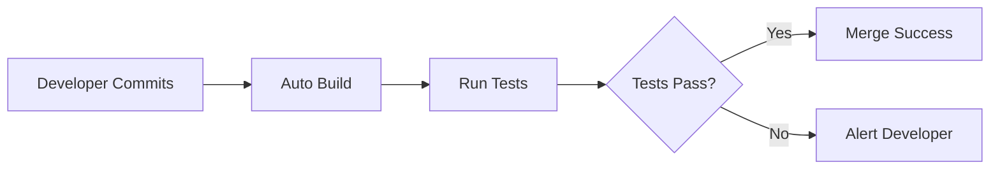
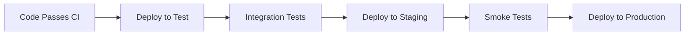

# Understand Azure Pipelines Key Terms

## Pipeline Architecture Diagram
```
Trigger → Pipeline → Stage 1 → Job 1 → Tasks
                              → Job 2 → Tasks
                  → Stage 2 → Job 3 → Tasks
                  → Stage 3 → Deploy → Artifacts → Deployment Target
```

## Core Building Blocks

### Pipeline
```yaml
# Example: Complete pipeline definition
name: Build and Deploy

trigger:
  - main

stages:
- stage: Build
  jobs:
  - job: BuildJob
    steps:
    - task: DotNetCoreCLI@2
      inputs:
        command: 'build'

- stage: Deploy
  jobs:
  - deployment: DeployJob
    environment: 'production'
    strategy:
      runOnce:
        deploy:
          steps:
          - task: AzureWebApp@1
```

**Definition**: Recipe describing exactly how to build, test, and deploy application
- Step-by-step instruction manual for Azure Pipelines
- Defines the complete workflow from code to deployment
- Example: "Build app → Run tests → Deploy to staging → Deploy to production"

### Stage
**Definition**: Major phases of pipeline representing logical boundaries
- Think of as chapters in instruction manual
- Each focuses on a different goal

**Common Examples**:
| Stage | Purpose |
|-------|---------|
| **Build** | Compile code and create application |
| **Test** | Run all automated tests to verify quality |
| **Deploy** | Release application to users |

### Job
```yaml
jobs:
- job: CompileAndTest
  displayName: 'Compile and run unit tests'
  pool:
    vmImage: 'ubuntu-latest'
  steps:
  - task: DotNetCoreCLI@2
    inputs:
      command: 'build'
  - task: DotNetCoreCLI@2
    inputs:
      command: 'test'

- job: SecurityScan
  displayName: 'Run security analysis'
  pool:
    vmImage: 'windows-latest'
  steps:
  - task: SecurityScan@1
```

**Definition**: Collection of related tasks that run together on same agent
- Set of related steps that need to happen in same place
- Example: One job compiles code and runs unit tests, another job runs security scans
- Jobs can run in parallel or sequentially

### Task
**Definition**: Single action or step in pipeline
- Individual instructions like "compile code," "run tests," "copy files"

**Task Examples**:
```yaml
# Build .NET application
- task: DotNetCoreCLI@2
  inputs:
    command: 'build'

# Run JavaScript tests
- task: Npm@1
  inputs:
    command: 'test'

# Deploy to Azure App Service
- task: AzureWebApp@1
  inputs:
    azureSubscription: 'MySubscription'
    appName: 'my-app'

# Send notification
- task: EmailReport@1
  inputs:
    sendTo: 'team@example.com'
```

## Execution and Automation

### Agent
**Definition**: Computer (virtual or physical) that actually runs pipeline tasks
- The worker that follows pipeline instructions and does actual work

**Agent Types**:
| Type | Description | Best For |
|------|-------------|----------|
| **Microsoft-hosted** | Microsoft provides and maintains | Easiest option, quick start |
| **Self-hosted** | You provide and maintain | Custom requirements, specific tools |

```yaml
# Specify agent pool
pool:
  vmImage: 'ubuntu-latest'  # Microsoft-hosted

# Or use self-hosted
pool:
  name: 'MyAgentPool'  # Self-hosted
```

### Build
**Definition**: One complete run of pipeline from start to finish
- One execution of your recipe, producing specific result

**Build Includes**:
- All logs showing what happened
- Test results and reports
- Any files or packages created
- Success/failure status and errors

### Trigger
```yaml
# Trigger examples
# 1. Code changes
trigger:
  branches:
    include:
    - main
    - develop

# 2. Scheduled
schedules:
- cron: "0 0 * * *"  # Daily at midnight
  branches:
    include:
    - main

# 3. Manual (no trigger)
trigger: none

# 4. Pipeline completion
resources:
  pipelines:
  - pipeline: buildPipeline
    source: 'MyBuildPipeline'
    trigger:
      branches:
      - main
```

**Definition**: Tells Azure Pipelines when to start running pipeline

**Common Triggers**:
| Trigger Type | Description | Use Case |
|--------------|-------------|----------|
| **Code changes** | Run when someone commits | Continuous integration |
| **Schedule** | Run at specific times | Nightly builds |
| **Manual** | Run when someone clicks button | On-demand deployments |
| **Pipeline completion** | Run when another pipeline finishes | Chained workflows |

## Outputs and Deployment

### Artifact
```yaml
# Publish artifacts
- task: PublishBuildArtifacts@1
  inputs:
    pathToPublish: '$(Build.ArtifactStagingDirectory)'
    artifactName: 'drop'

# Download artifacts in later stage
- task: DownloadBuildArtifacts@0
  inputs:
    artifactName: 'drop'
    downloadPath: '$(System.ArtifactsDirectory)'
```

**Definition**: Collection of files produced by pipeline that other processes can use
- Finished products from pipeline you want to keep or deploy

**Artifact Examples**:
- Compiled application files ready for deployment
- Test reports showing what passed or failed
- Documentation generated from code
- Container images ready for deployment

### Deployment Target
**Definition**: Where application will actually run for users
- Destination where finished application goes to serve real users

**Target Examples**:
| Target | Description |
|--------|-------------|
| **Azure App Service** | Web applications |
| **Virtual machines** | Cloud VMs |
| **Kubernetes clusters** | Containerized apps |
| **Azure Functions** | Serverless code |

### Release
```yaml
# Modern unified pipeline (replaces classic releases)
stages:
- stage: DeployDev
  jobs:
  - deployment: DeployToDev
    environment: 'dev'
    
- stage: DeployProd
  jobs:
  - deployment: DeployToProd
    environment: 'production'
```

**Definition**: Deploying application to one or more environments
- Process of taking finished application and making it available to users
- **Note**: Modern Azure Pipelines handle releases within same pipeline (not separate)

## Process Concepts

### Continuous Integration (CI)


**Definition**: Automatically building and testing code whenever changes are made
- **Why it matters**: Catches problems early when they're easier and cheaper to fix

**CI Workflow**:
1. Developer commits code changes
2. Pipeline automatically builds application
3. Automated tests run to check for problems
4. Team gets immediate feedback about code quality

### Continuous Delivery (CD)


**Definition**: Automatically deploying tested code to different environments
- **Why it matters**: Gets new features to users faster with less risk

**CD Workflow**:
1. Code passes all CI checks
2. Application automatically deployed to test environments
3. Further testing in production-like conditions
4. When ready, code deployed to production

## How Concepts Work Together

**Complete Pipeline Flow**:
```
1. Developer commits code
     ↓
2. Trigger fires pipeline
     ↓
3. Pipeline starts and runs through Stages
     ↓
4. Agents execute Jobs containing Tasks
     ↓
5. Build completes and produces Artifacts
     ↓
6. Artifacts deployed to Deployment targets
     ↓
7. Process repeats with each code change
```

## Terminology Benefits
Understanding these terms helps you:
- ✅ Plan pipeline strategy more effectively
- ✅ Communicate clearly with team members and stakeholders
- ✅ Troubleshoot problems when they occur
- ✅ Optimize process over time

## Critical Notes
- 🎯 Stages represent major phases (Build, Test, Deploy)
- 💡 Jobs run on single agent; can run in parallel for speed
- ⚠️ Tasks are smallest units of work in pipeline
- 📊 Artifacts pass data between stages and pipelines
- 🔄 Modern pipelines use YAML for releases (not classic release pipelines)
- ✨ Microsoft-hosted agents are easiest; self-hosted for custom needs

[Learn More](https://learn.microsoft.com/en-us/training/modules/explore-azure-pipelines/4-understand-key-terms)
