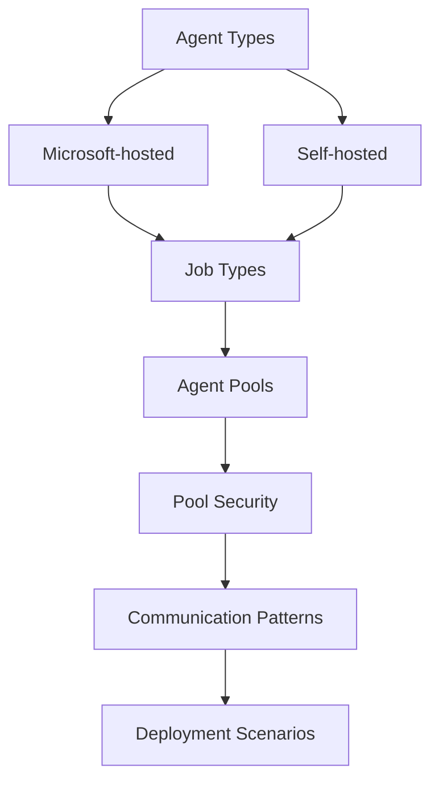

# Introduction to Managing Azure Pipeline Agents and Pools

## Key Concepts
- **Agent management** - Choose, install, configure, and secure agents
- **Agent pools** - Organize agents for team sharing and access control
- **Microsoft-hosted vs self-hosted** - Understand trade-offs between convenience and control
- **Security** - Manage roles and permissions for agent pools
- **Communication** - Understand agent-to-Azure Pipelines connectivity

## Learning Objectives
After completing this module, you'll be able to:
- ✅ Choose between Microsoft-hosted and self-hosted agents
- ✅ Install and configure Azure Pipelines agents
- ✅ Configure agent pools for organization and project use
- ✅ Secure agents and pools with role-based access control
- ✅ Explore communication patterns for deploying with Azure Pipelines

## Prerequisites
| Requirement | Description | Importance |
|-------------|-------------|------------|
| **DevOps understanding** | Know basic DevOps concepts | Helpful |
| **Version control** | Familiarity with Git principles | Helpful but not required |
| **Software delivery experience** | Working in organization that delivers software | Beneficial |

## Module Overview
- **Duration**: 1h 22min (largest LP2 module)
- **Units**: 13 units total (11 content + knowledge check + summary)
- **Focus**: Agent management, pools, security, communication
- **Level**: Advanced operational topics

## What You'll Learn

## Module Structure
| Section | Topics | Units |
|---------|--------|-------|
| **Agent Basics** | Types, job types, pools intro | 3 units |
| **Pool Management** | Predefined pools, typical situations | 2 units |
| **Communication** | Azure Pipelines, target servers | 2 units |
| **Advanced Topics** | Considerations, security, configuration | 3 units |
| **Lab** | Hands-on configuration | 1 unit (45 min) |

## Critical Notes
- 💡 Module explores differences between Microsoft-hosted and self-hosted agents
- 🎯 Details four job types: agent pool, container, deployment group, agentless
- ⚠️ Security is critical - role-based access control for all pools
- 📊 Agent communication always initiated by agent (pull model)
- 🔄 Agents can be configured behind firewalls (uses HTTPS/443)
- ✨ Includes 45-minute hands-on lab for practical experience

[Learn More](https://learn.microsoft.com/en-us/training/modules/manage-azure-pipeline-agents-pools/1-introduction)
