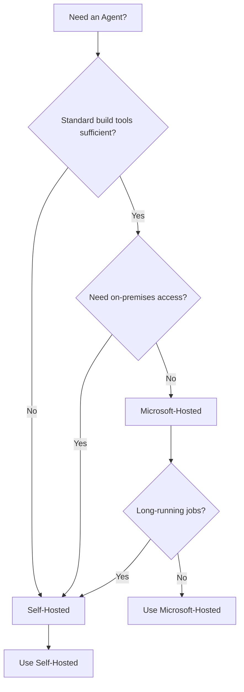

# Choose Between Microsoft-Hosted Versus Self-Hosted Agents

## Key Concepts
- **Agent** - Installable software that runs one build or deployment job at a time
- **Microsoft-hosted agents** - Managed by Microsoft, fresh VM per run
- **Self-hosted agents** - You manage, full control, custom software
- **Trade-offs** - Convenience vs control, cost vs customization
- **Scaling** - Add more agents as team and code grow

## Agent Fundamentals
To build code or deploy software, you need at least one agent. When build/deployment runs, system starts one or more jobs. An agent runs one job at a time.

## Microsoft-Hosted Agents

### Overview
```yaml
# Example: Using Microsoft-hosted agent
pool:
  vmImage: 'ubuntu-latest'  # Fresh VM every run

steps:
- script: echo "Running on Microsoft-hosted agent"
```

Convenient option for Azure Pipelines - build and deploy using Microsoft-hosted agents with automatic maintenance.

### Key Characteristics
| Feature | Description |
|---------|-------------|
| **Fresh VM** | New virtual machine for each pipeline run, discarded after one use |
| **Automatic maintenance** | Updates and upgrades happen automatically |
| **No setup** | No management or configuration required |
| **Job time limits** | Limits apply to job execution time |
| **Pre-installed software** | Common tools and frameworks already installed |

### Benefits
- ✅ Simplest way to build and deploy
- ✅ Try it first to see if it meets needs
- ✅ No infrastructure to maintain
- ✅ Always up-to-date with latest patches
- ✅ Clean environment for every run

### When to Use
- Quick start without infrastructure setup
- Standard build/deployment scenarios
- Public open source projects (free builds)
- Teams without dedicated infrastructure
- Projects not requiring custom tools

## Self-Hosted Agents

### Overview
```bash
# Download and configure self-hosted agent
# Windows
.\config.cmd

# Linux/macOS
./config.sh

# Register with agent pool
# Install custom software as needed
npm install -g specialized-tool
```

Agent you set up and manage yourself to run build and deployment jobs.

### Installation Options
- **Linux** - Any distribution
- **macOS** - Any version
- **Windows** - Any edition
- **Linux Docker containers** - Containerized agents

### Key Characteristics
| Feature | Description |
|---------|-------------|
| **Full control** | Complete control over environment |
| **Custom software** | Install any required build/deployment tools |
| **No job limits** | No time restrictions on job execution |
| **Setup required** | Requires installation and ongoing maintenance |
| **Persistent state** | Can preserve files between builds |

### Benefits
- ✅ Install dependent software for builds/deployments
- ✅ Incremental builds (preserve artifacts between runs)
- ✅ No job timeout limits
- ✅ Custom hardware (GPU, specialized equipment)
- ✅ Behind firewall access to internal resources
- ✅ Cost control for high-volume builds

### When to Use
- Specific software requirements not in Microsoft-hosted images
- Access to on-premises resources required
- Long-running build/deployment jobs
- Custom hardware needs (GPUs, specialized tools)
- High build volume (cost optimization)
- Network isolation requirements

## Comparison Matrix

| Aspect | Microsoft-Hosted | Self-Hosted |
|--------|------------------|-------------|
| **Setup** | Zero setup | Install and configure |
| **Maintenance** | Automatic | Manual updates required |
| **Cost** | Pay per minute | Infrastructure costs |
| **Customization** | Pre-configured images | Fully customizable |
| **Job duration** | Time limits apply | No limits |
| **Build speed** | Cold start every run | Can use incremental builds |
| **Security** | Microsoft-managed | You manage security |
| **Network access** | Public internet | Can access internal networks |
| **Software** | Pre-installed tools | Install anything needed |

## Decision Tree


## Hybrid Approach
Many organizations use **both agent types**:
- **Microsoft-hosted** for standard CI builds (fast, clean)
- **Self-hosted** for deployments to on-premises systems
- **Microsoft-hosted** for pull request validation
- **Self-hosted** for long-running integration tests

## Getting Started Recommendations

### Start with Microsoft-Hosted
1. Try Microsoft-hosted agents first
2. Evaluate if they meet your needs
3. Only move to self-hosted if necessary

### Migrate to Self-Hosted When
- Custom tools not available in Microsoft-hosted images
- On-premises deployment targets required
- Job time limits become constraint
- Build volume makes self-hosted more cost-effective
- Regulatory requirements mandate specific infrastructure

## Critical Notes
- 🎯 Microsoft-hosted agents get fresh VM for each run (no state preservation)
- 💡 Self-hosted agents give full control but require maintenance
- ⚠️ Job time limits apply to Microsoft-hosted agents only
- 📊 Both types can be used simultaneously in same organization
- 🔄 Agent is installable software that runs one job at a time
- ✨ For many teams, Microsoft-hosted is simplest way to start

[Learn More](https://learn.microsoft.com/en-us/training/modules/manage-azure-pipeline-agents-pools/2-choose-between-microsoft-hosted-versus-self-hosted-agents)
