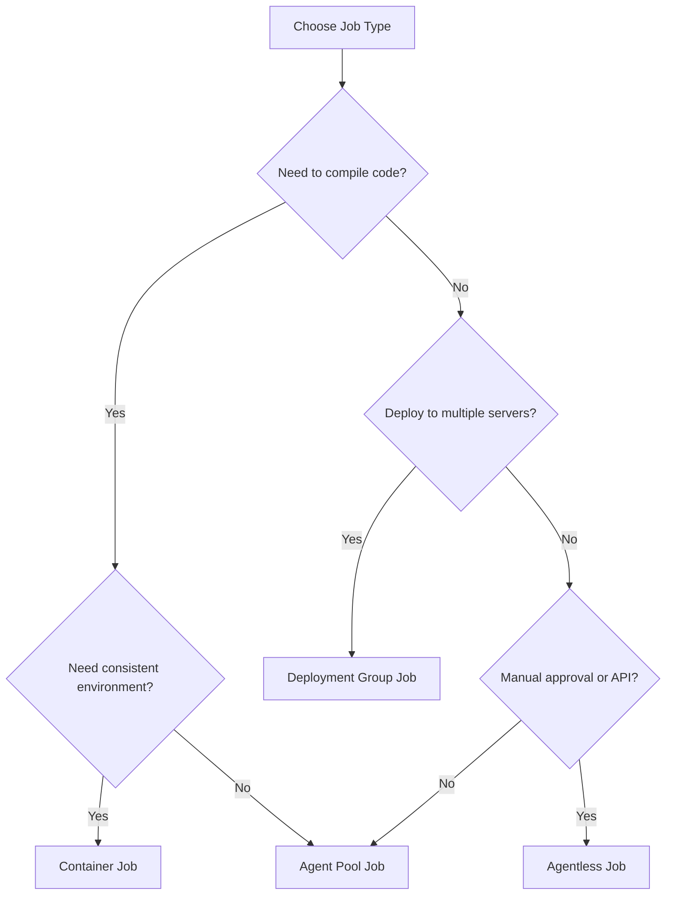

# Explore Job Types

## Key Concepts
- **Job types** - Four execution scenarios for different needs
- **Agent pool jobs** - Most common, runs on agent in pool
- **Container jobs** - Runs inside container for consistency
- **Deployment group jobs** - Deploys to multiple targets simultaneously
- **Agentless jobs** - Runs on Azure DevOps servers, no agent needed

## Job Types Overview

Azure DevOps supports **four types of jobs** to handle different execution scenarios:

```yaml
# Example showing different job types in one pipeline
stages:
- stage: Build
  jobs:
  - job: BuildJob           # Agent pool job
    pool:
      vmImage: 'ubuntu-latest'
    
  - job: ContainerJob       # Container job
    container: node:14
    
  - deployment: DeployJob   # Deployment group job
    environment: 'production'
    
  - job: ApprovalJob        # Agentless job
    pool: server
```

## 1. Agent Pool Jobs

### Definition
Most common type of job - runs on an agent that's part of an agent pool.

### Characteristics
- Requires an agent from specified pool
- Standard build and deployment tasks
- Execution environment provided by agent
- Can run on Microsoft-hosted or self-hosted agents

### Use Cases
| Scenario | Description |
|----------|-------------|
| **Building code** | Compile applications, run tests |
| **Running tests** | Unit tests, integration tests |
| **Deploying applications** | Standard deployment tasks |
| **Packaging** | Create artifacts, containers |

### Example
```yaml
jobs:
- job: BuildAndTest
  displayName: 'Build and run tests'
  pool:
    vmImage: 'ubuntu-latest'
  steps:
  - script: npm install
  - script: npm test
  - script: npm run build
```

## 2. Container Jobs

### Definition
Similar to agent pool jobs but run inside a container on an agent.

### Characteristics
- Provides consistency across builds
- Isolation from host environment
- Package job environment with dependencies
- Container image defines execution environment

### Benefits
- ✅ **Consistency** - Same environment every time
- ✅ **Isolation** - No interference with host
- ✅ **Reproducibility** - Portable across agents
- ✅ **Dependency management** - All tools in container

### Use Cases
| Scenario | Description |
|----------|-------------|
| **Consistent builds** | Same environment across all agents |
| **Complex dependencies** | Package all tools in container |
| **Multi-language projects** | Different containers for different stacks |
| **Testing isolation** | Clean environment for each test |

### Example
```yaml
jobs:
- job: BuildInContainer
  displayName: 'Build in Node.js container'
  pool:
    vmImage: 'ubuntu-latest'
  container: node:14-alpine
  steps:
  - script: node --version
  - script: npm install
  - script: npm test

# Use custom container image
- job: CustomContainer
  container:
    image: myregistry.azurecr.io/my-build-image:latest
    endpoint: MyACRConnection
  steps:
  - script: ./custom-build-script.sh
```

### Container Benefits Matrix
| Aspect | Without Container | With Container |
|--------|-------------------|----------------|
| **Environment** | Varies by agent | Consistent |
| **Dependencies** | Install on agent | In container image |
| **Isolation** | Shared with host | Fully isolated |
| **Portability** | Agent-specific | Runs anywhere |

## 3. Deployment Group Jobs

### Definition
Jobs that run on systems in a deployment group for simultaneous multi-target deployments.

### Characteristics
- Deploy to multiple target machines simultaneously
- Useful for server farms, web server clusters
- Rolling deployments across multiple servers
- Each target machine has deployment agent

### Use Cases
| Scenario | Description |
|----------|-------------|
| **Web server farms** | Deploy to multiple IIS servers |
| **Database clusters** | Update multiple database nodes |
| **Load-balanced apps** | Rolling updates across servers |
| **On-premises deployments** | Deploy to internal server groups |

### Example
```yaml
jobs:
- deployment: DeployWebApp
  displayName: 'Deploy to web farm'
  pool:
    name: Default
  environment:
    name: 'Production'
    resourceType: VirtualMachine
    tags: web-servers  # Target machines with this tag
  strategy:
    rolling:
      maxParallel: 2  # Deploy to 2 servers at a time
      preDeploy:
        steps:
        - script: echo "Prepare deployment"
      deploy:
        steps:
        - task: IISWebAppDeploymentOnMachineGroup@0
      postDeploy:
        steps:
        - script: echo "Deployment complete"
```

### Deployment Strategies
- **Rolling** - Deploy to servers in batches
- **Canary** - Deploy to small subset first
- **Blue-green** - Deploy to idle environment, then switch

## 4. Agentless Jobs

### Definition
Also called **server jobs** - run directly on Azure DevOps servers without requiring an agent.

### Characteristics
- No build environment needed
- Runs on Azure DevOps infrastructure
- Lightweight operations only
- No code compilation or complex processing

### Use Cases
| Scenario | Description |
|----------|-------------|
| **Manual approvals** | Human gates in pipeline |
| **REST API calls** | Invoke external services |
| **Azure Function execution** | Run serverless functions |
| **Delays/waits** | Time-based pipeline gates |
| **Query work items** | Check Azure Boards status |

### Example
```yaml
jobs:
- job: WaitForApproval
  displayName: 'Manual approval gate'
  pool: server  # Indicates agentless/server job
  steps:
  - task: ManualValidation@0
    inputs:
      notifyUsers: 'team@example.com'
      instructions: 'Please approve deployment to production'

- job: InvokeAPI
  displayName: 'Call external API'
  pool: server
  steps:
  - task: InvokeRESTAPI@1
    inputs:
      serviceConnection: 'MyAPIConnection'
      method: 'POST'
      urlSuffix: '/deploy'

- job: DelayJob
  displayName: 'Wait 1 hour'
  pool: server
  steps:
  - task: Delay@1
    inputs:
      delayForMinutes: '60'
```

### Agentless vs Agent Pool Jobs
| Aspect | Agentless | Agent Pool |
|--------|-----------|------------|
| **Agent required** | No | Yes |
| **Execution location** | Azure DevOps servers | Agent machine |
| **Code compilation** | Not possible | Yes |
| **File operations** | Limited | Full access |
| **API calls** | Yes | Yes |
| **Manual approvals** | Yes | Not typical |

## Job Type Selection Guide



## Quick Reference

| Job Type | Agent Required | Best For | Example Task |
|----------|----------------|----------|--------------|
| **Agent Pool** | ✅ Yes | Standard builds | Compile, test, package |
| **Container** | ✅ Yes | Consistent builds | Docker-based builds |
| **Deployment Group** | ✅ Yes (on targets) | Multi-server deploys | Web farm deployment |
| **Agentless** | ❌ No | Orchestration | Approvals, API calls |

## Critical Notes
- 🎯 Agent pool jobs are most common - standard builds and deployments
- 💡 Container jobs provide consistency and isolation
- ⚠️ Deployment group jobs require agents installed on target servers
- 📊 Agentless jobs perfect for orchestration tasks (approvals, API calls)
- 🔄 Can combine multiple job types in single pipeline
- ✨ Choose job type based on execution requirements and resources needed

[Learn More](https://learn.microsoft.com/en-us/training/modules/manage-azure-pipeline-agents-pools/3-explore-job-types)
