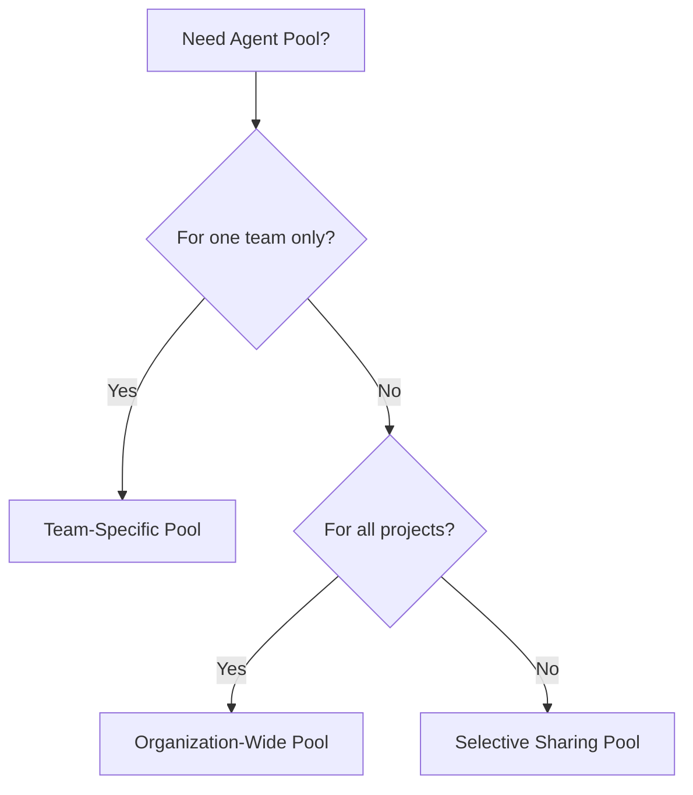

# Understand Typical Situations for Agent Pools

## Key Concepts
- **Team-specific pools** - Dedicated agents for single team
- **Organization-wide pools** - Shared across all projects
- **Selective sharing** - Share with multiple but not all projects
- **Administrator role** - Required to create agent pools
- **Auto-provision** - Automatically add pool to all projects

## When to Create Agent Pools

When you have many agents for **different teams or purposes**, create additional pools. Here are typical situations:



## Scenario 1: Team-Specific Agent Pools

### Use Case
You're a **project member** who wants to use machines your team owns for running build and deployment jobs.

### Requirements
- Member of a group in "All Pools" with **Administrator role**
- Need dedicated resources for your team
- Want full control over agent configuration

### Steps to Create
```yaml
# 1. Create new project agent pool in project settings
Project Settings → Agent pools → New agent pool
  - Name: "Team-A-Agents"
  - Option: "Create a new organization agent pool" ✓

# 2. Install and configure agents to join pool
./config.sh
  Enter server URL: https://dev.azure.com/yourorg
  Enter pool name: Team-A-Agents
  
# 3. Use in pipeline
pool:
  name: 'Team-A-Agents'
```

### Result
- ✅ **Organization agent pool created** - "Team-A-Agents" at org level
- ✅ **Project agent pool created** - Points to org pool
- ✅ **Team exclusive access** - Only your team's project can use it
- ✅ **Full control** - Configure agents as needed

### Benefits
| Benefit | Description |
|---------|-------------|
| **Dedicated resources** | No competition with other teams |
| **Custom configuration** | Install team-specific tools |
| **Predictable capacity** | Know exactly what's available |
| **Team ownership** | Full responsibility and control |

## Scenario 2: Organization-Wide Agent Pools

### Use Case
You're a member of the **infrastructure team** setting up a pool for use across all projects.

### Requirements
- Member of a group in "All Pools" with **Administrator role**
- Centralized infrastructure management
- Want to share resources across entire organization

### Steps to Create
```yaml
# 1. Create new organization agent pool in admin settings
Organization Settings → Agent pools → New agent pool
  - Name: "Enterprise-Agents"
  - Auto-provision: "Auto-provision in all projects" ✓
  - Grant access: "Grant access to all pipelines" ✓

# 2. Install and configure agents
./config.sh
  Enter server URL: https://dev.azure.com/yourorg
  Enter pool name: Enterprise-Agents

# 3. All projects automatically reference pool
# In any project pipeline:
pool:
  name: 'Enterprise-Agents'
```

### Result
- ✅ **All projects get access** - Including future projects
- ✅ **Single point of management** - Centralized control
- ✅ **Automatic provisioning** - New projects get pool automatically
- ✅ **Simplified access** - No per-project configuration needed

### Benefits
| Benefit | Description |
|---------|-------------|
| **Cost optimization** | Share infrastructure across organization |
| **Centralized management** | Single team maintains all agents |
| **Consistent configuration** | Same tools/versions everywhere |
| **Easier capacity planning** | Organization-wide view |

## Scenario 3: Selective Sharing Agent Pools

### Use Case
You want to **share agent machines with multiple projects, but not all of them**.

### Requirements
- Administrator role in agent pools
- Need to share with specific projects only
- Security or compliance requirements for selective access

### Steps to Create
```yaml
# 1. Create project agent pool in one project
Project A Settings → Agent pools → New agent pool
  - Name: "Shared-Deploy-Agents"
  - Option: "Create a new organization agent pool" ✓

# 2. Go to each target project and add pool
Project B Settings → Agent pools → Add pool
  - Option: "Use an existing organization agent pool" ✓
  - Select: "Shared-Deploy-Agents"

Project C Settings → Agent pools → Add pool
  - Option: "Use an existing organization agent pool" ✓
  - Select: "Shared-Deploy-Agents"

# 3. Install and configure agents
./config.sh
  Enter pool name: Shared-Deploy-Agents

# 4. Use in selected projects
# Project A, B, C can use:
pool:
  name: 'Shared-Deploy-Agents'
```

### Result
- ✅ **Only specified projects can access** - Not all projects
- ✅ **Controlled sharing** - Add projects individually
- ✅ **Security compliance** - Restrict sensitive resources
- ✅ **Flexible access control** - Add/remove projects as needed

### Benefits
| Benefit | Description |
|---------|-------------|
| **Controlled access** | Share only with approved projects |
| **Security isolation** | Keep sensitive agents restricted |
| **Cost allocation** | Track usage by specific projects |
| **Compliance** | Meet regulatory requirements |

## Comparison Matrix

| Aspect | Team-Specific | Organization-Wide | Selective Sharing |
|--------|---------------|-------------------|-------------------|
| **Scope** | Single project/team | All projects | Selected projects |
| **Management** | Team owns | Infrastructure team | Infrastructure team |
| **Access** | Exclusive | Everyone | Controlled list |
| **Best for** | Dedicated needs | Common resources | Security/compliance |
| **Cost model** | Team budget | Shared budget | Allocated budget |

## Permission Requirements

### Administrator Role Required
```
Administrator Permissions:
├── Create agent pools
├── Delete agent pools
├── Manage pool settings
├── Register/unregister agents
├── Manage pool membership
└── Grant permissions to others
```

### Getting Administrator Access
```bash
# Organization level
Organization Settings → Agent pools → Security
  → Add user to "Administrators" group

# Project level
Project Settings → Agent pools → Security
  → Add user to "Administrators" group
```

## Decision Guide

### Choose **Team-Specific** When:
- Team owns dedicated hardware
- Specific tools/configuration required
- Need guaranteed capacity
- Team has budget for infrastructure

### Choose **Organization-Wide** When:
- Central infrastructure team exists
- Want to optimize costs through sharing
- Need consistent configurations
- Want simplified management

### Choose **Selective Sharing** When:
- Security/compliance requires restrictions
- Some projects need special agents
- Want cost tracking by project
- Regulatory requirements for isolation

## Real-World Examples

### Example 1: Software Company
```
Organization: Contoso Software
├── Enterprise-Build-Agents (all projects)
├── Production-Deploy-Agents (selected projects)
├── Team-Mobile-Agents (mobile team only)
└── Team-Data-Agents (data team only)
```

### Example 2: Financial Institution
```
Organization: FinanceCorppool
├── Common-Build-Pool (all projects)
├── PCI-Compliant-Pool (payment projects only)
├── SOX-Compliant-Pool (financial reporting only)
└── Public-Website-Pool (marketing projects)
```

### Example 3: Government Agency
```
Organization: Gov Agency
├── Unclassified-Build (public projects)
├── Sensitive-Build (selected internal projects)
└── Classified-Deploy (restricted projects, air-gapped)
```

## Best Practices

### Pool Planning
- **Start with organization-wide** - Simplest management
- **Add team-specific when needed** - For specialized requirements
- **Use selective sharing** - For security/compliance
- **Document pool purpose** - Clear descriptions

### Naming Conventions
```
Good names:
- Enterprise-Build-Linux
- Team-Mobile-iOS
- Production-Deploy-EMEA
- Compliance-SOX-Deploy

Avoid:
- Pool1
- MyPool
- Test
```

### Capacity Planning
- **Monitor usage** - Track agent utilization
- **Scale proactively** - Add agents before bottlenecks
- **Review regularly** - Quarterly pool audits
- **Optimize allocation** - Move agents between pools as needed

## Critical Notes
- 🎯 Administrator role required to create agent pools
- 💡 Auto-provision option creates project pools in all projects automatically
- ⚠️ Team-specific pools provide dedicated resources for single team
- 📊 Organization-wide pools optimize costs through sharing
- 🔄 Selective sharing restricts access to specific projects only
- ✨ Choose approach based on security, compliance, and organizational needs

[Learn More](https://learn.microsoft.com/en-us/training/modules/manage-azure-pipeline-agents-pools/6-understand-typical-situations-for-agent-pools)
