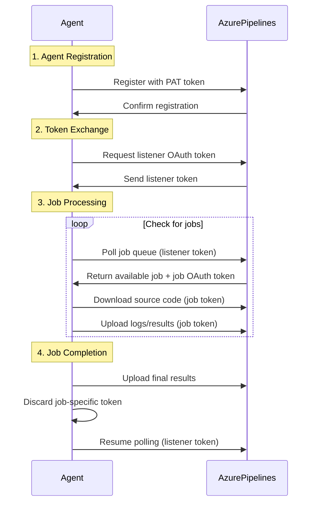

# Communicate with Azure Pipelines

## Key Concepts
- **Pull model** - Agent initiates all communication
- **HTTPS over port 443** - All messages use secure channel
- **OAuth tokens** - Listener token and job-specific tokens
- **Asymmetric encryption** - Public/private key pair for security
- **Firewall-friendly** - Agents can be behind firewalls

## Communication Model

The agent communicates with Azure Pipelines to determine which job to run and reports logs and job status. The agent **always initiates** this communication, with all messages sent to Azure Pipelines over **HTTPS**.

### Pull Model Benefits
- ✅ **Firewall-friendly** - Agents can be configured behind firewalls
- ✅ **Secure** - No inbound connections to agent machines
- ✅ **Flexible topology** - Works in various network configurations
- ✅ **Agent control** - Agent determines when to check for work

```
┌─────────────────┐
│  Azure Pipelines│
│   (Cloud)       │
└────────▲────────┘
         │ HTTPS (Port 443)
         │ ◄── Agent initiates
         │
┌────────┴────────┐
│   Firewall      │
└────────┬────────┘
         │
┌────────▼────────┐
│   Agent         │
│  (On-premises)  │
└─────────────────┘
```

## Communication Workflow

### Complete 4-Step Process



### 1. Agent Registration

**Purpose**: Register agent with Azure Pipelines by adding it to an agent pool.

**Requirements**:
- Must be **agent pool administrator** to register
- Administrator identity only needed during registration
- Not used for ongoing communication

**Registration Process**:
```bash
# Run agent configuration
./config.sh

# Provide details:
Server URL: https://dev.azure.com/yourorg
Personal Access Token (PAT): [enter PAT with Agent Pools (read, manage) scope]
Agent pool: MyAgentPool
Agent name: MyAgent-01

# Agent registers and receives initial authentication
```

**What Happens**:
- Agent connects to Azure DevOps organization
- Validates PAT token permissions
- Registers agent in specified pool
- Generates agent-specific keys

### 2. Token Exchange

**Purpose**: Agent downloads listener OAuth token for monitoring job queue.

**Listener Token Characteristics**:
- **Long-lived** - Used for continuous polling
- **Scoped** - Limited to job queue monitoring
- **Persistent** - Stored securely on agent

**Token Exchange**:
```
Agent Registration
     ↓
Azure Pipelines generates listener OAuth token
     ↓
Agent downloads and stores token securely
     ↓
Token used for all job queue polling
```

### 3. Job Processing

**Purpose**: Agent periodically checks for new job requests and executes them.

**Job Processing Flow**:
```yaml
# Job becomes available in queue
# Agent polls and receives job details

1. Agent checks job queue (using listener token)
   ↓
2. Azure Pipelines returns job + job-specific OAuth token
   ↓
3. Agent uses job token to:
   - Download source code from repository
   - Access build artifacts
   - Read pipeline variables/secrets
   - Upload test results
   - Publish build artifacts
   ↓
4. Job token is scoped to pipeline's identity
```

**Job-Specific OAuth Token**:
| Characteristic | Description |
|----------------|-------------|
| **Short-lived** | Valid only for duration of job |
| **Scoped** | Limited to pipeline's permissions |
| **Job-specific** | Different token for each job |
| **Auto-generated** | Created by Azure Pipelines |

**What Job Token Can Do**:
```yaml
# Access source code
- checkout: self

# Download artifacts
- download: current

# Publish test results
- task: PublishTestResults@2

# Upload artifacts
- publish: $(Build.ArtifactStagingDirectory)

# All use job-specific OAuth token automatically
```

### 4. Job Completion

**Purpose**: Clean up after job completes and return to monitoring state.

**Completion Steps**:
```
Job finishes (success or failure)
     ↓
Agent uploads final logs and results (job token)
     ↓
Agent discards job-specific OAuth token
     ↓
Agent returns to monitoring job queue (listener token)
     ↓
Process repeats for next job
```

## Security Measures

### Asymmetric Encryption

**How It Works**:
```
Agent Registration:
1. Agent generates public-private key pair
2. Agent sends public key to Azure Pipelines
3. Azure Pipelines stores public key

Job Assignment:
1. Azure Pipelines encrypts job payload with agent's public key
2. Encrypted payload sent to agent
3. Agent decrypts with private key
4. Job executes securely
```

**Key Pair Security**:
| Component | Location | Purpose |
|-----------|----------|---------|
| **Private key** | Agent machine only | Decrypt job payloads |
| **Public key** | Azure Pipelines | Encrypt job payloads |
| **Key storage** | Secure agent directory | Protected from unauthorized access |

### Message Payload Encryption

**All communication encrypted**:
- ✅ Job assignments encrypted with agent's public key
- ✅ Agent can only decrypt with private key
- ✅ No other agent can read job payload
- ✅ Man-in-the-middle attacks prevented

### Secrets Protection

**Pipeline secrets remain secure**:
```yaml
# Secrets defined in pipeline
variables:
- group: prod-secrets  # Variable group
- name: apiKey
  value: $(SecretApiKey)  # Secret variable

# During job execution:
# 1. Azure Pipelines encrypts secrets
# 2. Sends encrypted to agent
# 3. Agent decrypts using private key
# 4. Secrets used in build (masked in logs)
# 5. Secrets discarded after job
```

**Secret Handling**:
- Encrypted during transmission
- Masked in build logs
- Not persisted on agent
- Discarded after job completion

## Network Configuration

### Required Connectivity

**Agent must reach**:
```
Agent → dev.azure.com (HTTPS/443)
Agent → *.visualstudio.com (HTTPS/443)
Agent → *.vsassets.io (HTTPS/443)
Agent → *.vstmrblob.blob.core.windows.net (HTTPS/443)
```

### Firewall Configuration

**Outbound only**:
```bash
# No inbound connections required
# Agent initiates all communication
# Outbound HTTPS (port 443) only

# Firewall rules needed:
Allow outbound: dev.azure.com:443
Allow outbound: *.visualstudio.com:443
Allow outbound: *.vsassets.io:443
```

### Proxy Support

**Agent behind web proxy**:
```bash
# Configure during agent setup
./config.sh

Proxy URL: http://proxy.company.com:8080
Proxy Username: proxyuser
Proxy Password: ******

# Or configure in .proxy file
cat .proxy
http://proxy.company.com:8080

# Or set environment variables
export HTTP_PROXY=http://proxy.company.com:8080
export HTTPS_PROXY=http://proxy.company.com:8080
```

## Token Management

### Personal Access Token (PAT)

**Used for registration only**:
```
PAT Requirements:
├── Scope: Agent Pools (read, manage)
├── Organization: Specific organization
├── Expiration: Set appropriate lifetime
└── Security: Treat as password
```

**Best Practices**:
- Create dedicated service account
- Minimal required scope (Agent Pools only)
- Regular rotation (e.g., quarterly)
- Secure storage (don't commit to source control)
- Revoke after registration if desired

### OAuth Tokens

**Managed by Azure Pipelines**:
- **Listener token** - Long-lived, for polling
- **Job tokens** - Short-lived, job-specific
- **Auto-managed** - No manual intervention needed
- **Secure storage** - Agent stores securely

## Monitoring Communication

### Agent Status

**Check agent connectivity**:
```bash
# View agent status in Azure DevOps
Organization Settings → Agent pools → [Pool Name] → Agents

Status indicators:
├── Online - Agent connected and polling
├── Offline - Agent not communicating
├── Running - Agent executing job
└── Maintenance - Agent in maintenance mode
```

### Communication Logs

**Agent logs show communication**:
```bash
# Agent log location
_diag/Agent_[timestamp].log

# Look for:
[info]: Agent is listening for jobs
[info]: Polling for available jobs
[info]: Job [jobid] received
[info]: Job [jobid] completed
```

## Troubleshooting

### Connection Issues

| Issue | Possible Cause | Solution |
|-------|---------------|----------|
| **Agent offline** | Network connectivity | Check firewall, proxy settings |
| **Registration fails** | PAT expired/invalid | Generate new PAT with correct scope |
| **Job not assigned** | Pool mismatch | Verify agent in correct pool |
| **Timeout errors** | Proxy issues | Configure proxy settings correctly |

## Critical Notes
- 🎯 Agent always initiates communication (pull model) - never inbound connections
- 💡 All messages sent to Azure Pipelines over HTTPS (port 443)
- ⚠️ Administrator identity only required during registration, not ongoing communication
- 📊 Asymmetric encryption protects all message payloads between agent and Azure Pipelines
- 🔄 Job-specific OAuth tokens are short-lived and discarded after job completes
- ✨ Agent can be configured behind firewalls - only needs outbound HTTPS

[Learn More](https://learn.microsoft.com/en-us/training/modules/manage-azure-pipeline-agents-pools/7-communicate-with-azure-pipelines)
