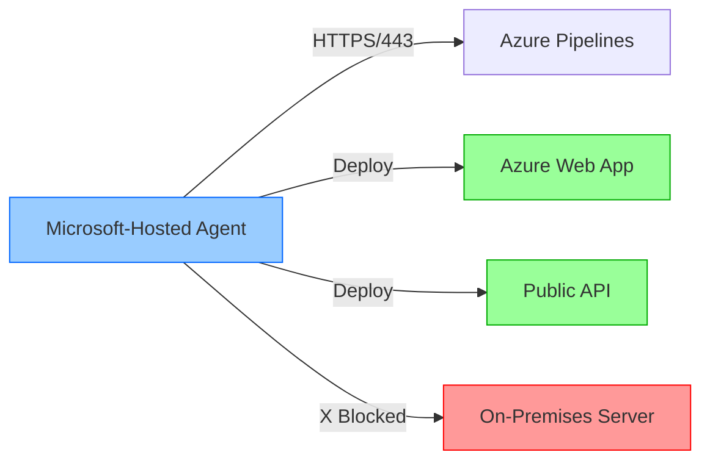
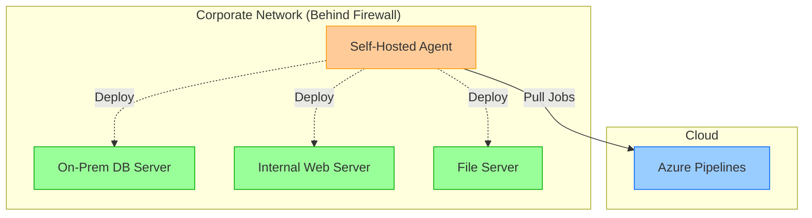

# Communicate to Deploy to Target Servers

## Key Concepts
- Agents must have "line of sight" connectivity to deployment target servers
- Microsoft-hosted agents connect to Azure and most internet-accessible endpoints by default
- On-premises environments require self-hosted agents when firewalls block Microsoft-hosted access
- Network topology planning is critical for reliable deployments
- Self-hosted agents bridge the gap between Azure Pipelines and internal infrastructure

## Microsoft-Hosted Agent Connectivity

### Default Connectivity

Microsoft-hosted agents have built-in connectivity to:

| Target Type | Description | Authentication |
|-------------|-------------|----------------|
| **Azure Websites** | App Services, Functions, Static Web Apps | Managed Identity/Service Principal |
| **Azure VMs** | Virtual Machines running in Azure | Azure credentials |
| **Internet Endpoints** | Public APIs, cloud services, CDNs | Standard HTTPS |
| **Public Repositories** | GitHub, npm, NuGet, Docker Hub | Token-based |

### Network Architecture



**Limitations**:
- ❌ Cannot reach servers behind corporate firewalls
- ❌ No direct access to on-premises data centers
- ❌ Cannot connect to private VNets without VPN/ExpressRoute

## On-Premises Deployment Requirements

### When to Use Self-Hosted Agents

**Required scenarios**:
1. **Firewall Restrictions**: Corporate networks block inbound connections from Microsoft IPs
2. **Private Networks**: Resources not exposed to internet (internal databases, file shares)
3. **Compliance**: Data sovereignty or regulatory requirements prevent external connections
4. **Legacy Systems**: On-premises servers without internet-accessible endpoints

### Self-Hosted Agent Requirements

| Requirement | Description | Example |
|-------------|-------------|---------|
| **Internet Access** | Connect to Azure Pipelines/DevOps Server | Outbound HTTPS on port 443 |
| **Target Connectivity** | Reach deployment servers | Network path to on-prem servers |
| **Firewall Rules** | Allow outbound to Azure DevOps | `dev.azure.com`, `*.visualstudio.com` |
| **Credentials** | Deploy to target systems | Service accounts, certificates |

### Network Topology



**Key Points**:
- Agent initiates all communication to Azure Pipelines (pull model)
- Agent has local network access to internal systems
- Firewall only needs outbound rules (no inbound ports)
- Agent runs inside secure perimeter with deployment targets

## Network Considerations

### Firewall Configuration

**Outbound Rules** (Self-Hosted Agent → Azure):

```bash
# Allow Azure DevOps domains
dev.azure.com:443
*.visualstudio.com:443
*.vstmrblob.vsassets.io:443
vstsagentpackage.azureedge.net:443

# Allow authentication endpoints
login.microsoftonline.com:443
management.azure.com:443
```

**Internal Rules** (Agent → Deployment Targets):

| Protocol | Port | Purpose |
|----------|------|---------|
| **SSH** | 22 | Linux server deployments |
| **WinRM** | 5985/5986 | Windows remote management |
| **RDP** | 3389 | Interactive sessions (avoid in production) |
| **HTTP/HTTPS** | 80/443 | Web server deployments |
| **SQL** | 1433 | Database deployments |
| **Custom** | Varies | Application-specific ports |

### Security Best Practices

#### Network Segmentation

```yaml
# Example deployment using self-hosted agent
trigger:
- main

pool:
  name: 'OnPremises-Pool'  # Self-hosted agent pool

stages:
- stage: Deploy
  jobs:
  - deployment: DeployToInternal
    environment: 'Production-Internal'
    strategy:
      runOnce:
        deploy:
          steps:
          - task: PowerShell@2
            inputs:
              targetType: 'inline'
              script: |
                # Agent can reach internal server
                Invoke-WebRequest -Uri "http://internal-server:8080/deploy" -Method POST
```

#### Security Measures

1. **Least Privilege**: Agent service account with minimal permissions
2. **Network Isolation**: Separate agent pool for production deployments
3. **Audit Logging**: Track all deployment activities
4. **Credential Management**: Use Azure Key Vault for secrets
5. **IP Restrictions**: Limit agent access to specific target servers

### Performance Optimization

**Latency Considerations**:

| Scenario | Agent Placement | Latency Impact |
|----------|----------------|----------------|
| **Agent in Azure** | Deploy to Azure resources | ✅ Low (same region) |
| **Agent in Azure** | Deploy to on-premises | ⚠️ Moderate (over ExpressRoute) |
| **Agent on-premises** | Deploy to on-premises | ✅ Low (LAN speed) |
| **Agent on-premises** | Deploy to Azure | ⚠️ Moderate (internet speed) |

**Bandwidth Planning**:
- Large artifact deployments (Docker images, binaries): Locate agent near target
- Small configuration changes: Location less critical
- Parallel deployments: Ensure sufficient network capacity

### Troubleshooting Connectivity

**Common Issues**:

```bash
# Test agent connectivity to Azure Pipelines
curl -v https://dev.azure.com

# Test deployment target connectivity
Test-NetConnection internal-server.company.local -Port 5985

# Check DNS resolution
nslookup internal-server.company.local

# Verify firewall rules
Test-NetConnection dev.azure.com -Port 443
```

## Critical Notes

- 🎯 **Microsoft-hosted agents cannot reach on-premises servers behind firewalls** - Always use self-hosted agents for internal deployments
- 💡 **Self-hosted agents use pull model** - No inbound firewall rules needed, only outbound HTTPS/443 to Azure DevOps
- ⚠️ **Plan agent placement strategically** - Consider latency, bandwidth, and network topology when positioning agents
- 📊 **One agent can deploy to multiple targets** - Same agent pool can reach various on-premises systems if network allows
- 🔄 **Hybrid scenarios require both agent types** - Use Microsoft-hosted for Azure resources, self-hosted for internal systems
- ✨ **Security follows network boundaries** - Agent inherits network access and security posture of its host environment

[Learn More](https://learn.microsoft.com/en-us/training/modules/manage-azure-pipeline-agents-pools/8-communicate-to-deploy-to-target-servers)
