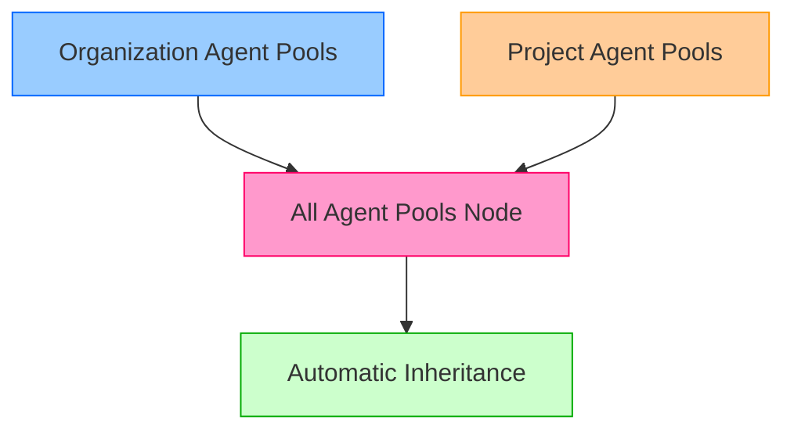
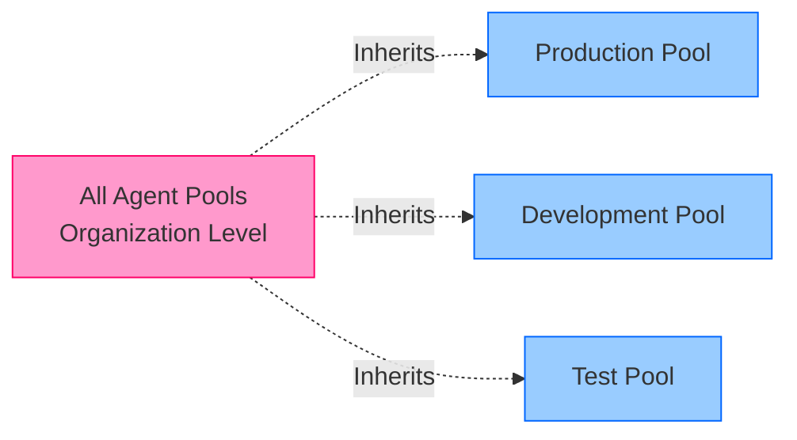
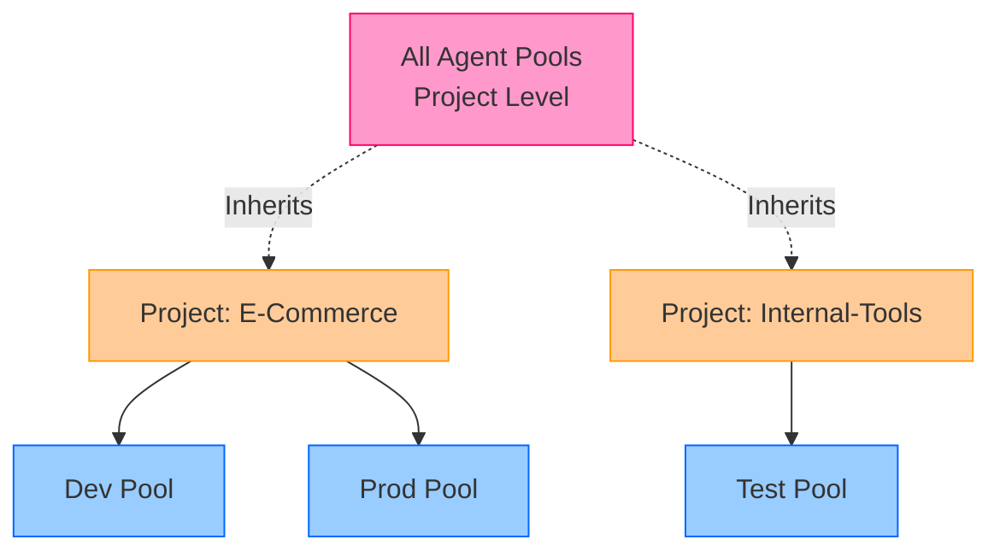

# Describe Security of Agent Pools

## Key Concepts
- Azure Pipelines uses role-based access control (RBAC) for agent pool security
- Organization and project agent pools have different security models
- Four primary roles govern agent pool operations: Reader, Service Account, User, Administrator
- Role memberships automatically inherit from 'All agent pools' node
- Security configuration affects who can view, use, and manage agent pools

## Security Model Overview

### Two-Tier Security Model



**Key Distinction**:
- **Organization Pools**: Shared across all projects in the organization
- **Project Pools**: Scoped to a single project with project-specific permissions

## Organization Agent Pool Roles

### Role Definitions

| Role | Permissions | Typical Users | Use Case |
|------|-------------|---------------|----------|
| **Reader** | • View pool<br>• View agents<br>• Monitor health | Operations team<br>DevOps observers | Monitoring agent status and availability |
| **Service Account** | • All Reader permissions<br>• Create project agent pool | Service principals<br>Automation accounts | Automated pool provisioning |
| **User** | • All Reader permissions<br>• Use agents in pipelines | Pipeline authors<br>Developers | Reference pool in pipeline definitions |
| **Administrator** | • All above permissions<br>• Register/unregister agents<br>• Manage role membership<br>• Create project pools | Pool owners<br>DevOps admins | Complete pool management |

### Organization Pool Security Hierarchy



**Configuration Path**:
```
Organization Settings → Agent Pools → All agent pools (Security)
Organization Settings → Agent Pools → [Specific Pool] (Security)
```

### Example: Organization Pool Security

**Scenario**: Configure production pool with restricted access

```yaml
# Organization-level configuration
Organization Pool: "Production-Windows"

Roles:
  Reader:
    - DevOps-Monitoring-Group
  User:
    - Production-Pipeline-Authors
  Administrator:
    - DevOps-Infrastructure-Team
    - John-Doe (pool creator, auto-added)
```

## Project Agent Pool Roles

### Role Definitions

| Role | Permissions | Typical Users | Use Case |
|------|-------------|---------------|----------|
| **Reader** | • View project pool<br>• Monitor jobs | Project stakeholders<br>QA team | Track build/deployment status |
| **User** | • All Reader permissions<br>• Author pipelines<br>• Queue builds/releases | Developers<br>Release managers | Create and execute pipelines |
| **Administrator** | • All above permissions<br>• Manage role membership | Project admins<br>Release admins<br>Build admins | Configure pool access for project |

### Default Project Assignments

**Automatically added to Administrator role**:
- Build Administrators group
- Release Administrators group
- Project Administrators group
- Creator of the pool

### Project Pool Security Hierarchy



**Configuration Path**:
```
Project Settings → Agent Pools → All agent pools (Security)
Project Settings → Agent Pools → [Specific Pool] (Security)
```

### Example: Project Pool Security

**Scenario**: E-Commerce project with separate dev/prod pools

```yaml
# Project-level configuration
Project: "E-Commerce"

Pool: "E-Commerce-Dev"
  Roles:
    Reader:
      - E-Commerce-Team
    User:
      - E-Commerce-Developers
      - E-Commerce-QA
    Administrator:
      - E-Commerce-DevOps-Leads
      - Build Administrators (auto)

Pool: "E-Commerce-Prod"
  Roles:
    Reader:
      - E-Commerce-Team
    User:
      - E-Commerce-Release-Managers  # Restricted
    Administrator:
      - E-Commerce-DevOps-Leads
      - Release Administrators (auto)
```

## Security Configuration Patterns

### Pattern 1: Least Privilege

**Principle**: Grant minimum necessary permissions

```yaml
# Development pool - broader access
Pool: Development
  User:
    - All-Developers-Group
  Administrator:
    - DevOps-Team

# Production pool - restricted access
Pool: Production
  User:
    - Senior-Engineers-Only
    - Release-Managers
  Administrator:
    - DevOps-Leads
    - VP-Engineering
```

### Pattern 2: Inheritance Strategy

**Leverage 'All agent pools' node** for organization-wide defaults:

```yaml
# All Agent Pools (Organization Level)
Reader:
  - Organization-All-Users  # Everyone can view
Administrator:
  - DevOps-Global-Admins  # Central management team

# Specific pools inherit + custom overrides
Pool: Special-Security-Pool
  User:
    - Security-Team-Only  # Additional restriction
    - Inherits: [Organization-All-Users as Reader]
```

### Pattern 3: Project Isolation

**Separate pools per project** for cost allocation and isolation:

```yaml
# Project A
Pool: ProjectA-Agents
  User: [ProjectA-Team]
  Administrator: [ProjectA-Admins, Build Administrators]

# Project B
Pool: ProjectB-Agents
  User: [ProjectB-Team]
  Administrator: [ProjectB-Admins, Build Administrators]

# No cross-project access unless explicitly granted
```

## Role Assignment Best Practices

### Adding Users to Roles

**Via Azure DevOps UI**:
```
1. Navigate to Organization Settings → Agent Pools
2. Select pool → Security tab
3. Click "Add" → Select role
4. Add Azure AD users/groups
5. Save
```

**Via Azure DevOps CLI**:
```bash
# Add user to pool administrator role
az devops security permission update \
  --id <security-namespace-id> \
  --subject <user-or-group> \
  --token <pool-token> \
  --allow-bit 31  # Administrator permissions

# Add user to pool user role
az devops security permission update \
  --id <security-namespace-id> \
  --subject <user-or-group> \
  --token <pool-token> \
  --allow-bit 1  # User permissions
```

### Common Security Configurations

| Scenario | Configuration | Benefit |
|----------|---------------|---------|
| **Public Projects** | Reader: Project Valid Users<br>User: Contributors | Open visibility, controlled execution |
| **Private Projects** | Reader: Project Members<br>User: Release Managers | Restricted access |
| **Shared Services** | User: Multiple project groups | Resource efficiency |
| **Isolated Production** | User: Release-Managers-Only<br>Administrator: Security-Team | Compliance, audit trail |

## Security Auditing

### Monitoring Pool Access

**Key Audit Points**:

```yaml
# Questions to audit regularly:
- Who can view agent pools?
  → Check Reader role membership
  
- Who can use agents in pipelines?
  → Check User role membership
  
- Who can register/remove agents?
  → Check Administrator role membership
  
- Are project pools properly isolated?
  → Review project-level security settings
  
- Do service accounts have appropriate access?
  → Verify Service Account role assignments
```

### Security Events to Track

| Event | Location | Action |
|-------|----------|--------|
| **Agent Registration** | Agent Pool → Agents | Verify authorized administrators only |
| **Role Changes** | Security tab → Audit log | Track permission modifications |
| **Pool Creation** | Organization settings | Ensure proper naming and security |
| **Pipeline Usage** | Analytics → Agent usage | Detect unauthorized pool access |

## Critical Notes

- 🎯 **Two security models exist** - Organization pools and project pools have separate RBAC systems; understand both for proper security
- 💡 **Inheritance from 'All agent pools'** - Individual pool permissions automatically inherit from parent node; configure defaults globally
- ⚠️ **Administrator role is powerful** - Can register/unregister agents and modify security; grant carefully and audit regularly
- 📊 **Default groups auto-assigned** - Build/Release/Project Administrators automatically get admin rights on project pools
- 🔄 **User role for pipeline authoring** - Developers need User role (not just Reader) to reference pools in YAML/classic pipelines
- ✨ **Service Account for automation** - Use for service principals that programmatically create project pools across multiple projects

[Learn More](https://learn.microsoft.com/en-us/training/modules/manage-azure-pipeline-agents-pools/10-describe-security-of-agent-pools)
