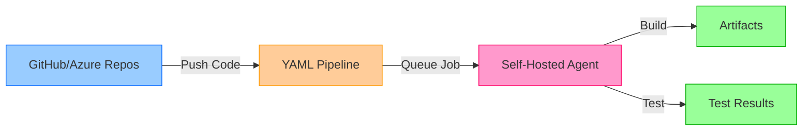

# Configure Agent Pools and Understand Pipeline Styles

## Key Concepts
- YAML pipelines enable CI/CD as code with version control and code review
- Self-hosted agents provide control over compute resources and custom tooling
- Lab focuses on implementing YAML pipelines with self-hosted agents
- Agents run jobs directly on host or in containers
- Hands-on experience bridges theory and practical implementation

## Lab Overview

### Duration
⏱️ **45 minutes** (estimated completion time)

### Scenario

Modern DevOps practices emphasize **infrastructure as code** and **CI/CD as code**. YAML-based pipelines allow you to:
- Store pipeline definitions alongside application code
- Version control pipeline changes
- Apply code review processes to pipeline modifications
- Reuse pipeline templates across projects
- Maintain pipeline history with full audit trail

This lab provides hands-on experience implementing self-hosted agents and YAML pipelines in Azure DevOps.

## Lab Objectives

By completing this lab, you'll be able to:

| Objective | Skills Gained | Real-World Application |
|-----------|---------------|------------------------|
| **Implement YAML pipelines** | • Create azure-pipelines.yml<br>• Define stages, jobs, steps<br>• Configure triggers and pools | Build CI/CD workflows using code-based definitions |
| **Implement self-hosted agents** | • Install agent software<br>• Register with Azure DevOps<br>• Configure agent capabilities | Deploy agents in corporate networks and custom environments |

## Prerequisites

### Required Software

| Tool | Purpose | Installation |
|------|---------|--------------|
| **Microsoft Edge** or [Azure DevOps-supported browser](https://learn.microsoft.com/en-us/azure/devops/server/compatibility) | Access Azure DevOps | Pre-installed on most systems |
| **Azure DevOps Organization** | Host projects and pipelines | [Create organization](https://learn.microsoft.com/en-us/azure/devops/organizations/accounts/create-organization) |
| **Git for Windows** | Version control operations | [Download Git](https://gitforwindows.org/) |
| **Visual Studio Code** | Edit YAML files | [Download VS Code](https://code.visualstudio.com/) |

### Setup Steps

```bash
# 1. Install Git for Windows
# Download from https://gitforwindows.org/
# Follow installation wizard

# 2. Install Visual Studio Code
# Download from https://code.visualstudio.com/
# Install with default options

# 3. Create Azure DevOps organization (if needed)
# Navigate to https://dev.azure.com/
# Click "Start free" → Follow prompts

# 4. Verify installations
git --version
code --version
```

## Lab Exercises

### Exercise 0: Configure Lab Prerequisites

**Tasks**:
1. Create Azure DevOps project
2. Import sample repository
3. Configure project settings
4. Prepare agent machine (VM or local)

**Expected Outcome**: Project ready with sample code for pipeline creation

---

### Exercise 1: Author YAML-Based Azure Pipelines

**Learning Objectives**:
- Create `azure-pipelines.yml` file in repository
- Define build stages (Restore, Build, Test)
- Configure triggers (CI on main branch)
- Specify agent pool requirements

**Example YAML Structure**:

```yaml
# azure-pipelines.yml
trigger:
- main

pool:
  name: 'Default'  # Will configure self-hosted pool in Exercise 2

stages:
- stage: Build
  displayName: 'Build Application'
  jobs:
  - job: BuildJob
    displayName: 'Build and Test'
    steps:
    - task: DotNetCoreCLI@2
      displayName: 'Restore dependencies'
      inputs:
        command: 'restore'
        projects: '**/*.csproj'
    
    - task: DotNetCoreCLI@2
      displayName: 'Build solution'
      inputs:
        command: 'build'
        projects: '**/*.csproj'
        arguments: '--configuration Release'
    
    - task: DotNetCoreCLI@2
      displayName: 'Run unit tests'
      inputs:
        command: 'test'
        projects: '**/*Tests.csproj'
        arguments: '--configuration Release --logger trx'
    
    - task: PublishTestResults@2
      displayName: 'Publish test results'
      inputs:
        testResultsFormat: 'VSTest'
        testResultsFiles: '**/*.trx'
```

**Key Concepts**:
- YAML pipeline stored in repository (version controlled)
- Changes to pipeline go through PR process
- Pipeline runs automatically on commits to main

---

### Exercise 2: Manage Azure DevOps Agent Pools

**Learning Objectives**:
- Create custom agent pool in Azure DevOps
- Download and install agent software
- Register agent with organization
- Configure agent to run as service
- Verify agent connectivity and capabilities

**Step-by-Step Process**:

#### 2.1: Create Agent Pool

```bash
# Navigate to Azure DevOps
1. Organization Settings → Agent Pools
2. Click "Add pool"
3. Pool type: Self-hosted
4. Name: "Lab-SelfHosted-Pool"
5. Grant access to all pipelines: ✓ (for lab purposes)
```

#### 2.2: Install Agent (Windows)

```powershell
# Create agent directory
mkdir C:\agents
cd C:\agents

# Download agent package (version may vary)
Invoke-WebRequest -Uri https://vstsagentpackage.azureedge.net/agent/3.220.5/vsts-agent-win-x64-3.220.5.zip -OutFile agent.zip

# Extract agent
Expand-Archive -Path agent.zip -DestinationPath $PWD

# Configure agent (interactive)
.\config.cmd
```

**Configuration Prompts**:
```
Server URL: https://dev.azure.com/your-org
Authentication type: PAT
Personal access token: <your-PAT>
Agent pool: Lab-SelfHosted-Pool
Agent name: Lab-Agent-01
Work folder: _work
Run agent as service: Y
User account: NT AUTHORITY\NETWORK SERVICE
```

#### 2.3: Install Agent (Linux)

```bash
# Create agent directory
mkdir ~/agents && cd ~/agents

# Download agent package
wget https://vstsagentpackage.azureedge.net/agent/3.220.5/vsts-agent-linux-x64-3.220.5.tar.gz

# Extract agent
tar -xzf vsts-agent-linux-x64-3.220.5.tar.gz

# Configure agent
./config.sh

# Install as systemd service
sudo ./svc.sh install
sudo ./svc.sh start
```

#### 2.4: Update Pipeline to Use Self-Hosted Pool

```yaml
# azure-pipelines.yml - Updated
trigger:
- main

pool:
  name: 'Lab-SelfHosted-Pool'  # Changed from 'Default'

# Rest of pipeline remains the same
stages:
- stage: Build
  jobs:
  - job: BuildJob
    steps:
    # ... steps from Exercise 1
```

#### 2.5: Verify Agent

```bash
# Check agent status in Azure DevOps
Organization Settings → Agent Pools → Lab-SelfHosted-Pool → Agents

# Verify:
✓ Agent Status: Online
✓ Enabled: Yes
✓ Capabilities: Listed (OS, software installed)

# Run pipeline and verify job runs on self-hosted agent
Pipelines → Run pipeline → Check "Agent" in job logs
```

## Lab Outcomes

### What You'll Build



### Skills Demonstrated

| Skill | Practical Knowledge | Production Readiness |
|-------|-------------------|---------------------|
| **YAML Authoring** | Create pipeline definitions | ✅ Ready to write production pipelines |
| **Agent Installation** | Configure self-hosted agents | ✅ Can deploy agents in corporate networks |
| **Pool Management** | Create and secure agent pools | ✅ Understand pool organization strategies |
| **Pipeline Execution** | Trigger and monitor builds | ✅ Can troubleshoot pipeline failures |

## Post-Lab Exploration

### Advanced Topics to Explore

**Multi-stage YAML pipelines**:
```yaml
stages:
- stage: Build
  jobs:
  - job: BuildJob
    steps:
    - script: echo "Building..."

- stage: Test
  dependsOn: Build
  jobs:
  - job: UnitTests
    steps:
    - script: echo "Testing..."

- stage: Deploy
  dependsOn: Test
  condition: and(succeeded(), eq(variables['Build.SourceBranch'], 'refs/heads/main'))
  jobs:
  - deployment: DeployToStaging
    environment: 'Staging'
    strategy:
      runOnce:
        deploy:
          steps:
          - script: echo "Deploying..."
```

**Container jobs** (agents in Docker):
```yaml
pool:
  vmImage: 'ubuntu-latest'

container: node:18

steps:
- script: |
    node --version
    npm --version
```

**Template reuse**:
```yaml
# File: templates/build-template.yml
parameters:
  buildConfiguration: 'Release'

steps:
- task: DotNetCoreCLI@2
  inputs:
    command: 'build'
    arguments: '--configuration ${{ parameters.buildConfiguration }}'

# File: azure-pipelines.yml
steps:
- template: templates/build-template.yml
  parameters:
    buildConfiguration: 'Debug'
```

## Lab Access

🚀 **[Launch Hands-On Lab](https://go.microsoft.com/fwlink/?linkid=2270113)**

**Lab Environment Includes**:
- Pre-configured Azure DevOps project
- Sample application code
- Step-by-step instructions
- Validation checkpoints
- Estimated completion tracking

## Critical Notes

- 🎯 **YAML pipelines are code** - Store in repository, version control, apply code review; treat pipeline definitions as first-class code artifacts
- 💡 **Self-hosted agents for control** - Use when you need custom software, on-premises connectivity, or specific hardware configurations
- ⚠️ **Lab is hands-on practice** - Completing the lab is essential for understanding agent configuration and YAML pipeline authoring
- 📊 **45 minutes estimated** - Budget adequate time; rushing through labs reduces learning effectiveness
- 🔄 **Prerequisites are mandatory** - Git, VS Code, and Azure DevOps organization required; install before starting lab
- ✨ **Skills transfer to production** - Lab exercises mirror real-world agent deployment and pipeline creation workflows

[Learn More](https://learn.microsoft.com/en-us/training/modules/manage-azure-pipeline-agents-pools/11-configure-agent-pools-understand-pipeline-styles)

[🚀 Launch Lab](https://go.microsoft.com/fwlink/?linkid=2270113)
