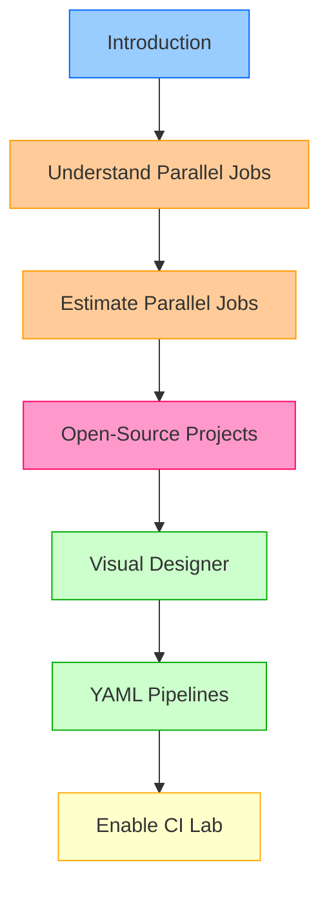

# Introduction

## Module Overview

This module explores **Azure Pipelines concurrency** and **parallel jobs** - critical concepts for managing pipeline resources efficiently. You'll learn how to estimate parallel job needs, understand the differences between Visual Designer and YAML approaches, and enable continuous integration workflows.

## Learning Objectives

By completing this module, you'll be able to:

| Objective | Skills Gained |
|-----------|---------------|
| **Understand and estimate parallel jobs** | Calculate organizational capacity needs, plan for team growth, optimize pipeline throughput |
| **Use Azure Pipelines for open-source and private projects** | Leverage free tier benefits, manage public projects, understand pricing models |
| **Work with Visual Designer** | Create pipelines graphically, use drag-and-drop interface, configure classic pipelines |
| **Create and manage YAML pipelines** | Implement CI/CD as code, version control pipelines, use modern DevOps practices |
| **Enable continuous integration** | Configure PR validation, automate builds on commits, implement CI workflows |

## Prerequisites

### Required Knowledge

- **Basic DevOps concepts**: Understanding of CI/CD principles
- **Version control familiarity**: Experience with Git workflows (helpful)
- **Software development workflows**: Knowledge of build/test/deploy processes (beneficial)

### Optional But Helpful

- Azure DevOps organization (can be created during module)
- GitHub or Azure Repos repository
- Experience with YAML syntax

## Module Structure

### Content Breakdown

| Unit | Topic | Duration | Focus |
|------|-------|----------|-------|
| 1 | Introduction | 1 min | Module overview and objectives |
| 2 | Understand Parallel Jobs | 4 min | How parallel jobs work, consumption model |
| 3 | Estimate Parallel Jobs | 6 min | Free tier, calculation guidelines, usage monitoring |
| 4 | Open-Source Projects | 6 min | Public vs private, free tier benefits |
| 5 | Visual Designer | 4 min | Classic pipelines, GUI-based workflows |
| 6 | YAML Pipelines | 4 min | Infrastructure as code, version control benefits |
| 7 | Enable CI Lab | 45 min | Hands-on PR validation and CI configuration |

**Total**: ~1 hour 10 minutes

## Key Themes

### 1. Concurrency Management

Understanding how Azure Pipelines manages **parallel execution** of jobs:
- Parallel job slots as organizational capacity
- Queue management when capacity is exhausted
- Strategies for optimizing throughput

### 2. Pipeline Authoring Approaches

Two methods for creating pipelines:
- **Visual Designer**: Graphical, beginner-friendly, quick setup
- **YAML**: Code-based, version controlled, modern DevOps standard

### 3. Open-Source Support

Azure Pipelines provides generous free tier for public projects:
- 10 parallel jobs for Microsoft-hosted agents
- Unlimited build minutes for open-source projects
- Community transparency and collaboration

## What You'll Build

By the end of this module, you'll have:

✅ Understanding of parallel job capacity planning  
✅ Knowledge of free tier benefits for open-source projects  
✅ Skills to create pipelines using Visual Designer  
✅ Ability to author YAML-based pipelines  
✅ Hands-on experience with CI/CD workflows  
✅ PR validation and continuous integration implementation

## Real-World Applications

| Scenario | Application | Benefit |
|----------|-------------|---------|
| **Growing Team** | Estimate parallel jobs before bottlenecks occur | Prevent pipeline queues |
| **Open-Source Project** | Use free tier for public repositories | Zero cost CI/CD |
| **Learning Phase** | Start with Visual Designer | Lower barrier to entry |
| **Production Pipelines** | Migrate to YAML for version control | Pipeline as code benefits |
| **PR Workflows** | Implement PR validation | Catch issues before merge |

## Success Criteria

After completing this module, you should be able to:

- [ ] Explain how parallel jobs control pipeline concurrency
- [ ] Calculate parallel job needs for your organization
- [ ] Choose between Visual Designer and YAML approaches
- [ ] Create a basic YAML pipeline with CI triggers
- [ ] Configure PR validation to protect main branch
- [ ] Navigate Azure Pipelines interface confidently

## Critical Notes

- 🎯 **Parallel jobs = organizational capacity** - Shared across all projects; one job slot consumed per running pipeline job
- 💡 **Start with free tier** - 1 parallel job for private projects, 10 for public; monitor usage before purchasing more
- ⚠️ **YAML is recommended for new projects** - Microsoft invests in YAML features; Visual Designer remains for learning/simple scenarios
- 📊 **Open-source gets generous benefits** - 10 parallel jobs + unlimited minutes for public projects; leverage for community projects
- 🔄 **Lab is essential** - 45-minute hands-on exercise cements PR validation and CI concepts; don't skip practical application
- ✨ **Version control pipelines like code** - YAML enables branching, code review, and rollback for pipeline definitions

[Learn More](https://learn.microsoft.com/en-us/training/modules/describe-pipelines-concurrency/1-introduction)
