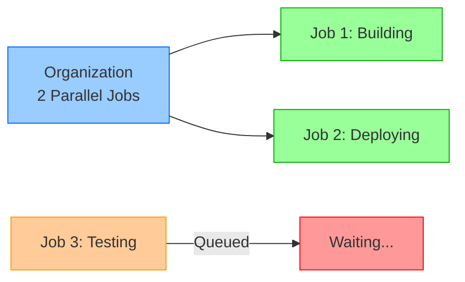
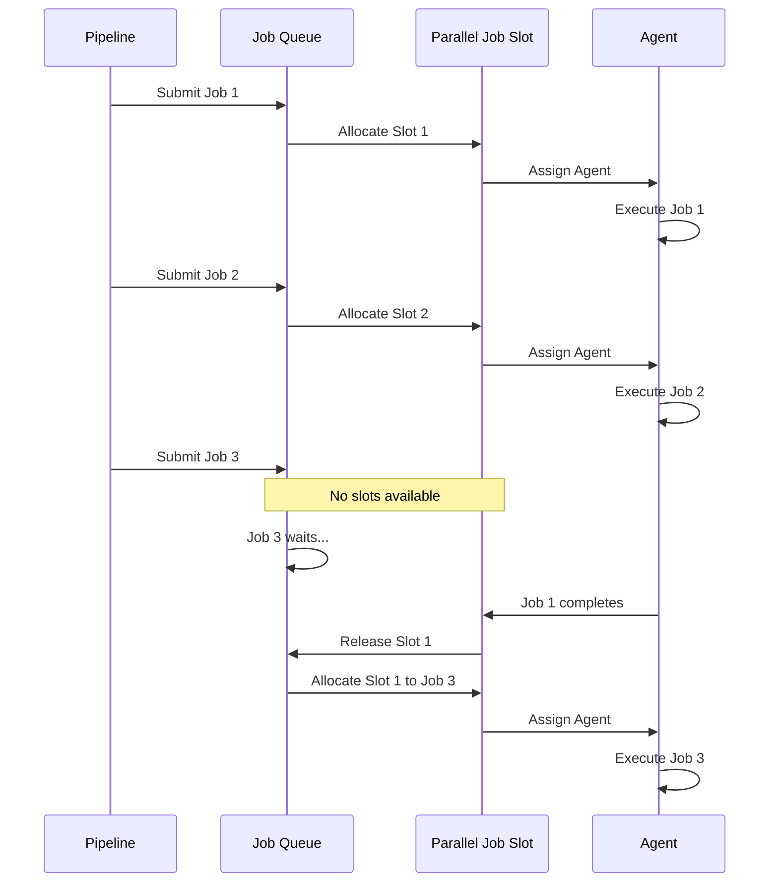
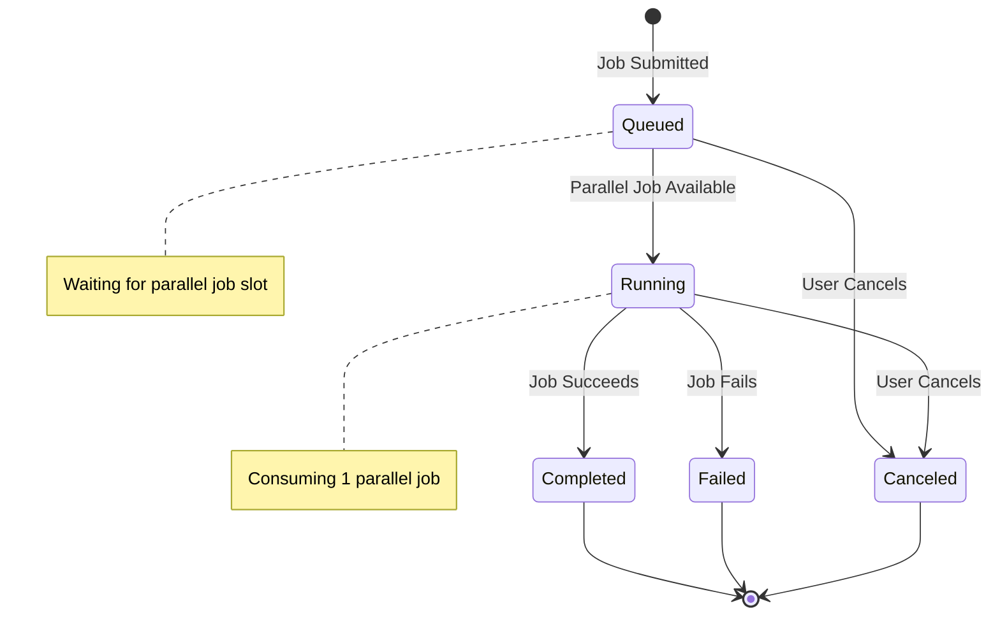

# Understand Parallel Jobs

## Key Concepts
- Parallel jobs represent organizational capacity to run pipeline jobs simultaneously
- Each running job consumes one parallel job slot
- Jobs queue when all parallel job slots are occupied
- Jobs release their slot upon completion, allowing queued jobs to start
- Parallel jobs are shared across entire organization, not per-project

## What Are Parallel Jobs?

**Definition**: Parallel jobs = the number of pipeline jobs your organization can execute **at the same time**.



### Pipeline Jobs vs Parallel Jobs

| Concept | Definition | Example |
|---------|------------|---------|
| **Pipeline Job** | Individual work unit within a pipeline | Build job, Test job, Deploy job |
| **Parallel Job** | Capacity slot to run a pipeline job | Organization has 3 parallel jobs = can run 3 jobs simultaneously |

**Key Distinction**:
- Pipeline jobs = **tasks to perform** (potentially unlimited)
- Parallel jobs = **execution capacity** (limited organizational resource)

## How Parallel Jobs Work

### Basic Flow



### Execution Stages

1. **Job Submission**: Pipeline starts, submits job to queue
2. **Slot Check**: System checks for available parallel job slot
3. **Allocation**: If slot available, job allocated immediately
4. **Queue**: If no slots, job waits in queue (FIFO order)
5. **Execution**: Job runs on assigned agent
6. **Release**: Job completes, slot released for next queued job

## Parallel Job Consumption Example

### Scenario: FabrikamFiber Organization (2 Parallel Jobs)

**Timeline**:

| Time | Event | Parallel Jobs Used | Queued Jobs |
|------|-------|-------------------|-------------|
| 10:00 | Build 102 (main) starts | 1/2 (Build 102) | 0 |
| 10:05 | Release 11 starts | 2/2 (Build 102 + Release 11) | 0 |
| 10:07 | Build 101 (feature) submitted | 2/2 | 1 (Build 101) |
| 10:15 | Release 11 pauses for approval | 1/2 (Build 102) | 0 |
| 10:15 | Build 101 starts immediately | 2/2 (Build 102 + Build 101) | 0 |
| 10:20 | Build 102 completes | 1/2 (Build 101) | 0 |
| 10:22 | Release 11 approved | 1/2 (Build 101) | 1 (Release 11) |
| 10:25 | Build 101 completes | 0/2 | 0 |
| 10:25 | Release 11 resumes | 1/2 (Release 11) | 0 |

### Visual Representation

```mermaid
gantt
    title Parallel Job Consumption Timeline
    dateFormat HH:mm
    axisFormat %H:%M
    
    section Slot 1
    Build 102 (main)     :active, 10:00, 20m
    Build 101 (feature)  :active, 10:15, 10m
    
    section Slot 2
    Release 11           :active, 10:05, 10m
    Approval Wait        :crit, 10:15, 7m
    Release 11 Resume    :active, 10:25, 5m
    
    section Queue
    Build 101 Waiting    :done, 10:07, 8m
    Release 11 Waiting   :done, 10:22, 3m
```



**Key Observations**:
- Build 101 **queued** when both slots occupied (10:07)
- Approval releases parallel job slot (10:15) - Build 101 starts
- Release 11 **re-queues** when approval granted but slots full (10:22)

## Jobs That Don't Consume Parallel Jobs

### Exempt Job Types

| Job Type | Description | Why No Slot Needed |
|----------|-------------|-------------------|
| **Server Jobs** | Agentless jobs running on Azure DevOps server | No agent required, pure orchestration |
| **Deployment Group Jobs** | Target-based deployments | Uses deployment group capacity, not parallel jobs |
| **Approval Gates** | Manual approvals, waiting periods | No compute resources consumed |
| **Delay Tasks** | Wait/sleep operations | No active processing |

**Example: Server Job**

```yaml
jobs:
- job: WaitForApproval
  pool: server  # Server job - no parallel job consumed
  steps:
  - task: ManualValidation@0
    inputs:
      notifyUsers: 'approvers@company.com'
      instructions: 'Please approve deployment to production'
```

## Understanding Job Lifecycle

### State Transitions



**Parallel Job Consumption**:
- ❌ **Not consumed**: Queued, Canceled, Completed, Failed states
- ✅ **Consumed**: Running state only

## Organizational Impact

### Shared Resource Model

```yaml
# Organization: Contoso
# Parallel Jobs: 3
# Projects: 5 (Marketing, Engineering, Sales, Support, Research)

# All projects compete for same 3 parallel jobs:
Marketing Pipeline → Uses 1 slot
Engineering CI → Uses 1 slot  
Engineering CD → Uses 1 slot
Sales Build → Queued (no slots)
Support Tests → Queued (no slots)
```

**Key Points**:
- 🎯 **Organization-level**: Parallel jobs belong to org, not individual projects
- 🎯 **No isolation**: Can't dedicate slots to specific projects or teams
- 🎯 **First-come, first-served**: Jobs queue in order of submission
- 🎯 **Priority unavailable**: All jobs have equal priority in queue

### Capacity Planning

**Indicators you need more parallel jobs**:

| Symptom | Impact | Solution |
|---------|--------|----------|
| **Long queue times** | Developers wait for builds | Purchase additional slots |
| **CI/CD bottlenecks** | Delayed feedback on PRs | Increase capacity |
| **Peak hour congestion** | All jobs queue during work hours | Add parallel jobs |
| **Multi-team competition** | Projects block each other | Scale parallel jobs |

## Critical Notes

- 🎯 **One job = one slot** - Each running pipeline job consumes exactly 1 parallel job, regardless of duration or complexity
- 💡 **Approval gates release slots** - Jobs waiting for manual approval don't hold parallel job capacity; useful for long-running approvals
- ⚠️ **Organization-wide sharing** - All projects compete for same pool; no way to reserve slots for specific teams or critical pipelines
- 📊 **Queue visibility is crucial** - Monitor "View in-progress jobs" to identify bottlenecks and capacity needs
- 🔄 **Server jobs are free** - Agentless/server jobs don't consume parallel jobs; use for orchestration, approvals, and delays
- ✨ **FIFO queue order** - Jobs execute in submission order when slots become available; no priority system exists

[Learn More](https://learn.microsoft.com/en-us/training/modules/describe-pipelines-concurrency/2-understand-parallel-jobs)
