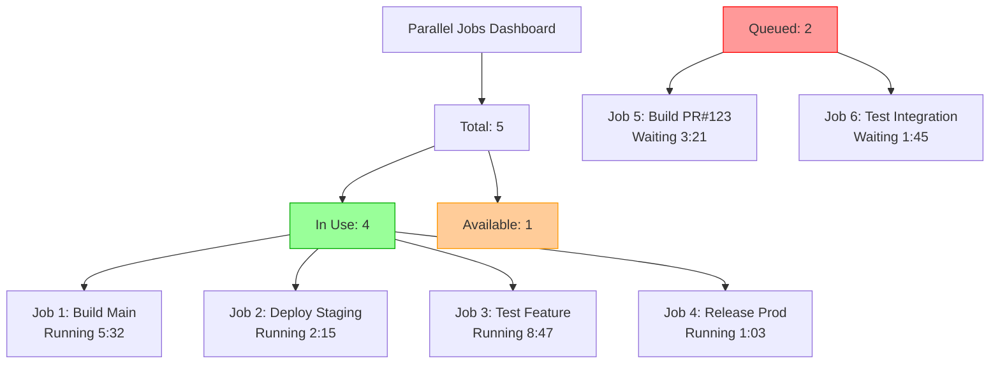
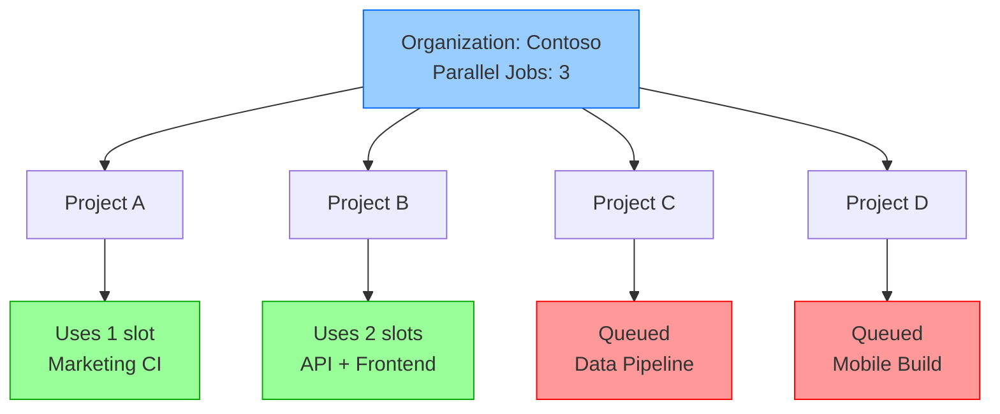
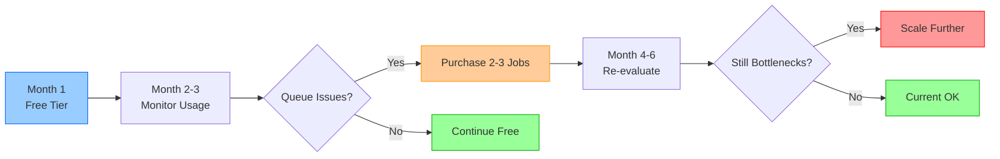

# Estimate Parallel Jobs

## Key Concepts
- Start with free tier to understand usage patterns before purchasing
- Quick estimation: 1 parallel job per 4-5 users
- Free tier provides 1 parallel job (private) or 10 (public) with time limits
- Parallel jobs are organization-level resources, shared across all projects
- Monitor usage through Organization Settings to identify bottlenecks

## Free Tier Allocation

### Default Parallel Jobs

Every Azure DevOps organization receives free parallel jobs with the following limits:

| Project Type | Parallel Jobs | Time Limit Per Job | Monthly Limit | Cost |
|--------------|---------------|-------------------|---------------|------|
| **Private Projects** | 1 | 60 minutes | 1,800 minutes | Free |
| **Public Projects** | 10 | Unlimited | Unlimited | Free |

**Example Calculation** (Private Projects):

```bash
# Free tier private project:
1 parallel job × 60 minutes = 60 minutes per job
1,800 minutes per month / 60 minutes = 30 jobs per month (if each takes full 60 min)

# More realistic scenario (15-minute builds):
1,800 minutes / 15 minutes = 120 builds per month
120 builds / 30 days = 4 builds per day
```

### Free Tier Limitations

**Private Projects**:
- ⚠️ Jobs longer than 60 minutes automatically canceled
- ⚠️ Only 1 job runs at a time (others queue)
- ⚠️ Monthly limit of 1,800 minutes

**When Free Tier Insufficient**:
- Long queue times (multiple jobs waiting)
- Frequent timeout issues (>60 minute builds)
- Monthly limit exhausted before month end
- Multiple teams submitting concurrent builds

## Estimation Guidelines

### Quick Estimate

**Rule of Thumb**: 1 parallel job per 4-5 users

| Team Size | Estimated Parallel Jobs | Rationale |
|-----------|------------------------|-----------|
| 5 users | 1 parallel job | Free tier sufficient |
| 20 users | 4-5 parallel jobs | 1 per 4-5 users |
| 50 users | 10-12 parallel jobs | Account for peak usage |
| 100 users | 20-25 parallel jobs | Multiple teams, many branches |

### Detailed Analysis Factors

**You may need MORE parallel jobs if you have**:

#### 1. Multiple Teams

```yaml
# Scenario: 3 teams, each doing CI
Team A: 10 developers → 2-3 parallel jobs
Team B: 15 developers → 3-4 parallel jobs  
Team C: 8 developers → 2 parallel jobs

# Total estimate: 7-9 parallel jobs
# Peak usage during work hours may require 10-12
```

#### 2. Multiple Branches

```yaml
# Active branches with CI triggers:
main → CI on every commit
develop → CI on every commit
feature/new-api → CI on every commit
feature/ui-redesign → CI on every commit
release/v2.0 → CI on every commit

# 5 active branches = potentially 5 simultaneous builds
# Recommendation: 5-6 parallel jobs minimum
```

#### 3. Multiple Applications

```yaml
# Microservices architecture:
- frontend-app → Separate CI/CD pipeline
- backend-api → Separate CI/CD pipeline  
- mobile-app → Separate CI/CD pipeline
- admin-portal → Separate CI/CD pipeline

# Each app may build simultaneously
# Recommendation: 4-6 parallel jobs
```

#### 4. Complex Workflows

```yaml
# Multi-stage pipeline with parallel stages:
stages:
- stage: BuildAll
  jobs:
  - job: BuildService1  # Parallel job 1
  - job: BuildService2  # Parallel job 2
  - job: BuildService3  # Parallel job 3
  
- stage: TestAll
  dependsOn: BuildAll
  jobs:
  - job: IntegrationTests  # Parallel job 4
  - job: PerformanceTests  # Parallel job 5

# Single pipeline can consume 5 parallel jobs
```

### Calculation Formula

**Comprehensive Estimate**:

```
Parallel Jobs Needed = 
  (Number of Active Developers / 5) +
  (Number of Active Branches × 0.5) +
  (Number of Concurrent Applications × 0.75) +
  (Complex Pipeline Multiplier: 1.2-1.5)
  
Round up to nearest integer
```

**Example**:
```
Company: 30 developers, 6 active branches, 4 applications, moderate complexity

Calculation:
  (30 / 5) + (6 × 0.5) + (4 × 0.75) + (1.3 multiplier)
  = 6 + 3 + 3 + ~2
  = 14 parallel jobs recommended
```

## Monitoring Current Usage

### Check Parallel Job Limits

**Navigate to Organization Settings**:

```bash
# Direct URL:
https://dev.azure.com/{your_organization}/_settings/buildqueue?_a=concurrentJobs

# Or navigate:
Organization Settings → Pipelines → Parallel jobs
```

**What You'll See**:

| View | Information |
|------|-------------|
| **Parallel jobs** | Total allocated (purchased + free) |
| **Microsoft-hosted** | Jobs for Microsoft-hosted agents |
| **Self-hosted** | Jobs for self-hosted agents |
| **In use** | Currently running jobs |
| **Available** | Free slots |

### View In-Progress Jobs

```bash
# Organization Settings → Pipelines → Parallel jobs
# Click "View in-progress jobs"

# Shows:
- Job name
- Pipeline name
- Project
- Agent pool
- Duration
- Queue time (if waiting)
```

**Example Dashboard**:



### Usage Pattern Analysis

**Key Metrics to Track**:

| Metric | What It Tells You | Action Threshold |
|--------|------------------|------------------|
| **Average Queue Time** | Capacity sufficiency | >5 minutes = consider more jobs |
| **Peak Hour Congestion** | Time-of-day bottlenecks | Multiple jobs queued regularly |
| **Job Timeouts** | 60-minute limit issues | Frequent cancellations = optimize or buy more time |
| **Monthly Minute Usage** | Free tier exhaustion | >80% = approaching limit |

## Parallel Jobs as Shared Resource

### Organization-Level Resource



### No Project-Level Partitioning

**Current Reality**:
- ❌ Cannot dedicate parallel jobs to specific projects
- ❌ Cannot reserve capacity for critical pipelines
- ❌ Cannot set project-level quotas
- ✅ All projects share org-wide pool equally

**Example Issue**:
```yaml
# Organization has 3 parallel jobs

# Project A (Low Priority): Runs 3 builds → Uses all 3 slots
# Project B (Production Release): Needs 1 slot → Must wait

# No way to prioritize Project B's production release
```

**Workaround Strategies**:
1. **Time-based scheduling**: Run low-priority builds off-hours
2. **Self-hosted agent pools**: Dedicate specific agents to critical projects
3. **Purchase additional capacity**: Ensure buffer for unexpected needs
4. **Pipeline optimization**: Reduce build times to free slots faster

## Purchasing Additional Parallel Jobs

### When to Purchase

**Indicators**:
- ✅ Free tier consistently exhausted
- ✅ Average queue time >5 minutes
- ✅ Multiple teams competing for capacity
- ✅ Build times slow development velocity
- ✅ Monthly minute limits reached regularly

### Pricing Tiers

| Agent Type | Cost | What You Get |
|------------|------|--------------|
| **Microsoft-hosted** | ~$40/month per parallel job | Pre-configured agents, unlimited minutes |
| **Self-hosted** | ~$15/month per parallel job | Use your own agents, unlimited minutes |

**Example Cost Calculation**:
```
Small Team (5 parallel jobs needed):
- Start with 1 free (private)
- Purchase 4 additional Microsoft-hosted = $160/month

Medium Team (15 parallel jobs needed):
- Start with 1 free
- Purchase 14 self-hosted = $210/month
- Manage own agent infrastructure

Large Team (30 parallel jobs needed):
- Hybrid approach:
  - 10 Microsoft-hosted = $400/month (quick setup)
  - 20 self-hosted = $300/month (custom tooling)
  - Total: $700/month
```

## Best Practices for Capacity Planning

### Start Small, Scale Up



### Optimization Before Scaling

**Before purchasing more jobs, optimize**:

| Optimization | Impact | Effort |
|--------------|--------|--------|
| **Reduce build scope** | Fewer jobs running | Medium |
| **Use caching** | Faster builds = quicker slot release | Low |
| **Combine small jobs** | Reduce total job count | Medium |
| **Schedule non-critical builds** | Off-hours = less contention | Low |
| **Self-hosted agents** | Lower cost per parallel job | High |

## Critical Notes

- 🎯 **Start with free tier** - 1,800 minutes/month for private projects sufficient for small teams; monitor before purchasing
- 💡 **Quick estimate: 1 per 4-5 users** - Baseline rule; adjust for multiple teams, branches, apps, and complex pipelines
- ⚠️ **No project-level isolation** - All projects share org-wide parallel job pool; cannot reserve capacity for critical workflows
- 📊 **Monitor queue times religiously** - Average queue time >5 minutes indicates capacity issues; purchase before productivity suffers
- 🔄 **Public projects get 10 parallel jobs free** - Massive benefit for open-source; leverage for community projects with zero cost
- ✨ **Optimize before scaling** - Use caching, reduce build scope, schedule off-hours builds before purchasing additional capacity

[Learn More](https://learn.microsoft.com/en-us/training/modules/describe-pipelines-concurrency/3-estimate-parallel-jobs)
