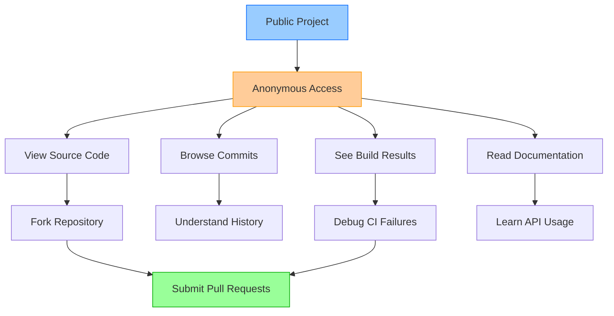

# Describe Azure Pipelines and Open-Source Projects

## Key Concepts
- Public projects enable anonymous read access to encourage community collaboration
- Open-source projects get 10 free parallel jobs with unlimited minutes
- Private projects limited to 1 parallel job with 1,800 minutes/month
- Azure Pipelines has no per-user charges - unlimited users can author pipelines
- Transparency builds trust and enables community contributions

## Public vs Private Projects

### Access Model Comparison

| Feature | Public Projects | Private Projects |
|---------|----------------|------------------|
| **Source Code** | ✅ Anonymous viewing | ❌ Requires authentication |
| **Commits & Branches** | ✅ Public access | ❌ Team members only |
| **Pull Requests** | ✅ Anyone can view | ❌ Authenticated users only |
| **Work Items** | ✅ Read-only public access | ❌ Project access required |
| **Dashboards** | ✅ Publicly visible | ❌ Team members only |
| **Wikis** | ✅ Open documentation | ❌ Restricted access |
| **Build Results** | ✅ **Public visibility** | ❌ Team members only |
| **Code Search** | ✅ Public search | ❌ Authenticated search |

### Public Project Benefits



## Open-Source Collaboration Scenario

### Before Public Projects

**Problem**: Closed build visibility

```yaml
# Popular open-source library: awesome-library
README.md:
  "Build Status: [Build Badge]"
  
# Community member clicks badge:
Result: "Access Denied - You must be a project member"

# Community impact:
- Cannot see why builds fail
- Cannot help fix CI issues
- Contributions blocked by lack of transparency
- Trust issues due to hidden build status
```

**Limitations**:
- ❌ Community can't debug build failures
- ❌ Contributors can't verify their PRs work
- ❌ Learning from CI/CD setup blocked
- ❌ Reduced transparency = lower trust

### With Public Projects

**Solution**: Full transparency

```yaml
# Popular open-source library: awesome-library
README.md:
  "Build Status: [Build Badge] ✅ Passing"
  
# Community member clicks badge:
Result: Full build logs, test results, deployment status

# Community impact:
- See exactly why builds fail → Submit targeted fixes
- Verify PR builds pass before requesting review
- Learn from real-world CI/CD configurations
- Trust through transparency
```

**Benefits**:
- ✅ Community debugs build issues
- ✅ Contributors verify PRs locally
- ✅ Learn modern CI/CD practices
- ✅ Enhanced project health visibility

### Real-World Example

**Scenario**: Node.js Package with Test Failures

```yaml
# Community member "AliceD" browses public project:

1. Views README → Sees build badge showing "Failing"
2. Clicks badge → Opens Azure Pipelines
3. Reviews build logs → Identifies:
   - Test failing on Windows only
   - Path separator issue (/ vs \)
   - Missing dependency on Windows agents

4. Forks repository
5. Fixes path handling:
   # Before:
   const configPath = 'config/settings.json'
   
   # After:
   const path = require('path')
   const configPath = path.join('config', 'settings.json')

6. Submits PR with fix
7. Public build validates fix works on all platforms
8. Maintainer merges PR

# Without public builds: Issue might persist for weeks
# With public builds: Fixed by community in hours
```

## Free Tier Eligibility for Public Projects

### Automatic Benefits

**Qualification Criteria**:
1. Pipeline runs in **Azure DevOps public project**
2. Pipeline builds **public repository** (GitHub or Azure Repos)

**When BOTH criteria met**:

| Resource | Public Projects | Private Projects |
|----------|----------------|------------------|
| **Parallel Jobs** | **10 parallel jobs** | 1 parallel job |
| **Time Limit** | **Unlimited minutes** | 60 minutes per job |
| **Monthly Limit** | **Unlimited** | 1,800 minutes/month |
| **Agent Type** | Microsoft-hosted | Microsoft-hosted |
| **Cost** | **$0** | $0 (free tier) |

### Example Capacity

**Public Project Build Capacity**:

```bash
# 10 parallel jobs = 10 simultaneous builds
# Unlimited minutes = No monthly caps

# Example workload:
PR #1: Build + Test + Deploy → Uses 1 parallel job
PR #2: Build + Test → Uses 1 parallel job  
PR #3: Build + Test → Uses 1 parallel job
Main Branch: CI → Uses 1 parallel job
Release Branch: CD → Uses 1 parallel job
...
PR #10: Build → Uses 1 parallel job

# All 10 run simultaneously
# No queue, no wait time
# No monthly limit concerns
```

**Private Project Limitation**:

```bash
# 1 parallel job = 1 build at a time
# 1,800 minutes/month = ~2.5 hours total

# Same workload:
PR #1: Running (10 minutes)
PR #2-10: Queued (waiting)
Main Branch CI: Queued
Release CD: Queued

# Sequential execution causes delays
# Monthly limit easily exhausted
```

### Pricing Comparison

| Scenario | Public Project | Private Project | Annual Savings |
|----------|----------------|-----------------|----------------|
| **10 Parallel Jobs** | $0 | $4,800/year ($40/mo × 10 × 12) | $4,800 |
| **Unlimited Minutes** | $0 | Included with purchased jobs | Priceless |
| **No Per-User Fees** | $0 | $0 | $0 |

## Common Questions

### User Limits

**Q**: How many users can author pipelines?  
**A**: **Unlimited** - No per-user charges

```yaml
# Organization permissions:
Basic License: Unlimited users (no cost)
  - Create pipelines
  - Edit YAML files
  - Queue builds
  - View results

Stakeholder License: Unlimited users (no cost)
  - View pipelines
  - View build results
  - Cannot author/edit
```

### Pipeline Limits

**Q**: How many pipelines can I create?  
**A**: **Unlimited** - Create as many as needed

```yaml
# No restrictions on:
- Number of build pipelines
- Number of release pipelines  
- Pipeline complexity
- YAML pipeline files

# Only restriction: Parallel job capacity (how many run simultaneously)
```

### Self-Hosted Agents

**Q**: Can I use self-hosted agents for free?  
**A**: **Yes** - Register unlimited self-hosted agents

```yaml
# Self-hosted agents:
Registration: Free (unlimited agents)
Parallel Jobs: Purchase if needed ($15/month per parallel job)

# Example:
- Register 50 self-hosted agents: $0
- Purchase 5 parallel jobs: $75/month
- Result: Can run 5 jobs simultaneously across 50 agents
```

### Visual Studio Enterprise

**Q**: Do VS Enterprise subscribers get benefits?  
**A**: **Yes** - One additional self-hosted parallel job per organization

```yaml
# VS Enterprise Subscription Benefits:
- 1 free self-hosted parallel job (per subscriber)
- Can assign to any organization
- Stacks with purchased parallel jobs

# Example:
Organization with 3 VS Enterprise subscribers:
- 3 free self-hosted parallel jobs
- Purchase 7 more = 10 total parallel jobs
- Cost: 7 × $15 = $105/month (instead of $150)
```

## Making Your Project Public

### Prerequisites

**Before making project public**:

| Consideration | Action |
|--------------|--------|
| **Sensitive Data** | Remove secrets, credentials, API keys |
| **Code Quality** | Ensure code is production-ready or clearly marked WIP |
| **Documentation** | Write clear README, contributing guidelines |
| **License** | Add appropriate open-source license (MIT, Apache, GPL) |
| **Build Configuration** | Verify pipelines don't expose secrets |

### Conversion Process

```yaml
# Azure DevOps: Project Settings

1. Navigate to: Project Settings → Overview
2. Click: "Public" visibility option
3. Confirm: Understanding of public access implications
4. Save: Project becomes publicly accessible

# What changes:
✅ Repository publicly readable
✅ Work items publicly visible
✅ Build results publicly accessible
✅ Wikis publicly readable

# What stays private:
❌ Secrets in Key Vault
❌ Secure files
❌ Service connections (properly configured)
```

### Security Considerations

**Public Project Security**:

```yaml
# Safe:
- Source code visibility
- Build logs (sanitized)
- Test results
- Public documentation

# Requires Protection:
- Secrets → Use Azure Key Vault + Secret Variables
- API Keys → Store in secure variable groups
- Credentials → Never commit to repository
- Service Connections → Configure with restricted access
```

## Critical Notes

- 🎯 **10 parallel jobs for public projects** - Massive benefit worth $4,800/year; make projects public when possible for open-source work
- 💡 **Transparency builds community** - Public build results enable community debugging, learning, and contributions; key for open-source success
- ⚠️ **Sanitize before going public** - Remove all secrets, credentials, and sensitive data before making project public; audit thoroughly
- 📊 **No per-user fees** - Unlimited users can author pipelines regardless of public/private status; team size doesn't affect cost
- 🔄 **Unlimited pipelines** - Create as many build/release pipelines as needed; only parallel job capacity is limited resource
- ✨ **VS Enterprise subscribers get bonus** - One free self-hosted parallel job per subscriber; significant savings for enterprise teams

[Learn More](https://learn.microsoft.com/en-us/training/modules/describe-pipelines-concurrency/4-describe-azure-pipelines-open-source-projects)
