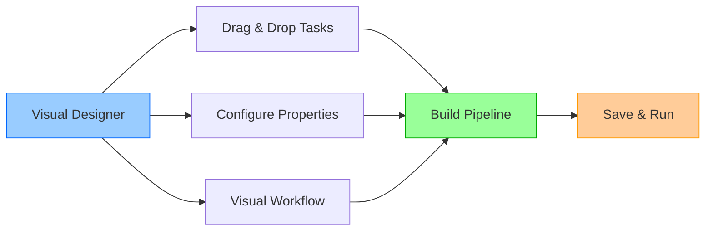
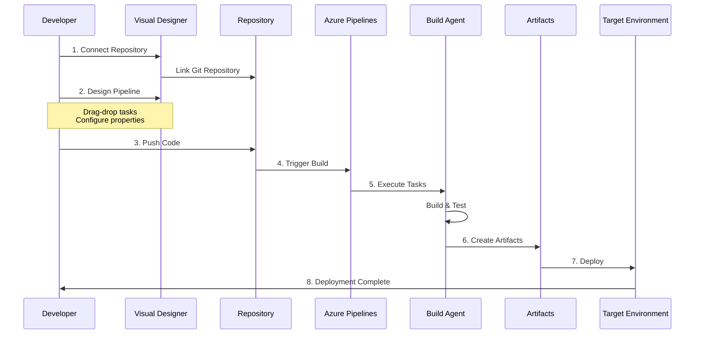
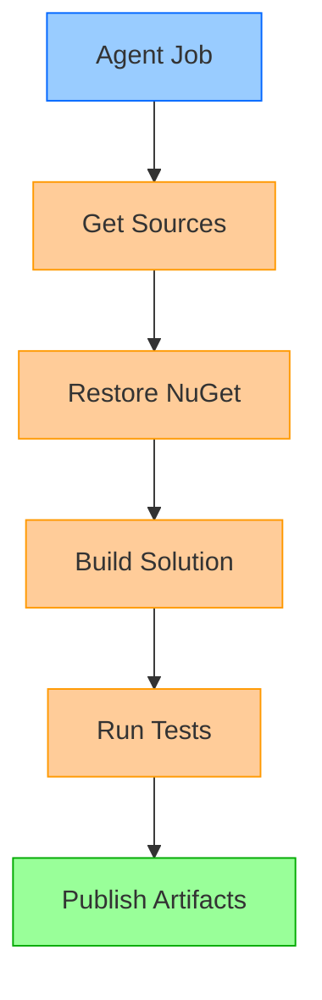
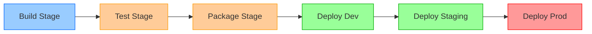
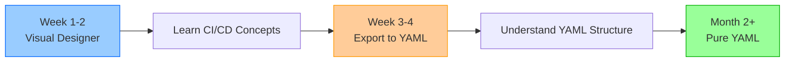

# Explore Azure Pipelines and Visual Designer

## Key Concepts
- Visual Designer (Classic Pipelines) provides graphical, no-code pipeline authoring
- Ideal for beginners and teams learning CI/CD concepts
- Drag-and-drop interface with pre-configured task library
- Microsoft recommends YAML for new projects, but Visual Designer valuable for learning
- Integrated experience between pipeline configuration and monitoring

## What is Visual Designer?

**Azure Pipelines Visual Designer** = Graphical user interface for creating CI/CD pipelines without writing code



**Also Known As**:
- Classic Pipelines
- UI-based Pipelines
- Graphical Pipelines
- Designer Pipelines

## How Visual Designer Works

### Pipeline Creation Workflow



### Step-by-Step Process

| Step | Action | Description |
|------|--------|-------------|
| **1. Connect Repository** | Link to Git source | Azure Repos, GitHub, Bitbucket, external Git |
| **2. Design Pipeline** | Add tasks via UI | Drag-and-drop from task library |
| **3. Trigger Builds** | Automatic or manual | CI triggers on code push |
| **4. Create Artifacts** | Package build outputs | ZIP, NuGet, npm, Docker images |
| **5. Deploy** | Release pipeline | Deliver artifacts to environments |

## Visual Designer Interface

### Task Library

**Pre-configured tasks** organized by category:

| Category | Example Tasks | Use Cases |
|----------|---------------|-----------|
| **Build** | MSBuild, Maven, Gradle, npm | Compile code, resolve dependencies |
| **Test** | VSTest, JUnit, pytest | Run unit/integration tests |
| **Package** | NuGet, npm publish | Create distributable packages |
| **Deploy** | Azure App Service, Kubernetes | Deploy to hosting platforms |
| **Utility** | PowerShell, Bash, Copy Files | Custom scripting, file operations |

### Configuration Panel

**Task configuration** via forms:

```yaml
# Example: Visual Designer Task Configuration

Task: MSBuild
  Properties (GUI Form):
    ┌─────────────────────────────────────┐
    │ Project: **/*.csproj               │
    │ Platform: $(BuildPlatform)          │
    │ Configuration: $(BuildConfiguration)│
    │ MSBuild Arguments: /p:DeployOn Build=true │
    │ Clean: ☑ Enabled                    │
    └─────────────────────────────────────┘

# No YAML required - all configuration via forms
```

### Visual Workflow

**Pipeline represented graphically**:



## Visual Designer Benefits

### 1. Easy for Beginners

**No coding required**:

| Learning Curve | Visual Designer | YAML Pipelines |
|----------------|----------------|----------------|
| **Day 1** | Create working pipeline | Learn YAML syntax |
| **Week 1** | Configure multiple tasks | Understand indentation rules |
| **Month 1** | Build complex workflows | Master schema, conditionals |

**Example**: First Pipeline in 10 Minutes

```
1. Click "New Pipeline" (30 seconds)
2. Select repository (30 seconds)
3. Choose template "ASP.NET" (1 minute)
4. Visual Designer opens with pre-configured tasks (instant)
5. Click "Save & Queue" (30 seconds)
6. Pipeline runs successfully (7-8 minutes)

Total: 10 minutes to first successful build
```

### 2. Visual Pipeline Representation

**See workflow at a glance**:



**Benefits**:
- ✅ Understand pipeline structure instantly
- ✅ Identify dependencies visually
- ✅ Spot missing steps easily
- ✅ Communicate workflows to stakeholders

### 3. Integrated Experience

**Seamless navigation** between design and monitoring:

```yaml
# Designer View → Run View → Designer View
# All in same interface

Click "Edit Pipeline" → Visual Designer opens
Click "View Run" → Build results appear
Click "Tasks" → See executed tasks
Click "Edit" → Back to Visual Designer

# No context switching between tools
```

### 4. Built-in Task Library

**300+ pre-configured tasks**:

```yaml
# Popular tasks with smart defaults:

✅ "Build .NET Core" task:
   - Automatically finds *.csproj files
   - Sets output directory
   - Configures build configuration

✅ "Publish Test Results" task:
   - Detects test result format
   - Uploads to Azure DevOps
   - Displays in Test tab

✅ "Deploy Azure App Service" task:
   - Authenticates with Azure
   - Uploads application
   - Handles slot swaps
```

### 5. Quick Setup

**Template-based creation**:

| Template | Pre-configured Tasks | Time to Working Pipeline |
|----------|---------------------|-------------------------|
| **ASP.NET** | Build, Test, Publish | 2-3 minutes |
| **Node.js** | npm install, test, build | 2-3 minutes |
| **Python** | pip install, pytest | 2-3 minutes |
| **Docker** | Build, tag, push image | 3-4 minutes |
| **Azure Functions** | Build, package, deploy | 3-4 minutes |

## When to Use Visual Designer

### Ideal Scenarios

```mermaid
decision
    graph TD
        A{Who are you?} -->|New to CI/CD| B[✅ Visual Designer]
        A -->|Experienced DevOps| C{What do you need?}
        
        C -->|Quick prototype| B
        C -->|Production pipeline| D[YAML Pipelines]
        
        B --> E[Learn concepts visually]
        D --> F[Version control, templates]
        
        style B fill:#9f9,stroke:#0a0
        style D fill:#9cf,stroke:#06f
```

**Choose Visual Designer if**:

| Situation | Reason | Example |
|-----------|--------|---------|
| **New to Azure Pipelines** | Visual learning, no YAML knowledge required | First CI/CD project |
| **Prefer GUI** | Point-and-click over code editing | Non-developer admins |
| **Quick Setup** | Need pipeline running in minutes | Proof of concept |
| **Simple Workflows** | Straightforward build → test → deploy | Single-project builds |
| **Learning Phase** | Understand CI/CD before YAML | Training scenarios |

### When to Avoid Visual Designer

**Limitations compared to YAML**:

| Limitation | Impact | YAML Alternative |
|------------|--------|------------------|
| **No version control** | Pipeline changes not tracked in Git | YAML stored with code |
| **No branching strategy** | Same pipeline for all branches | Branch-specific YAML |
| **No code review** | Changes bypass PR process | YAML reviewed in PRs |
| **Limited reuse** | Hard to share across projects | YAML templates |
| **Less flexibility** | GUI constraints | Full YAML schema |

**Microsoft's Recommendation**:

> **Note**: Microsoft recommends YAML pipelines for new projects due to version control benefits and modern DevOps practices. However, Visual Designer remains valuable for learning and simpler scenarios.

## Migrating from Visual Designer to YAML

### Export to YAML

```yaml
# Visual Designer pipeline can export to YAML:

1. Open Classic Pipeline
2. Click "..." (More actions)
3. Select "Export to YAML"
4. YAML file generated with equivalent configuration

# Example output:
trigger:
- main

pool:
  vmImage: 'windows-latest'

steps:
- task: NuGetToolInstaller@1
- task: NuGetCommand@2
  inputs:
    restoreSolution: '**/*.sln'
- task: VSBuild@1
  inputs:
    solution: '**/*.sln'
    msbuildArgs: '/p:DeployOnBuild=true'
    platform: '$(BuildPlatform)'
    configuration: '$(BuildConfiguration)'
```

### Hybrid Approach

**Strategy**: Start with Visual Designer, migrate to YAML



## Example: Building ASP.NET with Visual Designer

### Visual Designer Configuration

**Steps in GUI**:

1. **Get Sources**: Automatically configured
2. **Restore NuGet**: Add "NuGet restore" task
3. **Build**: Add "Visual Studio Build" task
   - Solution: `**/*.sln`
   - Platform: `$(BuildPlatform)`
   - Configuration: `$(BuildConfiguration)`
4. **Test**: Add "Visual Studio Test" task
   - Test assembly: `**/*test*.dll`
5. **Publish**: Add "Publish Build Artifacts" task
   - Path to publish: `$(Build.ArtifactStagingDirectory)`

**Total Time**: 5-10 minutes (point and click)

### Equivalent YAML

```yaml
trigger:
- main

pool:
  vmImage: 'windows-latest'

variables:
  BuildPlatform: 'Any CPU'
  BuildConfiguration: 'Release'

steps:
- task: NuGetToolInstaller@1

- task: NuGetCommand@2
  displayName: 'Restore NuGet packages'
  inputs:
    restoreSolution: '**/*.sln'

- task: VSBuild@1
  displayName: 'Build solution'
  inputs:
    solution: '**/*.sln'
    msbuildArgs: '/p:DeployOnBuild=true /p:WebPublishMethod=Package'
    platform: '$(BuildPlatform)'
    configuration: '$(BuildConfiguration)'

- task: VSTest@2
  displayName: 'Run tests'
  inputs:
    testAssemblyVer2: '**/*test*.dll'
    platform: '$(BuildPlatform)'
    configuration: '$(BuildConfiguration)'

- task: PublishBuildArtifacts@1
  displayName: 'Publish artifacts'
  inputs:
    PathtoPublish: '$(Build.ArtifactStagingDirectory)'
    ArtifactName: 'drop'
```

**Learning Time**: 1-2 hours (learn YAML syntax)

## Critical Notes

- 🎯 **Perfect for beginners** - Visual Designer enables first successful pipeline in minutes without learning YAML syntax
- 💡 **No version control** - Pipeline definition not stored in repository; changes don't go through code review process
- ⚠️ **Microsoft recommends YAML** - New projects should use YAML for version control, branching, and modern DevOps practices
- 📊 **Export to YAML available** - Use Visual Designer to learn, then export to YAML for production pipelines
- 🔄 **Integrated experience** - Same interface for design and monitoring; easy switching between configuration and results
- ✨ **Use for learning, migrate to YAML** - Start with Visual Designer to understand concepts, transition to YAML for scalability

[Learn More](https://learn.microsoft.com/en-us/training/modules/describe-pipelines-concurrency/5-explore-azure-pipelines-visual-designer)
