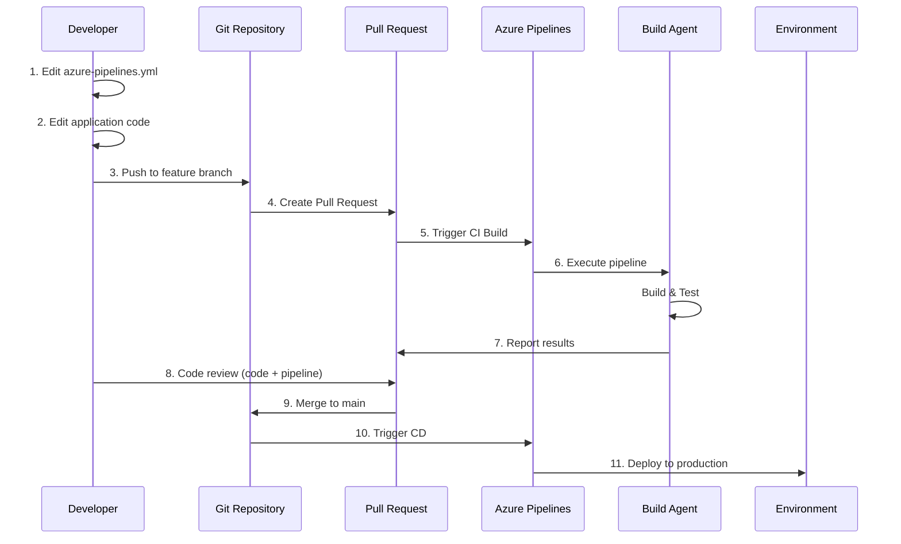
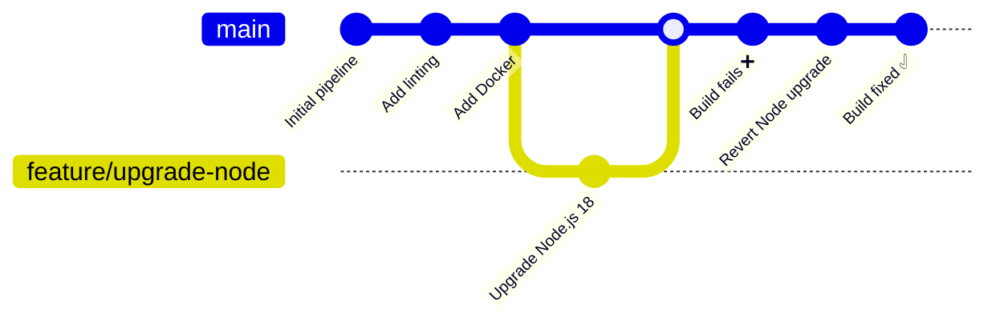
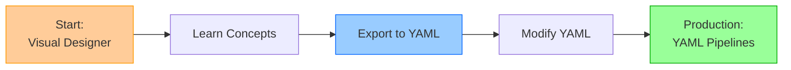
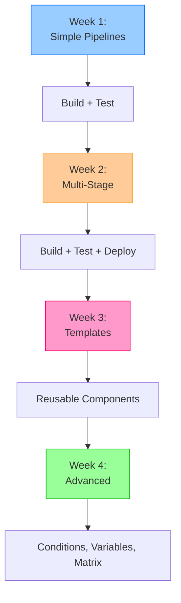

# Describe Azure Pipelines and YAML

## Key Concepts
- YAML pipelines represent "infrastructure as code" for CI/CD workflows
- Pipeline definitions stored in repository alongside application code
- Version control enables branching, code review, and rollback for pipelines
- Microsoft recommends YAML for new projects due to modern DevOps benefits
- Steeper learning curve but offers superior power and flexibility

## What is YAML?

**YAML** = **Y**AML **A**in't **M**arkup **L**anguage

Human-readable data serialization format used to define Azure Pipelines configuration.

```yaml
# Example: Simple YAML Pipeline
trigger:
- main

pool:
  vmImage: 'ubuntu-latest'

steps:
- script: echo "Hello, World!"
  displayName: 'Run greeting'
```

**Key Characteristics**:
- Text-based configuration
- Indentation-sensitive (uses spaces, not tabs)
- Hierarchical structure (parent-child relationships)
- Stored as `azure-pipelines.yml` in repository root

## Why Use YAML?

### Problem: Manual UI Configuration at Scale

**Microservices Challenge**:

```yaml
# Company with 50 microservices

Traditional Approach (Visual Designer):
  Service 1: Click through UI to create pipeline (15 minutes)
  Service 2: Click through UI to create pipeline (15 minutes)
  Service 3: Click through UI to create pipeline (15 minutes)
  ...
  Service 50: Click through UI to create pipeline (15 minutes)

Total Time: 750 minutes (12.5 hours)
Issues:
  ❌ Tedious and error-prone
  ❌ Inconsistent configurations
  ❌ Hard to update all 50 pipelines
  ❌ No audit trail of changes
```

### Solution: YAML Templates

```yaml
# YAML Approach

# File: templates/microservice-pipeline.yml (ONE TEMPLATE)
parameters:
  serviceName: ''

trigger:
- main

pool:
  vmImage: 'ubuntu-latest'

steps:
- script: npm install
- script: npm test
- script: npm run build
- task: Docker@2
  inputs:
    repository: '${{ parameters.serviceName }}'
    command: 'buildAndPush'

---

# File: service-1/azure-pipelines.yml
trigger:
- main

extends:
  template: ../templates/microservice-pipeline.yml
  parameters:
    serviceName: 'service-1'

# All 50 services use same template
# Update template → All pipelines updated
# Total Time: 50 minutes (1 min per service to reference template)
```

**Benefits**:
- ✅ **Code reuse**: Share templates across projects
- ✅ **Consistency**: Identical setups across services
- ✅ **Maintainability**: Update once, apply everywhere
- ✅ **Speed**: Minutes instead of hours

## How YAML Pipelines Work

### Workflow



### File Location

```bash
# Standard location:
project-root/
├── azure-pipelines.yml          # Main pipeline definition
├── src/
│   └── app.js
├── tests/
│   └── app.test.js
└── package.json

# Alternative locations:
project-root/
├── .azure-pipelines/
│   ├── ci.yml                   # CI pipeline
│   ├── cd.yml                   # CD pipeline
│   └── templates/
│       └── build-template.yml   # Reusable template
```

## YAML Pipeline Benefits

### 1. Version Control Integration

**Pipeline + Code = Single Source of Truth**

```yaml
# Git commit includes both:

Commit: feat/add-new-endpoint
Files changed:
  M  src/api/users.js              (application code)
  M  tests/users.test.js           (tests)
  M  azure-pipelines.yml           (pipeline)
  
Pipeline changes:
  + - script: npm run lint         (added linting)
  + - script: npm run security-scan (added security)

# Pipeline evolves WITH the application
```

**Benefits**:

| Scenario | Traditional (Visual Designer) | YAML Pipelines |
|----------|------------------------------|----------------|
| **Track Changes** | No history | Full Git history |
| **Code Review** | Pipeline changes unreviewed | PR reviews pipeline + code |
| **Rollback** | Manual reconfiguration | `git revert` |
| **Audit** | Azure DevOps UI only | Git log shows all changes |

### 2. Branch Flexibility

**Each branch customizes its pipeline**:

```yaml
# main branch: azure-pipelines.yml
trigger:
- main

stages:
- stage: Build
- stage: Test
- stage: Deploy_Production  # Production deployment

---

# feature/experiment branch: azure-pipelines.yml
trigger:
- feature/*

stages:
- stage: Build
- stage: Test
- stage: Deploy_Dev  # Only dev deployment
- stage: ExperimentalTests  # Additional testing

# Feature branch tests new pipeline steps safely
# Merge to main only after validation
```

**Use Cases**:

| Branch | Pipeline Customization | Benefit |
|--------|----------------------|---------|
| **Feature Branches** | Skip deployment, add extra tests | Faster feedback |
| **Release Branches** | Add approval gates | Production safety |
| **Hotfix Branches** | Fast-track to production | Emergency fixes |
| **Experiment Branches** | Try new tools, tasks | Safe innovation |

### 3. Better Troubleshooting

**Git history reveals pipeline changes**:

```bash
# Build suddenly fails - when did pipeline change?

$ git log --oneline azure-pipelines.yml

a1b2c3d (HEAD -> main) Fix: Restore Node.js version to 16.x
e4f5g6h Upgrade to Node.js 18.x
i7j8k9l Add Docker build step
m0n1o2p Initial pipeline

# Identify breaking change: e4f5g6h upgraded Node.js
# Root cause: Application incompatible with Node.js 18

$ git revert e4f5g6h  # Rollback pipeline change
# Pipeline now works again
```

**Timeline Tracking**:



### 4. Enhanced Security

**Pipeline configuration reviewed like code**:

```yaml
# Pull Request #123

## Changes:
- Add production deployment step
- Use service connection 'PROD-AZURE'

## Security Review:
Reviewer: "Why does this PR need production access?"
Author: "This is a feature branch, changed by mistake"
Reviewer: "❌ Rejected - Remove production deployment"

# Pipeline security enforced through code review
```

**Branch Policies Protect Production**:

```yaml
# main branch protection:
✅ Require PR approval before merge
✅ Require build validation
✅ Require code review
✅ Restrict who can approve

# Prevents:
❌ Direct commits to main (including pipeline changes)
❌ Unreviewed pipeline modifications
❌ Accidental production deployments
```

### 5. Collaboration

**Team members contribute pipeline improvements**:

```yaml
# Developer submits PR to improve pipeline:

# Before:
steps:
- script: npm test

# After (PR #456):
steps:
- script: npm test
- task: PublishTestResults@2  # Added
  inputs:
    testResultsFiles: '**/test-results.xml'
- task: PublishCodeCoverageResults@1  # Added
  inputs:
    codeCoverageTool: 'Cobertura'

# PR discussion:
Reviewer: "Great addition! Can you also add code coverage threshold?"
Author: "Done! Added 80% threshold"
Reviewer: "✅ Approved"

# Entire team benefits from improved pipeline
```

## YAML vs Visual Designer

### Comparison Matrix

| Feature | YAML Pipelines | Visual Designer |
|---------|---------------|----------------|
| **Learning Curve** | Steeper (learn syntax) | Easy (point-and-click) |
| **Version Control** | ✅ Yes (in Git) | ❌ No (in Azure DevOps) |
| **Code Review** | ✅ Yes (PR process) | ❌ No (direct edits) |
| **Branching** | ✅ Per-branch customization | ❌ Same for all branches |
| **Templates** | ✅ Reusable, shareable | ⚠️ Limited |
| **Flexibility** | ✅ Full schema access | ⚠️ GUI limitations |
| **Rollback** | ✅ Git revert | ⚠️ Manual |
| **Audit Trail** | ✅ Git history | ⚠️ Azure DevOps only |
| **Recommended** | ✅ Yes (Microsoft) | ⚠️ Learning only |

### Migration Path



## Getting Started with YAML

### Basic Structure

```yaml
# Minimal YAML pipeline

trigger:              # When to run
- main

pool:                 # Where to run
  vmImage: 'ubuntu-latest'

steps:                # What to run
- script: echo "Hello, World!"
  displayName: 'Greeting'
```

### Multi-Stage Pipeline

```yaml
# Production-ready structure

trigger:
- main

pool:
  vmImage: 'ubuntu-latest'

stages:
- stage: Build
  jobs:
  - job: BuildJob
    steps:
    - script: npm install
    - script: npm run build
    - publish: $(System.DefaultWorkingDirectory)/dist
      artifact: WebApp

- stage: Test
  dependsOn: Build
  jobs:
  - job: TestJob
    steps:
    - download: current
      artifact: WebApp
    - script: npm test

- stage: Deploy
  dependsOn: Test
  condition: and(succeeded(), eq(variables['Build.SourceBranch'], 'refs/heads/main'))
  jobs:
  - deployment: DeployJob
    environment: 'Production'
    strategy:
      runOnce:
        deploy:
          steps:
          - script: echo "Deploying to production"
```

### Template Example

```yaml
# File: templates/build.yml
parameters:
  buildConfiguration: 'Release'

steps:
- script: dotnet restore
- script: dotnet build --configuration ${{ parameters.buildConfiguration }}
- script: dotnet test

---

# File: azure-pipelines.yml
trigger:
- main

stages:
- stage: Build
  jobs:
  - job: BuildJob
    steps:
    - template: templates/build.yml
      parameters:
        buildConfiguration: 'Release'
```

## Learning Resources

### Microsoft Documentation

| Resource | Focus | Link |
|----------|-------|------|
| **YAML Schema** | Complete reference | [aka.ms/yaml-schema](https://aka.ms/yaml-schema) |
| **Pipeline Samples** | Real-world examples | [Azure Pipelines YAML samples](https://learn.microsoft.com/en-us/azure/devops/pipelines/yaml-schema) |
| **Task Reference** | Built-in tasks | [Task reference](https://learn.microsoft.com/en-us/azure/devops/pipelines/tasks/) |

### Practice Strategy



## Critical Notes

- 🎯 **YAML = Infrastructure as Code for CI/CD** - Pipeline definitions version controlled, reviewed, and evolved alongside application code
- 💡 **Microsoft recommends YAML for new projects** - Active feature development, modern DevOps practices, version control benefits outweigh learning curve
- ⚠️ **Steeper learning curve** - Syntax, indentation, schema knowledge required; budget 1-2 weeks for proficiency
- 📊 **Templates enable massive scale** - Single template shared across dozens of services; update once, apply everywhere
- 🔄 **Each branch can customize pipeline** - Feature branches test new pipeline steps safely; merge to main only after validation
- ✨ **Git history reveals pipeline changes** - Troubleshoot issues by reviewing pipeline modifications; rollback with `git revert`

[Learn More](https://learn.microsoft.com/en-us/training/modules/describe-pipelines-concurrency/6-describe-azure-pipelines-yaml)
