# Enable Continuous Integration with Azure Pipelines

## Key Concepts
- Continuous Integration (CI) automates build and test on every code change
- PR validation prevents broken code from merging to main branch
- YAML pipelines implement CI as code with version control
- Lab provides hands-on experience with real-world CI workflows
- 45-minute exercise covers PR validation and CI pipeline configuration

## Lab Overview

### Duration
⏱️ **45 minutes** (estimated completion time)

### Scenario

Learn to define **build pipelines in Azure DevOps using YAML** in two critical scenarios:


## Lab Objectives

By completing this lab, you'll be able to:

| Objective | Skills Gained | Real-World Application |
|-----------|---------------|------------------------|
| **Include build validation as part of PR** | Configure branch policies, validate before merge | Protect main branch from broken code |
| **Configure CI pipeline as code with YAML** | Author azure-pipelines.yml, define triggers | Automate builds on every commit |

## Prerequisites

### Required Tools

| Tool | Purpose | Installation |
|------|---------|--------------|
| **Microsoft Edge** or [Azure DevOps-supported browser](https://learn.microsoft.com/en-us/azure/devops/server/compatibility) | Access Azure DevOps portal | Pre-installed on most systems |
| **Azure DevOps Organization** | Host projects and pipelines | [Create organization](https://learn.microsoft.com/en-us/azure/devops/organizations/accounts/create-organization) |

### Setup Checklist

```bash
# Pre-lab setup:
☐ Azure DevOps organization created
☐ Browser tested and working
☐ Account has project creation permissions
☐ Estimated 45 minutes available
```

## Lab Exercises

### Exercise 0: Configure Lab Prerequisites

**Objective**: Prepare Azure DevOps environment

**Tasks**:
1. Create new Azure DevOps project
2. Import sample repository
3. Verify permissions
4. Review project structure

**Expected Outcome**: Project ready with sample code for CI configuration

---

### Exercise 1: Include Build Validation as Part of PR

**Objective**: Prevent broken code from reaching main branch

#### What is PR Validation?

**PR Validation** = Automatic build triggered when pull request created

```mermaid
sequenceDiagram
    participant Dev as Developer
    participant Feature as Feature Branch
    participant PR as Pull Request
    participant Pipeline as CI Pipeline
    participant Main as Main Branch
    
    Dev->>Feature: 1. Make changes
    Dev->>PR: 2. Create PR to main
    PR->>Pipeline: 3. Trigger build
    
    alt Build Passes ✅
        Pipeline->>PR: 4. Report success
        Dev->>Main: 5. Merge allowed
    else Build Fails ❌
        Pipeline->>PR: 4. Report failure
        Note over PR,Main: Merge BLOCKED
        Dev->>Feature: 5. Fix issues
        Dev->>PR: 6. Update PR
        PR->>Pipeline: 7. Re-trigger build
    end
```



#### Configuration Steps

**1. Create Build Pipeline**

```yaml
# File: azure-pipelines.yml

trigger:
- main
- develop

pool:
  vmImage: 'ubuntu-latest'

steps:
- script: npm install
  displayName: 'Install dependencies'

- script: npm run lint
  displayName: 'Run linting'

- script: npm test
  displayName: 'Run tests'

- script: npm run build
  displayName: 'Build application'
```

**2. Configure Branch Policy**

```yaml
# Navigate to: Repos → Branches → main → Branch policies

Branch Protection Settings:
  ☑ Require a minimum number of reviewers: 1
  ☑ Check for linked work items
  ☑ Check for comment resolution
  ☑ Build Validation:
    ├─ Build pipeline: azure-pipelines.yml
    ├─ Trigger: Automatic
    ├─ Policy requirement: Required
    └─ Display name: "PR Build Validation"
```

**3. Test PR Validation**

```bash
# Create feature branch
git checkout -b feature/add-login
echo "// New feature" >> login.js
git add login.js
git commit -m "Add login feature"
git push origin feature/add-login

# Create PR in Azure DevOps
# Pipeline automatically triggers
# PR shows build status

# If build fails:
# ❌ "1 policy failure" → Cannot merge
# Fix issues → Push again → Build re-runs

# If build passes:
# ✅ "All policies passed" → Can merge
```

#### Benefits of PR Validation

| Benefit | Description | Impact |
|---------|-------------|--------|
| **Early Detection** | Catch bugs before merge | Prevent broken main branch |
| **Quality Gate** | Enforce code standards | Maintain code quality |
| **Confidence** | Know code works before merge | Reduce production incidents |
| **Team Coordination** | Automated checks, no manual testing | Faster code review |

---

### Exercise 2: Configure CI Pipeline as Code with YAML

**Objective**: Automate builds on every commit to main

#### What is Continuous Integration?

**Continuous Integration (CI)** = Automated build + test on every code change


#### CI Pipeline Configuration

**Complete YAML Example**:

```yaml
# File: azure-pipelines.yml

trigger:
  branches:
    include:
    - main
    - develop
    - release/*

pr:
  branches:
    include:
    - main

pool:
  vmImage: 'ubuntu-latest'

variables:
  buildConfiguration: 'Release'
  npm_config_cache: $(Pipeline.Workspace)/.npm

stages:
- stage: Build
  displayName: 'Build and Test'
  jobs:
  - job: BuildJob
    displayName: 'Build Application'
    steps:
    
    # Cache npm packages
    - task: Cache@2
      inputs:
        key: 'npm | "$(Agent.OS)" | package-lock.json'
        path: $(npm_config_cache)
      displayName: 'Cache npm packages'
    
    # Install dependencies
    - script: npm ci
      displayName: 'Install dependencies'
    
    # Run linting
    - script: npm run lint
      displayName: 'Run ESLint'
    
    # Run tests with coverage
    - script: npm test -- --coverage
      displayName: 'Run unit tests'
    
    # Publish test results
    - task: PublishTestResults@2
      condition: succeededOrFailed()
      inputs:
        testResultsFormat: 'JUnit'
        testResultsFiles: '**/test-results.xml'
        failTaskOnFailedTests: true
      displayName: 'Publish test results'
    
    # Publish code coverage
    - task: PublishCodeCoverageResults@1
      inputs:
        codeCoverageTool: 'Cobertura'
        summaryFileLocation: '$(System.DefaultWorkingDirectory)/coverage/cobertura-coverage.xml'
      displayName: 'Publish code coverage'
    
    # Build application
    - script: npm run build
      displayName: 'Build production bundle'
    
    # Publish artifacts
    - task: PublishBuildArtifacts@1
      inputs:
        PathtoPublish: '$(System.DefaultWorkingDirectory)/dist'
        ArtifactName: 'webapp'
        publishLocation: 'Container'
      displayName: 'Publish build artifacts'

- stage: SecurityScan
  displayName: 'Security Scanning'
  dependsOn: Build
  jobs:
  - job: SecurityJob
    displayName: 'Run Security Checks'
    steps:
    
    - script: npm audit
      displayName: 'Run npm audit'
      continueOnError: true
    
    - script: |
        npm install -g snyk
        snyk test --severity-threshold=high
      displayName: 'Run Snyk security scan'
      env:
        SNYK_TOKEN: $(SNYK_TOKEN)
      continueOnError: true
```

#### Trigger Configuration

**Trigger Types**:

```yaml
# 1. CI Trigger (automatic on push)
trigger:
  branches:
    include:
    - main
    - develop
  paths:
    include:
    - src/*
    - tests/*
    exclude:
    - docs/*

# 2. PR Trigger (validation before merge)
pr:
  branches:
    include:
    - main
  paths:
    exclude:
    - README.md

# 3. Scheduled Trigger (nightly builds)
schedules:
- cron: "0 0 * * *"
  displayName: Nightly build
  branches:
    include:
    - main
  always: true
```

#### Testing CI Pipeline

**Workflow**:

```bash
# 1. Commit to main
git checkout main
echo "// Bug fix" >> app.js
git add app.js
git commit -m "Fix: Resolve login issue"
git push origin main

# 2. CI Pipeline triggers automatically
# Azure Pipelines:
# ► azure-pipelines.yml detected
# ► Build started
# ► Running stages: Build → Test → Security

# 3. Monitor pipeline
# View: Pipelines → Recent runs → Select run
# Watch: Real-time logs, test results, artifacts

# 4. Review results
# ✅ Build succeeded
# ✅ Tests passed: 47/47
# ✅ Coverage: 85%
# ✅ Artifacts published

# 5. Notifications
# Email: "Build succeeded for commit abc123"
# Slack: "Main branch build #42 passed ✅"
```

## Lab Outcomes

### Skills Demonstrated


### Practical Knowledge

| Concept | Before Lab | After Lab |
|---------|-----------|-----------|
| **PR Validation** | "What is it?" | Configure policies, test workflows |
| **CI Triggers** | "How do they work?" | Author YAML triggers, understand paths |
| **Build Stages** | "What are stages?" | Create multi-stage pipelines |
| **Artifacts** | "Why publish?" | Publish and consume artifacts |

## Common Lab Issues

### Troubleshooting

| Issue | Cause | Solution |
|-------|-------|----------|
| **Pipeline not triggering** | Incorrect trigger configuration | Verify trigger branches in YAML |
| **Tests failing** | Missing dependencies | Check `npm install` step |
| **Merge blocked** | Build validation fails | Review build logs, fix errors |
| **Artifacts missing** | Publish step failed | Check artifact paths, permissions |

## Real-World Applications

### Scenario 1: Startup Development Team

```yaml
# Requirements:
- 5 developers
- Single application
- Rapid iteration

# Solution:
trigger:
- main

pool:
  vmImage: 'ubuntu-latest'

steps:
- script: npm install && npm test && npm run build
  displayName: 'Quick CI'

# Benefit: Fast feedback, minimal setup
```

### Scenario 2: Enterprise Application

```yaml
# Requirements:
- 50 developers
- Multiple microservices
- High quality standards

# Solution:
trigger:
- main

pr:
- main

stages:
- stage: Build
- stage: UnitTest
- stage: IntegrationTest
- stage: SecurityScan
- stage: PerformanceTest
- stage: Deploy_QA

# Branch policies:
- Minimum 2 reviewers
- Build validation required
- Work item linking required

# Benefit: High quality gate, comprehensive validation
```

## Lab Access

🚀 **[Launch Hands-On Lab](https://go.microsoft.com/fwlink/?linkid=2270037)**

**Lab Environment Includes**:
- Pre-configured Azure DevOps project
- Sample application code
- Step-by-step instructions
- Validation checkpoints
- Progress tracking

## Post-Lab Next Steps

### Continue Learning


### Enhance Your Pipeline

**Extensions to try**:

1. **Add code coverage threshold**:
   ```yaml
   - script: npm test -- --coverage --coverageThreshold.global.lines=80
     displayName: 'Enforce 80% coverage'
   ```

2. **Integrate Slack notifications**:
   ```yaml
   - task: SlackNotification@1
     inputs:
       SlackApiToken: $(SLACK_TOKEN)
       MessageText: 'Build $(Build.BuildNumber) succeeded!'
   ```

3. **Implement matrix builds**:
   ```yaml
   strategy:
     matrix:
       Node14:
         node_version: '14.x'
       Node16:
         node_version: '16.x'
       Node18:
         node_version: '18.x'
   ```

## Critical Notes

- 🎯 **PR validation prevents broken main** - Configure branch policies to require successful build before merge; catches bugs early
- 💡 **CI automates build on every commit** - YAML triggers enable automatic builds on push to main; no manual intervention required
- ⚠️ **Lab is essential** - 45-minute hands-on exercise cements concepts; don't skip practical application of theory
- 📊 **Two scenarios cover real workflows** - PR validation (before merge) + CI (after merge) = complete development cycle
- 🔄 **YAML enables version control** - Pipeline definition stored with code; changes reviewed through PR process
- ✨ **Build status visible to team** - Test results, coverage, artifacts all published; team knows build health at a glance

[Learn More](https://learn.microsoft.com/en-us/training/modules/describe-pipelines-concurrency/7-enable-continuous-integration-azure-pipelines)

[🚀 Launch Lab](https://go.microsoft.com/fwlink/?linkid=2270037)
