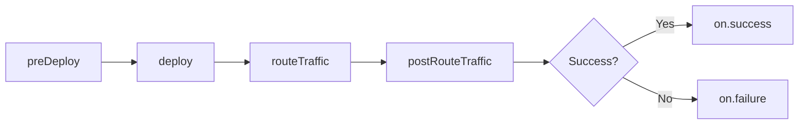

# Understand Pipeline Structure

## Key Concepts

Azure Pipelines support multi-stage workflows that organize jobs into logical phases (build, test, deploy). Stages provide approval gates, environment isolation, and deployment strategies for complex release processes.

### Pipeline Hierarchy

```
Pipeline
└── Stages (logical boundaries for approvals/gates)
    └── Jobs (units of work running on agents)
        └── Steps (individual tasks/scripts)
```

### Stage vs Job vs Step

| Level | Purpose | Runs On | Parallelism | Use Case |
|-------|---------|---------|-------------|----------|
| **Stage** | Logical phase | N/A (organizes jobs) | Sequential (default) | Build → Test → Deploy |
| **Job** | Unit of work | Single agent | Parallel (default) | Platform matrix, test suites |
| **Step** | Single task | Within job | Sequential only | Commands, tasks, scripts |

## Multi-Stage Pipeline Structure

### Basic Multi-Stage Pipeline

```yaml
stages:
- stage: Build
  displayName: 'Build Stage'
  jobs:
  - job: BuildJob
    pool:
      vmImage: 'ubuntu-latest'
    steps:
    - script: echo Building application
      displayName: 'Build'
    - script: echo Running unit tests
      displayName: 'Test'

- stage: Deploy
  displayName: 'Deploy Stage'
  dependsOn: Build  # Wait for Build stage
  jobs:
  - job: DeployJob
    pool:
      vmImage: 'ubuntu-latest'
    steps:
    - script: echo Deploying application
      displayName: 'Deploy'
```

### Stages with Dependencies

#### Sequential Stages

```yaml
stages:
- stage: Build
  jobs:
  - job: Compile
    steps:
    - script: dotnet build

- stage: Test
  dependsOn: Build  # Wait for Build
  jobs:
  - job: UnitTest
    steps:
    - script: dotnet test

- stage: Deploy
  dependsOn: Test  # Wait for Test
  jobs:
  - job: Production
    steps:
    - script: echo Deploying
```

**Flow**: Build → Test → Deploy (linear)

#### Parallel Stages

```yaml
stages:
- stage: Build
  jobs:
  - job: Compile
    steps:
    - script: dotnet build

- stage: TestLinux
  dependsOn: Build
  jobs:
  - job: LinuxTests
    pool:
      vmImage: 'ubuntu-latest'
    steps:
    - script: dotnet test

- stage: TestWindows
  dependsOn: Build
  jobs:
  - job: WindowsTests
    pool:
      vmImage: 'windows-latest'
    steps:
    - script: dotnet test

- stage: Deploy
  dependsOn:  # Fan-in: wait for both test stages
  - TestLinux
  - TestWindows
  jobs:
  - job: Production
    steps:
    - script: echo Deploying
```

**Flow**: Build → (TestLinux + TestWindows) → Deploy

### Conditional Stages

```yaml
stages:
- stage: Build
  jobs:
  - job: BuildApp
    steps:
    - script: dotnet build

- stage: DeployDev
  dependsOn: Build
  condition: eq(variables['Build.SourceBranch'], 'refs/heads/develop')
  jobs:
  - job: DevDeploy
    steps:
    - script: echo Deploy to Dev

- stage: DeployProd
  dependsOn: Build
  condition: eq(variables['Build.SourceBranch'], 'refs/heads/main')
  jobs:
  - job: ProdDeploy
    steps:
    - script: echo Deploy to Production
```

## Deployment Jobs

Deployment jobs are specialized jobs that deploy to environments and support deployment strategies with lifecycle hooks.

### Deployment Job Structure

```yaml
stages:
- stage: Deploy
  jobs:
  - deployment: DeployWeb
    displayName: 'Deploy Web Application'
    pool:
      vmImage: 'ubuntu-latest'
    environment: 'production'  # Links to environment for history/approvals
    strategy:
      runOnce:  # Deployment strategy
        deploy:
          steps:
          - script: echo Deploying application
```

### Deployment Strategies

#### 1. RunOnce Strategy

Simplest strategy: execute steps once.

```yaml
- deployment: DeployApp
  environment: 'production'
  strategy:
    runOnce:
      preDeploy:
        steps:
        - script: echo Pre-deployment validation
      deploy:
        steps:
        - script: echo Deploying application
        - script: kubectl apply -f deployment.yaml
      routeTraffic:
        steps:
        - script: echo Routing traffic to new version
      postRouteTraffic:
        steps:
        - script: echo Running smoke tests
      on:
        failure:
          steps:
          - script: echo Deployment failed, alerting team
        success:
          steps:
          - script: echo Deployment successful
```

#### 2. Rolling Strategy

Deploy to targets incrementally.

```yaml
- deployment: DeployApp
  environment: 'production'
  strategy:
    rolling:
      maxParallel: 2  # Deploy to 2 targets at a time
      preDeploy:
        steps:
        - script: echo Pre-deployment checks
      deploy:
        steps:
        - script: echo Deploying to $(Agent.MachineName)
      routeTraffic:
        steps:
        - script: echo Routing traffic
      postRouteTraffic:
        steps:
        - script: echo Smoke testing $(Agent.MachineName)
      on:
        failure:
          steps:
          - script: echo Rollback deployment
```

**Execution**: If you have 6 targets and `maxParallel: 2`, deployment happens in 3 batches (2+2+2).

#### 3. Canary Strategy

Deploy to percentage of targets, validate, then proceed.

```yaml
- deployment: DeployApp
  environment: 'production'
  strategy:
    canary:
      increments: [10, 25, 50]  # Deploy to 10%, then 25%, then 50%, then 100%
      preDeploy:
        steps:
        - script: echo Pre-deployment validation
      deploy:
        steps:
        - script: echo Deploying to $(strategy.increment)% of targets
      routeTraffic:
        steps:
        - script: echo Routing $(strategy.increment)% traffic
      postRouteTraffic:
        steps:
        - script: echo Monitoring $(strategy.increment)% deployment
        - script: sleep 300  # Wait 5 minutes before next increment
      on:
        failure:
          steps:
          - script: echo Canary failed, rolling back
```

**Execution**: 
1. Deploy to 10% → validate → wait
2. Deploy to 25% → validate → wait
3. Deploy to 50% → validate → wait
4. Deploy to 100% (remaining 50%)

## Lifecycle Hooks

Deployment strategies support lifecycle hooks for structured deployment phases:

### Hook Execution Order



### Hook Descriptions

| Hook | Purpose | Typical Actions | Runs On Failure |
|------|---------|-----------------|-----------------|
| **preDeploy** | Pre-deployment validation | Health checks, backup, notifications | No (stops pipeline) |
| **deploy** | Core deployment | Update code, database migrations, config | No (stops pipeline) |
| **routeTraffic** | Traffic management | Update load balancer, DNS, service mesh | No (stops pipeline) |
| **postRouteTraffic** | Post-deployment validation | Smoke tests, monitoring, health checks | No (stops pipeline) |
| **on.failure** | Failure handling | Rollback, alerts, incident creation | Yes (after failure) |
| **on.success** | Success handling | Notifications, documentation, cleanup | Yes (after success) |

### Complete Deployment Example

```yaml
stages:
- stage: DeployProduction
  displayName: 'Deploy to Production'
  dependsOn: Test
  condition: and(succeeded(), eq(variables['Build.SourceBranch'], 'refs/heads/main'))
  
  jobs:
  - deployment: ProductionDeployment
    displayName: 'Production Deployment'
    pool:
      vmImage: 'ubuntu-latest'
    environment: 'production'
    
    strategy:
      canary:
        increments: [25, 50]  # 25% → 50% → 100%
        
        preDeploy:
          steps:
          - script: |
              echo "Validating deployment prerequisites"
              echo "Checking service health"
              curl -f https://api.production.com/health
            displayName: 'Pre-deployment validation'
          
          - script: |
              echo "Creating backup"
              az sql db export --name mydb --resource-group myrg
            displayName: 'Backup database'
        
        deploy:
          steps:
          - download: current
            artifact: drop
            
          - script: |
              echo "Deploying to $(strategy.increment)% of instances"
              kubectl set image deployment/myapp myapp=myapp:$(Build.BuildId)
              kubectl rollout status deployment/myapp
            displayName: 'Deploy application'
          
          - script: |
              echo "Running database migrations"
              dotnet ef database update
            displayName: 'Update database'
        
        routeTraffic:
          steps:
          - script: |
              echo "Routing $(strategy.increment)% traffic to new version"
              kubectl patch service myapp -p '{"spec":{"selector":{"version":"$(Build.BuildId)"}}}'
            displayName: 'Update traffic routing'
        
        postRouteTraffic:
          steps:
          - script: |
              echo "Running smoke tests on $(strategy.increment)% deployment"
              curl -f https://api.production.com/health
              curl -f https://api.production.com/api/status
            displayName: 'Smoke tests'
          
          - script: |
              echo "Monitoring for 5 minutes"
              sleep 300
            displayName: 'Monitor deployment'
          
          - script: |
              echo "Checking error rates"
              # Query Application Insights or monitoring system
            displayName: 'Validate metrics'
        
        on:
          failure:
            steps:
            - script: |
                echo "Deployment failed, initiating rollback"
                kubectl rollout undo deployment/myapp
              displayName: 'Rollback deployment'
            
            - script: |
                echo "Sending failure notification"
                # Send alert to Teams/Slack
              displayName: 'Alert team'
          
          success:
            steps:
            - script: |
                echo "Deployment successful to $(strategy.increment)% of production"
                # Send success notification
              displayName: 'Success notification'
```

## Job Types Comparison

### Regular Job vs Deployment Job

```yaml
# Regular Job
jobs:
- job: Build
  pool:
    vmImage: 'ubuntu-latest'
  steps:
  - script: dotnet build
  - script: dotnet test

# Deployment Job
jobs:
- deployment: Deploy
  pool:
    vmImage: 'ubuntu-latest'
  environment: 'production'  # Key difference
  strategy:
    runOnce:
      deploy:
        steps:
        - script: kubectl apply -f deployment.yaml
```

**Key Differences**:
- Deployment jobs link to **environments** (provides deployment history, approvals, gates)
- Deployment jobs support **deployment strategies** (runOnce, rolling, canary)
- Deployment jobs have **lifecycle hooks** (preDeploy, deploy, routeTraffic, postRouteTraffic)
- Regular jobs are for build/test, deployment jobs are for deploy/release

## Critical Notes

🎯 **Stage Dependencies**: Stages run sequentially by default. Use `dependsOn: []` to run stages in parallel or `dependsOn: [Stage1, Stage2]` for fan-in patterns.

💡 **Deployment History**: Deployment jobs automatically record deployment history in the linked environment, providing traceability and audit trails.

⚠️ **Canary Increments**: Increments are cumulative percentages, not additive. `increments: [25, 50]` means 25% → 50% → 100%, not 25% + 50% + 25%.

📊 **Environment Approvals**: Environments can have approval gates and checks. Pipeline will pause at deployment job until approvals are granted.

🔄 **Rolling Strategy**: `maxParallel` controls batch size for rolling deployments. Lower values provide safer deployments; higher values provide faster deployments.

✨ **Lifecycle Hooks**: Use `preDeploy` for backups/validation, `postRouteTraffic` for smoke tests/monitoring, and `on.failure` for rollback automation.

## Quick Reference

### Deployment Strategies

| Strategy | Use Case | Risk | Speed | Rollback |
|----------|----------|------|-------|----------|
| **runOnce** | Simple deployments | High (all-or-nothing) | Fast | Manual |
| **rolling** | Incremental updates | Medium (gradual) | Medium | Manual or auto |
| **canary** | Production validation | Low (percentage-based) | Slow | Auto on failure |

### Stage Conditions

```yaml
# Deploy only on main branch
condition: eq(variables['Build.SourceBranch'], 'refs/heads/main')

# Deploy only if previous stage succeeded
condition: succeeded()

# Deploy even if previous stage failed
condition: always()

# Deploy only on manual trigger
condition: eq(variables['Build.Reason'], 'Manual')
```

### Environment Configuration

```yaml
- deployment: DeployApp
  environment: 
    name: 'production'
    resourceName: 'kubernetes-cluster'  # Specific resource within environment
    resourceType: 'Kubernetes'
```

[Learn More](https://learn.microsoft.com/en-us/training/modules/integrate-azure-pipelines/understand-pipeline-structure/)
