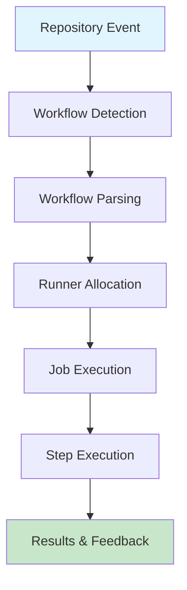

# Explore Actions Flow

Understanding how GitHub Actions workflows execute from trigger to completion helps you design efficient automation pipelines and troubleshoot issues effectively.

## The GitHub Actions Execution Flow



### 1. Event Detection and Triggering

GitHub continuously monitors your repository for events that can initiate workflows.

**Repository Events**:
- Code pushes to branches
- Pull request creation, updates, or merging
- Issue creation or modification
- Release publishing
- Branch/tag creation or deletion

**Scheduled Events**:
- Cron-based time schedules (nightly builds, weekly reports)
- Recurring maintenance tasks

**External Events**:
- Manual workflow triggers via GitHub UI (`workflow_dispatch`)
- Webhook calls from external systems (`repository_dispatch`)
- GitHub API workflow dispatch

**Example Event Configuration**:
```yaml
on:
  # Repository events
  push:
    branches: [main, develop]
  pull_request:
    branches: [main]
  
  # Scheduled event
  schedule:
    - cron: '0 2 * * *'  # Daily at 2 AM UTC
  
  # Manual trigger
  workflow_dispatch:
    inputs:
      environment:
        description: 'Target environment'
        required: true
        default: 'staging'
```

### 2. Workflow Orchestration

Once an event triggers, GitHub Actions processes your workflow.

**Workflow Parsing**:
1. Reads YAML workflow file from `.github/workflows/` directory
2. Validates syntax and configuration
3. Resolves workflow expressions (`${{ }}`)
4. Determines job dependencies and execution order
5. Prepares environment variables and secrets

**Runner Allocation**:
1. Identifies required runner type (`runs-on: ubuntu-latest`)
2. Provisions fresh virtual environment for each job
3. Sets up operating system (Ubuntu, Windows, macOS)
4. Installs pre-configured software and tools
5. Allocates compute resources (4-core CPU, 16 GB RAM)

**Example Runner Selection**:
```yaml
jobs:
  build:
    runs-on: ubuntu-latest  # GitHub-hosted Ubuntu runner
  
  test-windows:
    runs-on: windows-latest  # GitHub-hosted Windows runner
  
  deploy:
    runs-on: [self-hosted, linux, x64]  # Self-hosted runner with labels
```

### 3. Job Execution and Coordination

Jobs can execute in parallel (default) or sequentially (with dependencies).

**Parallel Execution** (Default):
```yaml
jobs:
  lint:         # Starts immediately
    runs-on: ubuntu-latest
    steps:
    - run: npm run lint
  
  test:         # Starts immediately (parallel with lint)
    runs-on: ubuntu-latest
    steps:
    - run: npm test
  
  security:     # Starts immediately (parallel with lint and test)
    runs-on: ubuntu-latest
    steps:
    - run: npm audit
```

**Execution Flow**: lint + test + security run simultaneously

**Sequential Execution** (With Dependencies):
```yaml
jobs:
  build:
    runs-on: ubuntu-latest
    steps:
    - run: npm run build
  
  test:
    needs: build  # Wait for build to complete
    runs-on: ubuntu-latest
    steps:
    - run: npm test
  
  deploy:
    needs: [build, test]  # Wait for both build and test
    runs-on: ubuntu-latest
    steps:
    - run: ./deploy.sh
```

**Execution Flow**: build → test → deploy (sequential)

**Fan-Out/Fan-In Pattern**:
```yaml
jobs:
  build:
    runs-on: ubuntu-latest
    steps:
    - run: npm run build
  
  # Fan-out: Multiple jobs depend on build
  unit-test:
    needs: build
    runs-on: ubuntu-latest
    steps:
    - run: npm run test:unit
  
  integration-test:
    needs: build
    runs-on: ubuntu-latest
    steps:
    - run: npm run test:integration
  
  security-scan:
    needs: build
    runs-on: ubuntu-latest
    steps:
    - run: npm audit
  
  # Fan-in: Deploy depends on all tests
  deploy:
    needs: [unit-test, integration-test, security-scan]
    runs-on: ubuntu-latest
    steps:
    - run: ./deploy.sh
```

**Execution Flow**: build → (unit-test + integration-test + security-scan) → deploy

### 4. Action Execution Within Jobs

Each job executes its steps sequentially on the assigned runner.

**Step Execution Order**:
1. **Environment Preparation**: Runner setup, workspace creation
2. **Repository Checkout**: Clone repository to workspace
3. **Action Resolution**: Download and cache required actions
4. **Step Execution**: Run commands and actions in defined order
5. **Artifact Handling**: Upload/download artifacts between jobs
6. **Cleanup**: Tear down environment, release resources

**Example Step Sequence**:
```yaml
jobs:
  build:
    runs-on: ubuntu-latest
    steps:
    # Step 1: Environment preparation (automatic)
    
    # Step 2: Checkout code
    - name: Checkout repository
      uses: actions/checkout@v4
    
    # Step 3: Setup environment
    - name: Setup Node.js
      uses: actions/setup-node@v4
      with:
        node-version: '20'
        cache: 'npm'
    
    # Step 4: Install dependencies
    - name: Install dependencies
      run: npm ci
    
    # Step 5: Build application
    - name: Build
      run: npm run build
    
    # Step 6: Upload artifacts
    - name: Upload build artifacts
      uses: actions/upload-artifact@v4
      with:
        name: dist
        path: dist/
    
    # Step 7: Cleanup (automatic)
```

### 5. Results and Feedback

Upon completion, GitHub Actions provides comprehensive feedback.

**Status Reporting**:
- ✅ Individual step success/failure indicators
- ⏱️ Job-level status and duration metrics
- 📊 Overall workflow status and summary
- 📈 Workflow run history and trends

**Notification Integration**:
```yaml
jobs:
  notify:
    needs: [build, test, deploy]
    if: always()  # Run even if previous jobs fail
    runs-on: ubuntu-latest
    steps:
    - name: Send Slack notification
      uses: slackapi/slack-github-action@v1
      with:
        payload: |
          {
            "text": "Workflow ${{ job.status }}: ${{ github.workflow }}"
          }
      env:
        SLACK_WEBHOOK_URL: ${{ secrets.SLACK_WEBHOOK }}
```

**Status Checks on Pull Requests**:
- Workflows automatically create status checks
- Required checks can block PR merging
- Status badge shows workflow state

## Flow Optimization Strategies

### 1. Efficient Job Design

**Fast Feedback Loop** - Run quick checks first:
```yaml
jobs:
  # Step 1: Fast linting (30 seconds)
  lint:
    runs-on: ubuntu-latest
    steps:
    - uses: actions/checkout@v4
    - run: npm run lint
  
  # Step 2: Quick unit tests (2 minutes)
  unit-test:
    runs-on: ubuntu-latest
    steps:
    - uses: actions/checkout@v4
    - run: npm run test:unit
  
  # Step 3: Slower integration tests (5 minutes) - parallel with unit tests
  integration-test:
    runs-on: ubuntu-latest
    steps:
    - uses: actions/checkout@v4
    - run: npm run test:integration
  
  # Step 4: Deploy only after all checks pass
  deploy:
    needs: [lint, unit-test, integration-test]
    if: github.ref == 'refs/heads/main'
    runs-on: ubuntu-latest
    steps:
    - run: ./deploy.sh
```

**Benefits**:
- Developers get fast feedback from linting
- Tests run in parallel (saves time)
- Deployment happens only after all validations pass

### 2. Conditional Execution

Control workflow behavior based on context to save resources.

**Branch-Based Execution**:
```yaml
jobs:
  build:
    runs-on: ubuntu-latest
    steps:
    - uses: actions/checkout@v4
    - run: npm run build
  
  # Deploy to staging for develop branch
  deploy-staging:
    needs: build
    if: github.ref == 'refs/heads/develop'
    runs-on: ubuntu-latest
    steps:
    - run: ./deploy-staging.sh
  
  # Deploy to production for main branch
  deploy-production:
    needs: build
    if: github.ref == 'refs/heads/main' && github.event_name == 'push'
    runs-on: ubuntu-latest
    steps:
    - run: ./deploy-production.sh
```

**Event-Based Execution**:
```yaml
jobs:
  # Run on all events
  build:
    runs-on: ubuntu-latest
    steps:
    - run: npm run build
  
  # Run only on pull requests
  code-review:
    if: github.event_name == 'pull_request'
    runs-on: ubuntu-latest
    steps:
    - run: npm run lint
  
  # Run only on tags
  release:
    if: startsWith(github.ref, 'refs/tags/v')
    runs-on: ubuntu-latest
    steps:
    - run: ./create-release.sh
```

### 3. Resource Optimization

**Dependency Caching**:
```yaml
jobs:
  build:
    runs-on: ubuntu-latest
    steps:
    - uses: actions/checkout@v4
    
    - name: Cache dependencies
      uses: actions/cache@v3
      with:
        path: ~/.npm
        key: ${{ runner.os }}-node-${{ hashFiles('**/package-lock.json') }}
    
    - run: npm ci  # Faster with cache
    - run: npm run build
```

**Artifact Sharing**:
```yaml
jobs:
  build:
    runs-on: ubuntu-latest
    steps:
    - uses: actions/checkout@v4
    - run: npm run build
    - uses: actions/upload-artifact@v4
      with:
        name: dist
        path: dist/
  
  deploy:
    needs: build
    runs-on: ubuntu-latest
    steps:
    - uses: actions/download-artifact@v4
      with:
        name: dist
    - run: ./deploy.sh  # Use pre-built artifacts
```

## Complete Flow Example

```yaml
name: Complete CI/CD Flow

on:
  push:
    branches: [main, develop]
  pull_request:
    branches: [main]

jobs:
  # Phase 1: Fast feedback (parallel)
  lint:
    runs-on: ubuntu-latest
    steps:
    - uses: actions/checkout@v4
    - run: npm run lint
  
  # Phase 2: Build and test (after lint)
  build:
    needs: lint
    runs-on: ubuntu-latest
    steps:
    - uses: actions/checkout@v4
    - uses: actions/cache@v3
      with:
        path: ~/.npm
        key: ${{ runner.os }}-node-${{ hashFiles('**/package-lock.json') }}
    - run: npm ci
    - run: npm run build
    - uses: actions/upload-artifact@v4
      with:
        name: dist
        path: dist/
  
  # Phase 3: Multiple test types (parallel)
  unit-test:
    needs: build
    runs-on: ubuntu-latest
    steps:
    - uses: actions/checkout@v4
    - run: npm run test:unit
  
  integration-test:
    needs: build
    runs-on: ubuntu-latest
    steps:
    - uses: actions/checkout@v4
    - run: npm run test:integration
  
  # Phase 4: Deploy (after all tests)
  deploy:
    needs: [unit-test, integration-test]
    if: github.ref == 'refs/heads/main'
    runs-on: ubuntu-latest
    steps:
    - uses: actions/download-artifact@v4
      with:
        name: dist
    - run: ./deploy.sh
```

**Flow Visualization**:
```
Event (push to main)
    ↓
lint (30s)
    ↓
build (2m) + cache dependencies + upload artifacts
    ↓
unit-test (1m) + integration-test (3m)  [parallel]
    ↓
deploy (1m) [only on main branch]
```

## Critical Notes

🎯 **Parallel by Default**: Jobs run in parallel unless you specify `needs`. Use dependencies strategically to balance speed and correctness.

💡 **Fast Feedback**: Structure workflows to fail fast - run quick checks (linting, type checking) before slow tests (integration, E2E).

⚠️ **Resource Limits**: Free accounts have 20 concurrent jobs. Complex matrix strategies can hit this limit quickly.

📊 **Caching Strategy**: Cache dependencies aggressively - can save 50-90% of installation time. Use `hashFiles()` for cache keys.

🔄 **Conditional Jobs**: Use `if:` conditions to skip unnecessary jobs (e.g., skip deployment on PR, skip tests on docs-only changes).

✨ **Artifact Efficiency**: Build once, test multiple times. Upload artifacts from build job, download in test/deploy jobs to avoid rebuilding.

## Quick Reference

### Job Dependency Patterns

```yaml
# Independent (parallel)
jobs:
  job1: ...
  job2: ...
  job3: ...

# Sequential
jobs:
  job1: ...
  job2:
    needs: job1
  job3:
    needs: job2

# Fan-out then fan-in
jobs:
  build: ...
  test1:
    needs: build
  test2:
    needs: build
  deploy:
    needs: [test1, test2]
```

### Conditional Expressions

| Expression | Meaning |
|------------|---------|
| `if: success()` | Run if previous job succeeded (default) |
| `if: failure()` | Run if previous job failed |
| `if: always()` | Run regardless of previous job status |
| `if: cancelled()` | Run if workflow was cancelled |
| `if: github.ref == 'refs/heads/main'` | Run only on main branch |

[Learn More](https://learn.microsoft.com/en-us/training/modules/introduction-to-github-actions/3-explore-actions-flow)
