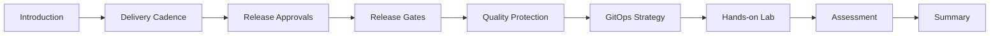

# Introduction

## Module Overview
This module explores critical **release strategy recommendations** for designing automated deployment workflows. Learn to define release pipeline components, configure artifact sources, create approval workflows, and implement release gates.

**Duration**: ~20 minutes  
**Level**: Intermediate

## Learning Objectives
By the end of this module, you'll be able to:

1. ✅ **Analyze key considerations** for designing effective release strategies
2. ✅ **Define release pipeline components** and configure artifact sources
3. ✅ **Create comprehensive release approval workflows**
4. ✅ **Implement and configure release gates** for quality assurance

## Prerequisites

| Requirement | Description |
|------------|-------------|
| **DevOps Understanding** | Core DevOps concepts and principles |
| **Version Control** | Familiarity with version control (helpful but not required) |
| **Software Delivery** | Experience in software delivery organizations (beneficial) |
| **Azure DevOps** | Access to Azure DevOps Organization and Team Project |

**Setup Azure DevOps**: [Create an organization](https://learn.microsoft.com/en-us/azure/devops/organizations/accounts/create-organization)

## Module Scope

This module covers **9 units** focused on release strategy best practices:

### 📚 What You'll Learn

1. **Delivery Cadence & Triggers** (Unit 2)
   - Continuous deployment triggers
   - Scheduled triggers
   - Manual triggers

2. **Release Approvals** (Unit 3)
   - Manual approval workflows
   - Approval timing and placement
   - Stakeholder involvement

3. **Release Gates** (Unit 4)
   - Automated quality checks
   - Pre-deployment gates
   - Post-deployment gates

4. **Quality Protection** (Unit 5)
   - Quality gate implementation
   - Automated validation criteria
   - Policy enforcement

5. **GitOps Strategy** (Unit 6)
   - Infrastructure as Code
   - Declarative configuration
   - Git-based workflows

6. **Hands-on Lab** (Unit 7)
   - Configure release gates
   - Azure Monitor integration
   - Canary deployment testing

7. **Assessment & Summary** (Units 8-9)

## Why Release Strategies Matter

### 🎯 Key Benefits

| Benefit | Description |
|---------|-------------|
| **Controlled Rollouts** | Deploy updates in phased manner to subset of users |
| **Risk Mitigation** | Catch issues early before full production rollout |
| **Compliance** | Meet organizational governance requirements |
| **Automation** | Reduce manual intervention bottlenecks |
| **Visibility** | Track deployment status and quality metrics |
| **Rollback Safety** | Quick recovery from failed deployments |

### 🏢 Real-World Scenarios

**Scenario 1: Financial Services**
- Regulatory compliance requires manual approval
- SOX four-eyes principle enforcement
- Segregation of duties validation
- Audit trail for all production releases

**Scenario 2: E-commerce Platform**
- Zero-downtime deployments required
- Canary releases to 5% of users first
- Automated quality gates check performance
- Rollback if error rates spike

**Scenario 3: Healthcare SaaS**
- HIPAA compliance validation
- Security scans before deployment
- Blue-green deployment strategy
- Post-deployment health checks

## Release Strategy Components

```
Release Strategy
├── Delivery Cadence
│   ├── Continuous (CD)
│   ├── Scheduled
│   └── Manual/On-demand
├── Triggers
│   ├── Build completion
│   ├── Time-based
│   └── Manual initiation
├── Approvals
│   ├── Pre-deployment
│   ├── Post-deployment
│   └── Stakeholder sign-off
├── Gates
│   ├── Quality validation
│   ├── Security checks
│   └── Health monitoring
└── Deployment Patterns
    ├── Blue-Green
    ├── Canary
    ├── Rolling
    └── Feature Flags
```

## From Manual to Automated

### ❌ Traditional Manual Process
```
Build Complete → Email Notification → Manager Approval (24-48h) 
→ Security Review (2-4h) → Manual Deploy → Hope It Works
```

**Problems**:
- ⏰ Slow: Days between build and deployment
- 🐛 Error-prone: Manual steps lead to mistakes
- 📉 Limited visibility: Hard to track status
- 🚫 Bottlenecks: Waiting on approvers

### ✅ Modern Automated Strategy
```
Build Complete → Automatic Deploy to Dev → Quality Gates Pass 
→ Deploy to QA → Automated Tests Pass → Deploy to Canary (5% users) 
→ Monitoring Validates → Full Production Deploy
```

**Advantages**:
- ⚡ Fast: Minutes between build and deployment
- 🤖 Reliable: Automated steps are consistent
- 📊 Transparent: Real-time deployment status
- 🔄 Scalable: Handle multiple deployments per day

## Module Learning Path



## Success Criteria

By module completion, you should be able to:

- [ ] Design release strategy for multi-environment deployment
- [ ] Configure continuous deployment triggers
- [ ] Implement manual approval workflows
- [ ] Set up automated release gates
- [ ] Define quality validation criteria
- [ ] Explain GitOps principles
- [ ] Configure Azure Monitor alerts as gates

## Critical Notes

⚠️ **Important Considerations**:

1. **Start Simple**: Begin with manual approvals, evolve to automated gates
2. **Approvals Add Delay**: Each approval step impacts deployment velocity
3. **Gate vs Approval**: Gates are automated, approvals are manual
4. **Pre vs Post**: Pre-deployment gates prevent deployment, post-deployment validate success
5. **Quality Thresholds**: Define clear, measurable quality criteria
6. **Rollback Plan**: Always have automated rollback strategy
7. **Monitor Everything**: Instrument applications for observability

## Quick Reference

| Term | Definition | Example |
|------|-----------|---------|
| **Continuous Deployment (CD)** | Automatic deployment after build | Every commit to main deploys to dev |
| **Release Approval** | Manual gate requiring human sign-off | Product owner approves production deploy |
| **Release Gate** | Automated validation before/after deployment | Deploy only if 0 blocker bugs exist |
| **Quality Gate** | Automated policy enforcement | Code coverage must be >80% |
| **Canary Release** | Deploy to small user subset first | 5% of users get new version |
| **Blue-Green** | Two identical environments, switch traffic | Blue=current, Green=new version |
| **GitOps** | Infrastructure and config managed in Git | All changes through Git pull requests |

## What's Next?

**Unit 2**: Understand delivery cadence and three types of triggers (continuous, scheduled, manual)

---

**Learn More**:
- [Azure Pipelines Release Approvals](https://learn.microsoft.com/en-us/azure/devops/pipelines/release/approvals/approvals)
- [Release Gates Documentation](https://learn.microsoft.com/en-us/azure/devops/pipelines/release/approvals/gates)
- [DevOps Release Engineering](https://learn.microsoft.com/en-us/azure/architecture/framework/devops/release-engineering-app-dev)

[Learn More: Original Unit](https://learn.microsoft.com/en-us/training/modules/explore-release-strategy-recommendations/1-introduction)
