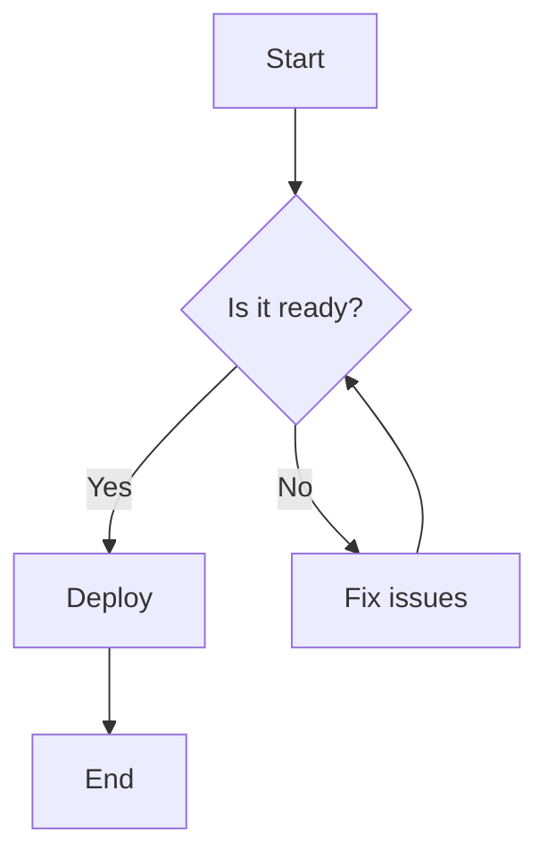
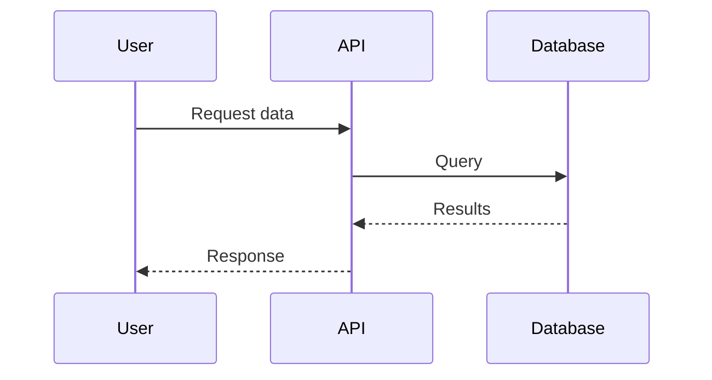
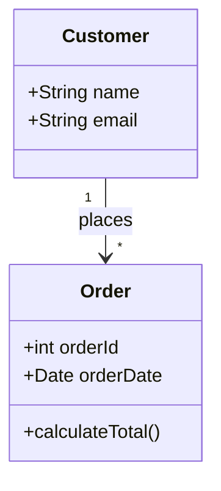
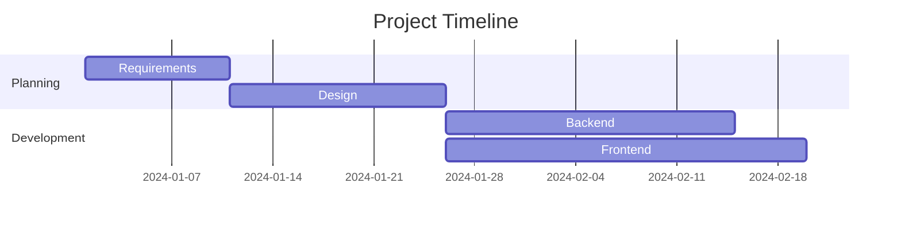
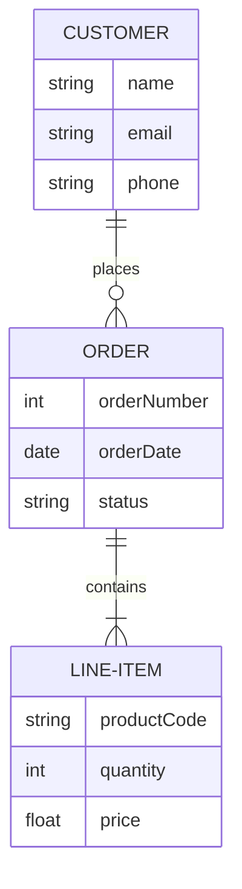
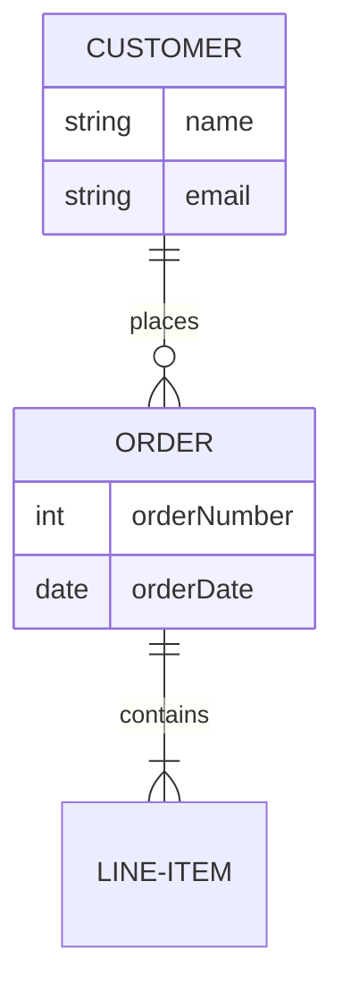
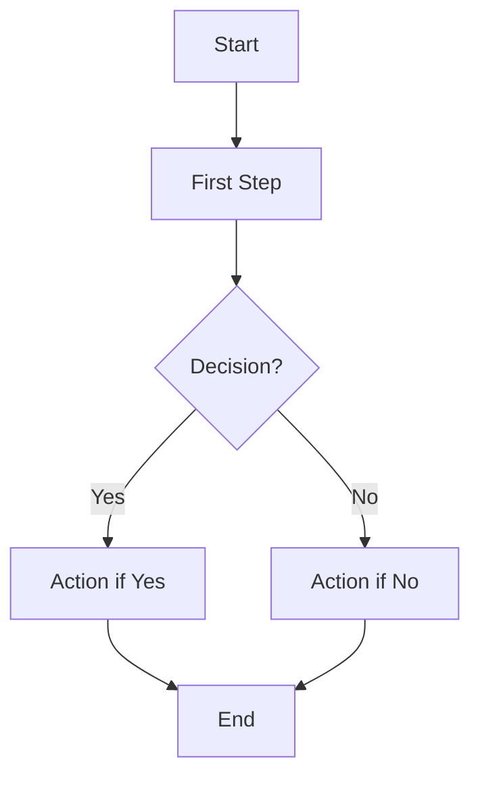

# Introduction to Azure DevOps Project Wikis

## Key Concepts
- **Project Wiki**: Provisioned for team projects, Git repository-backed, collaborative documentation
- **Published Wiki**: Convert existing Git repository into a wiki, version-controlled documentation
- **Git-Backed Storage**: All wiki pages stored as Markdown files in Git repository
- **Markdown Fundamentals**: Lightweight markup language for formatting text
- **GitHub Flavored Markdown (GFM)**: Extensions to standard Markdown (tables, task lists, emoji)
- **Mermaid Diagrams**: Text-based diagram syntax for flowcharts, sequence diagrams, class diagrams

## Wiki Types Comparison

| Feature | Project Wiki | Published Wiki |
|---------|--------------|----------------|
| **Purpose** | General project documentation | Version-controlled docs from code repo |
| **Creation** | Provisioned for Azure DevOps project | Publish existing Git repository |
| **Storage** | Dedicated Git repository created | Existing repository branch/folder |
| **Navigation** | Auto-generated from page hierarchy | Based on .order files or folder structure |
| **Versioning** | Git-backed (commits visible) | Full Git history from source repo |
| **Use Case** | Project overviews, architecture, onboarding | API docs, code guides, release notes |
| **Access Control** | Project-level permissions | Repository-level permissions |

## Wiki Permissions and Access Control

### Permission Model
```yaml
Create Repository Permission:
  - Required to provision a project wiki
  - Granted via project settings
  - Required: "Create Repository" permission
  
Contributors:
  - Can create, edit, delete pages
  - Default for team members
  - Full read/write access
  
Stakeholders/Readers:
  - Can view wiki pages only
  - Cannot create or edit pages
  - Read-only access
```

### Permission Settings
```bash
# Set wiki permissions in Azure DevOps
Project Settings → Repositories → Security → Create Repository

# Manage wiki permissions
Project Settings → Wikis → Security → Contributors/Readers
```

## Creating Wikis

### Create Project Wiki
**Steps**:
1. Navigate to **Overview** → **Wiki**
2. Click **Create project wiki**
3. Azure DevOps creates Git repository named `<ProjectName>.wiki`
4. Home page created automatically
5. Add pages using **New page** button

**Characteristics**:
- Dedicated wiki repository
- Auto-navigation generation
- Single project wiki per project
- Stored in separate repo from code

### Create Published Wiki
**Steps**:
1. Navigate to **Overview** → **Wiki**
2. Click **Publish code as wiki**
3. Select repository, branch, and folder
4. Name the published wiki
5. Specify folder containing Markdown files

**Characteristics**:
- Uses existing repository
- Can have multiple published wikis
- Follows repository structure
- Version control from source repo

**Use Case**: Maintain documentation alongside code, publish different versions

## Markdown Fundamentals

### Basic Syntax
```markdown
# Heading 1
## Heading 2
### Heading 3

**Bold text**
*Italic text*
~~Strikethrough~~

- Unordered list item 1
- Unordered list item 2
  - Nested item

1. Ordered list item 1
2. Ordered list item 2

[Link text](https://example.com)


`Inline code`

```javascript
// Code block with syntax highlighting
function example() {
    console.log("Hello, World!");
}
```
```

### GitHub Flavored Markdown (GFM)

#### Tables
```markdown
| Header 1 | Header 2 | Header 3 |
|----------|----------|----------|
| Cell 1   | Cell 2   | Cell 3   |
| Cell 4   | Cell 5   | Cell 6   |

# Alignment
| Left | Center | Right |
|:-----|:------:|------:|
| L    | C      | R     |
```

#### Task Lists
```markdown
- [ ] Incomplete task
- [x] Completed task
- [ ] Another incomplete task
```

#### Autolinks and Mentions
```markdown
# URLs automatically linked
https://dev.azure.com/yourorg

# Mention users
@username

# Link to work items
#1234
```

#### Emoji
```markdown
:smile: :rocket: :white_check_mark:
```

#### Code with Syntax Highlighting
```markdown
```python
def hello_world():
    print("Hello, World!")
```

```yaml
version: '3'
services:
  web:
    image: nginx:latest
```
```

### Multimedia Support
```markdown
# Images


# Attachments (upload via UI)
[Download setup guide](./attachments/setup-guide.pdf)

# Videos (embed)
[](https://video-url)
```

## Mermaid Diagrams

### What is Mermaid?
- **Text-based diagram syntax** rendered as graphics
- Integrated into Azure DevOps wikis
- Version-controlled (plain text)
- No external diagram tools needed

### Flowchart Syntax


**Code**:
```markdown

```

### Sequence Diagram


**Code**:
```markdown

```

### Class Diagram


**Code**:
```markdown

```

### Gantt Chart


**Code**:
```markdown

```

### Entity Relationship Diagram


**Code**:
```markdown

```

## Mermaid Diagram Types Quick Reference

| Diagram Type | Purpose | Syntax Start | Common Use |
|--------------|---------|--------------|------------|
| **Flowchart** | Process flows, decision trees | `graph TD` or `graph LR` | CI/CD pipelines, decision logic |
| **Sequence** | Interaction between components | `sequenceDiagram` | API calls, authentication flows |
| **Class** | Object relationships and structure | `classDiagram` | Software architecture, data models |
| **ER Diagram** | Database schema | `erDiagram` | Database design, data relationships |
| **Gantt** | Project timelines | `gantt` | Sprint planning, project milestones |
| **State** | State machines | `stateDiagram-v2` | Application state, workflow states |
| **Pie** | Data distribution | `pie` | Metrics, usage statistics |
| **Git Graph** | Repository branching | `gitGraph` | Branch strategies, release flows |

## Wiki Organization Best Practices

### Page Structure
```yaml
Home Page:
  - Project overview
  - Quick links to key pages
  - Getting started guide
  
Architecture:
  - System overview
  - Component diagrams
  - Technology stack
  
Developer Guide:
  - Setup instructions
  - Coding standards
  - Testing guidelines
  
Operations:
  - Deployment procedures
  - Troubleshooting guides
  - Runbooks
```

### Naming Conventions
```yaml
Clear Hierarchy:
  - Use descriptive page names
  - Organize in logical folders
  - Example: "Getting Started/Development Environment Setup"
  
Consistent Style:
  - Title case for page names
  - Use hyphens in URLs (auto-generated)
  - Keep names concise but descriptive
```

### Version Control Tips
```bash
# Wiki pages are Markdown files in Git
# Clone wiki repository
git clone https://dev.azure.com/org/project/_git/ProjectName.wiki

# Make changes locally
vim Home.md

# Commit and push
git add Home.md
git commit -m "Update home page with new architecture diagram"
git push origin master

# View history
git log Home.md

# Revert changes
git revert <commit-hash>
```

## Critical Notes
- ⚠️ **One project wiki per project**: Multiple published wikis allowed
- 💡 **Git-backed**: All changes version-controlled, can revert
- 🎯 **Permissions**: Use repository security to control wiki access
- 📊 **Mermaid support**: Create diagrams without external tools
- 🔗 **Work item links**: Reference #123 to link work items

## Quick Commands

**Create Wiki Page with Template**:
```markdown
# Page Title

## Overview
Brief description of this page's purpose

## Prerequisites
What you need to know or have before proceeding

## Main Content
Detailed information with examples

## See Also
- [Related Page 1](Link)
- [Related Page 2](Link)

## Last Updated
Date and author
```

**Mermaid Flowchart Template**:
```markdown

```

**Table of Contents (Auto-Generated)**:
```markdown
# Use heading hierarchy for automatic TOC
## Section 1
Content here

## Section 2
Content here

### Subsection 2.1
Content here
```

[Learn More](https://learn.microsoft.com/en-us/training/modules/share-knowledge-within-teams/3-introduction-azure-devops-project-wikis)
