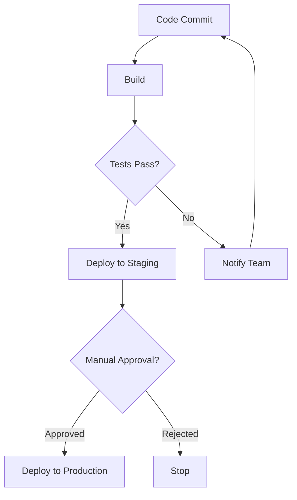
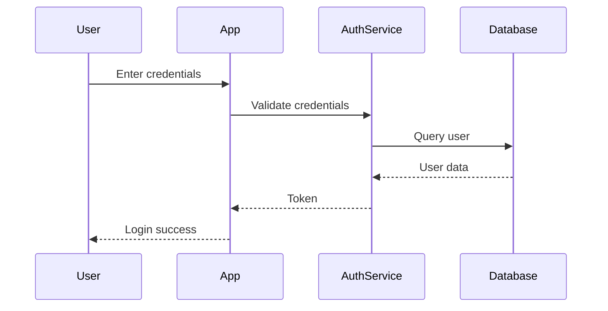
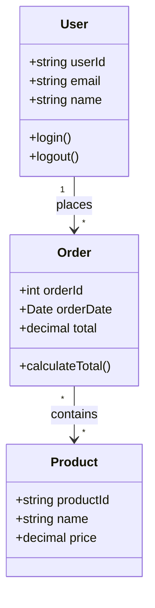
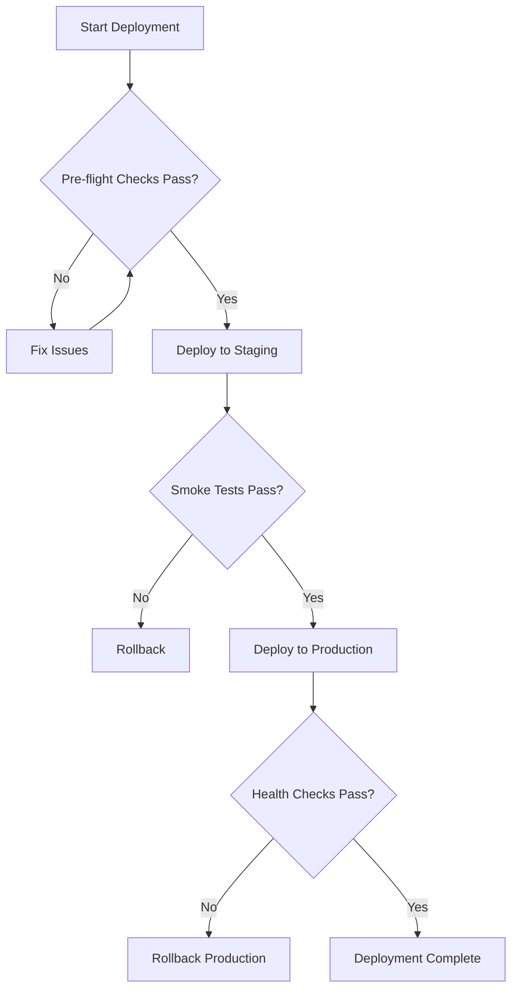
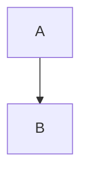
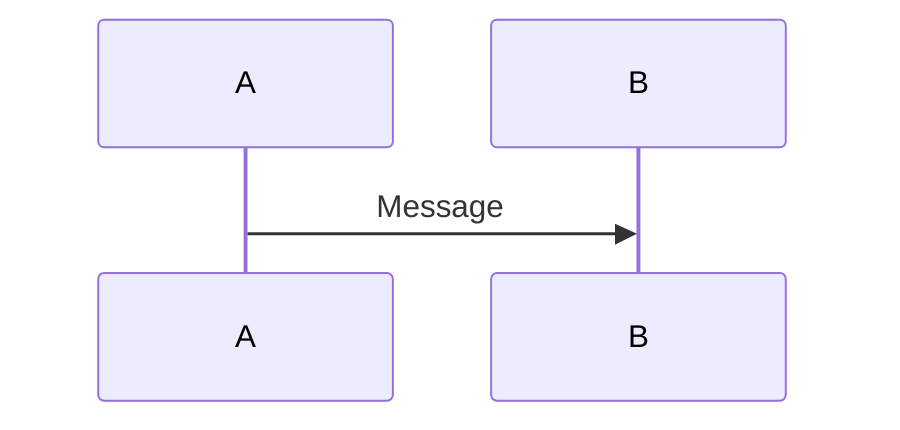
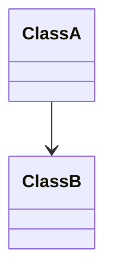

# Share Team Knowledge Using Azure Project Wiki

## Overview
Hands-on lab exercise for creating and managing Azure DevOps project wikis with Markdown and Mermaid diagrams.

**Duration**: 45 minutes

## Learning Objectives
- Create a project wiki in Azure DevOps
- Add and edit pages using Markdown
- Create Mermaid diagrams for visual documentation
- Organize wiki content with page hierarchy
- Understand wiki version control with Git

## Prerequisites
- Azure DevOps organization and project
- "Create Repository" permission in the project
- Basic understanding of Markdown syntax
- Familiarity with Git concepts

## Lab Exercises

### Exercise 1: Create Project Wiki
**Steps**:
1. Navigate to Azure DevOps project
2. Select **Overview** → **Wiki**
3. Click **Create project wiki**
4. Verify wiki repository created (`<ProjectName>.wiki`)
5. Review default home page

**Expected Outcome**:
- Project wiki provisioned
- Git repository created for wiki storage
- Home page accessible and editable

### Exercise 2: Add and Edit Markdown Pages
**Tasks**:
1. **Create new page**:
   - Click **New page** button
   - Enter page title (e.g., "Getting Started")
   - Add content using Markdown

2. **Use Markdown formatting**:
   ```markdown
   # Main Heading
   ## Subheading
   
   **Bold text** and *italic text*
   
   - Bullet point 1
   - Bullet point 2
   
   1. Numbered item 1
   2. Numbered item 2
   
   [Link text](https://example.com)
   
   | Column 1 | Column 2 |
   |----------|----------|
   | Data 1   | Data 2   |
   
   ```code block```
   ```

3. **Add images**:
   - Upload image via attachment
   - Reference in Markdown: ``

4. **Create page hierarchy**:
   - Create parent page (e.g., "Developer Guide")
   - Create child pages under parent (e.g., "Setup", "Testing")

**Expected Outcome**:
- Multiple wiki pages created
- Proper Markdown formatting applied
- Logical page hierarchy established

### Exercise 3: Create Mermaid Diagrams
**Task 1: Flowchart for CI/CD Pipeline**:
```markdown

```

**Task 2: Sequence Diagram for Authentication Flow**:
```markdown

```

**Task 3: Class Diagram for Data Model**:
```markdown

```

**Expected Outcome**:
- Functional Mermaid diagrams rendered in wiki
- Visual representations enhance documentation
- Diagrams are version-controlled (plain text)

### Exercise 4: Organize Wiki Content
**Task**: Create comprehensive wiki structure
```
Home
├── Getting Started
│   ├── Development Environment Setup
│   ├── Clone Repository
│   └── First Build
├── Architecture
│   ├── System Overview (with diagram)
│   ├── Component Diagram (Mermaid)
│   └── Data Flow (Mermaid)
├── Developer Guide
│   ├── Coding Standards
│   ├── Testing Guidelines
│   └── PR Process
└── Operations
    ├── Deployment Guide
    ├── Troubleshooting (with flowcharts)
    └── Monitoring
```

**Steps**:
1. Create parent pages for each major section
2. Add child pages with relevant content
3. Include Mermaid diagrams where helpful
4. Add navigation links between related pages
5. Create table of contents on home page

**Expected Outcome**:
- Well-organized wiki with clear navigation
- Related content grouped logically
- Easy to find information

### Exercise 5: Work with Wiki Git Repository
**Tasks**:
1. **Clone wiki repository**:
   ```bash
   # Get wiki repository URL from Azure DevOps
   git clone https://dev.azure.com/org/project/_git/ProjectName.wiki
   ```

2. **Edit pages locally**:
   ```bash
   cd ProjectName.wiki
   
   # Edit page (pages are .md files)
   vim Getting-Started.md
   
   # View changes
   git diff
   
   # Commit changes
   git add Getting-Started.md
   git commit -m "Update getting started guide with new prerequisites"
   
   # Push to Azure DevOps
   git push origin master
   ```

3. **View version history**:
   ```bash
   # View commit history for a page
   git log Getting-Started.md
   
   # View specific commit
   git show <commit-hash>
   
   # Revert to previous version
   git revert <commit-hash>
   ```

4. **Create branch for major changes** (optional):
   ```bash
   # Create feature branch
   git checkout -b update-architecture-docs
   
   # Make changes
   vim Architecture/System-Overview.md
   
   # Commit and push
   git add Architecture/System-Overview.md
   git commit -m "Revise system architecture documentation"
   git push origin update-architecture-docs
   
   # Merge via pull request in Azure DevOps
   ```

**Expected Outcome**:
- Understand wiki pages are Git-backed
- Can edit locally and push changes
- Version control enables collaboration and rollback

## Practice Exercises

### Exercise A: Document Deployment Process
**Goal**: Create deployment runbook with flowchart

**Requirements**:
- Create "Deployment Runbook" page
- Document pre-deployment checklist
- Create Mermaid flowchart showing deployment steps
- Include rollback procedure
- Add troubleshooting section

**Sample Flowchart**:


### Exercise B: Architecture Decision Record (ADR)
**Goal**: Document architecture decision using template

**Template**:
```markdown
# ADR-001: [Decision Title]

## Status
[Proposed | Accepted | Deprecated | Superseded]

## Context
What is the issue that we're seeing that is motivating this decision or change?

## Decision
What is the change that we're proposing and/or doing?

## Consequences
What becomes easier or more difficult to do because of this change?

### Positive
- Benefit 1
- Benefit 2

### Negative
- Trade-off 1
- Trade-off 2

### Risks
- Risk 1
- Risk 2

## Alternatives Considered
What other options were evaluated?

## References
- Link to related discussion
- Link to supporting documentation
```

### Exercise C: Create Onboarding Wiki
**Goal**: Build new developer onboarding guide

**Structure**:
```
Onboarding
├── Welcome (with team diagram)
├── Day 1 Checklist
│   ├── Account Setup
│   ├── Tool Installation
│   └── Access Requests
├── Development Setup
│   ├── Environment Configuration
│   ├── Repository Clone
│   └── First Build
├── Team Processes
│   ├── Daily Standup
│   ├── Sprint Planning
│   └── Code Review Process (with flowchart)
└── Resources
    ├── Contacts
    ├── Documentation Links
    └── FAQ
```

## Validation Checklist

After completing exercises, verify:
- [ ] Project wiki created and accessible
- [ ] Multiple pages created with Markdown formatting
- [ ] At least 3 different Mermaid diagram types used
- [ ] Page hierarchy organized logically
- [ ] Images and attachments uploaded
- [ ] Wiki repository cloned locally
- [ ] Changes committed and pushed via Git
- [ ] Version history visible for edited pages
- [ ] Navigation between related pages works
- [ ] Content is searchable in wiki

## Common Issues and Solutions

| Issue | Solution |
|-------|----------|
| "Create project wiki" button disabled | Verify "Create Repository" permission in project settings |
| Mermaid diagram not rendering | Check syntax, ensure triple backticks with "mermaid" language |
| Can't clone wiki repository | Ensure wiki created first (repository doesn't exist until wiki provisioned) |
| Images not displaying | Verify image uploaded, check file path is relative to page |
| Changes not visible after push | Refresh wiki page, check commit was successful |

## Additional Practice

### Challenge 1: API Documentation
Create API documentation page with:
- Endpoint tables (HTTP method, URL, description)
- Request/response examples in code blocks
- Authentication flow sequence diagram
- Error handling flowchart

### Challenge 2: Troubleshooting Guide
Build troubleshooting wiki with:
- Common error messages table
- Decision tree flowchart for diagnosis
- Resolution steps for each issue
- Links to related resources

### Challenge 3: System Architecture
Document system architecture with:
- High-level component diagram (Mermaid)
- Data flow diagrams
- Deployment architecture
- Technology stack table
- Integration points sequence diagram

## Critical Notes
- ⚠️ **Git-backed storage**: Every wiki edit is a Git commit
- 💡 **Mermaid preview**: Use online Mermaid editor to test diagrams before adding to wiki
- 🎯 **Page organization**: Plan hierarchy before creating many pages
- 📊 **Version control**: Can revert to any previous version via Git
- 🔗 **Links**: Use `[[Page Name]]` for internal wiki links (auto-generated)

## Quick Reference

**Internal Wiki Links**:
```markdown
# Link to another wiki page
[[Page Name]]
[[Parent/Child Page]]

# Link with custom text
[[Custom Text|Page Name]]
```

**Mermaid Quick Start**:
```markdown
# Flowchart


# Sequence


# Class

```

**Page Hierarchy**:
- Parent pages = Folders
- Child pages = Nested under parent
- Home page = Root of hierarchy

[Learn More](https://learn.microsoft.com/en-us/training/modules/share-knowledge-within-teams/5-share-team-knowledge-azure-project-wiki)
