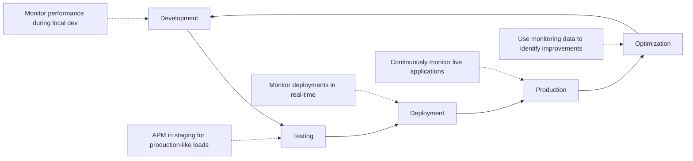

# Examine Monitoring Tools and Technologies

## Key Concepts
- **APM solutions**: Application Performance Management tools for intelligent monitoring and analysis
- **Continuous monitoring**: Extends beyond production to staging, testing, development
- **Advanced capabilities**: Synthetic monitoring, alert management, deployment integration, analytics
- **Business-critical applications**: Always available, always fast, constantly improving
- **DevOps lifecycle monitoring**: Development → Testing → Deployment → Production → Optimization

## The Business-Critical Nature of Modern Applications

### Modern Application Requirements

| Requirement | Description | Impact of Failure |
|-------------|-------------|-------------------|
| **Always Available** | Downtime not acceptable | Revenue loss, customer dissatisfaction, brand damage |
| **Always Fast** | Instant response expected | Abandoned transactions, decreased productivity, frustrated users |
| **Constantly Improving** | Continuous deployment | Each change must improve (not degrade) UX |

### User Expectations Continue Rising
```yaml
Reality:
  - Applications central to business operations
  - Customer expectations constantly increasing
  - High availability no longer optional
  - Performance directly impacts revenue
```

## Core Capabilities of APM Solutions

### 1. User Experience Monitoring
```yaml
Tracks:
  - Actual user interactions
  - Page load times
  - Transaction completion rates
  - User satisfaction metrics

Perspective: How app performs from user's view (not just technical)

Value: See real user experience, not just server metrics
```

### 2. Application Stability Tracking
```yaml
Monitors:
  - Application health indicators
  - Error rates
  - Exception frequency
  - Resource utilization
  - Service availability

Value: Early detection prevents outages before many users impacted
```

### 3. Root Cause Analysis
```yaml
Capability:
  - Correlates data across application layers
  - Links infrastructure components
  - Traces dependencies

Value: Speeds problem resolution from hours to minutes
```

### 4. Proactive Issue Prevention
```yaml
Approach:
  - Establishes baselines
  - Detects anomalies
  - Identifies potential problems before outages

Value: Prevents issues rather than just reacting to them
```

## Expanding Monitoring Across the DevOps Lifecycle

### Why Monitor Beyond Production?

| Phase | Monitoring Purpose | Benefits |
|-------|-------------------|----------|
| **Development** | Local development and integration testing | Catch issues earliest (cheapest to fix) |
| **Testing** | Validate performance under production-like loads | Earlier feedback, identify problems before production |
| **Staging** | Mirror production environment | Realistic performance feedback, operations team preparation |
| **Production** | Live application monitoring | Ensure optimal user experience |
| **Optimization** | Identify improvement opportunities | Measure impact of optimizations |

### Production-like Testing Environments
```yaml
Goal: Make test environments mirror production

Benefits:
  - Realistic performance feedback
  - Identify issues before production
  - Better capacity planning
  - Operations team preparation

Result: APM in staging provides advance knowledge
```

### Earlier Feedback Loops
```yaml
When: Development teams receive APM feedback early

Can Identify:
  - Performance issues
  - Memory leaks
  - Scalability problems

Before: Code reaches production

Result: Cheaper, faster fixes (earlier detection = lower cost)
```

### Operations Team Preparation
```yaml
When: Operations monitors pre-production environments

Gains:
  - Advance knowledge of app behavior
  - Understanding of resource requirements
  - Awareness of potential issues

Result: Better production tuning and capacity planning
```

### Reduced Production Incidents
```yaml
Formula:
  Earlier Detection + Better Preparation = More Stable Releases

Result:
  - Issues discovered and fixed in dev/testing
  - Never impact production users
  - Significantly more stable production releases
```

## DevOps Monitoring Strategy

### Comprehensive Lifecycle Monitoring



**Phase Details**:

1. **Development Phase**
   - Monitor during local development
   - Integration testing feedback
   - Catch issues earliest

2. **Testing Phase**
   - APM in staging environments
   - Validate under production-like loads
   - Performance testing with real metrics

3. **Deployment Phase**
   - Monitor deployments in real-time
   - Detect issues immediately after changes
   - Correlate deployments with metrics

4. **Production Phase**
   - Continuously monitor live applications
   - Ensure user experience remains optimal
   - Rapid incident response

5. **Optimization Phase**
   - Use monitoring data to identify opportunities
   - Measure impact of optimizations
   - Data-driven improvements

### Collaborative Monitoring
```yaml
Result:
  - Development and operations teams collaborate
  - Optimize user experience at every stage
  - Less time firefighting
  - More time for innovation and feature development
  - Delivers business value
```

## Advanced Features for Monitoring Tools

### 1. Synthetic Monitoring

**Definition**: Proactively test applications by simulating user interactions

**Capabilities**:
```yaml
Tests From:
  - Various geographic locations
  - Multiple points of presence worldwide

Monitors:
  - Internet applications
  - Intranet applications
  - Mobile applications
  - Web applications

Simulates:
  - User journeys
  - Transaction flows
  - Multi-step processes
```

**Value**:
- Detects issues before real users encounter them
- Validates functionality from different locations
- Tests availability 24/7 even without users
- Measures baseline performance

**Use Case**:
```yaml
Example: E-commerce Checkout Flow
  1. Add item to cart
  2. Proceed to checkout
  3. Enter shipping info
  4. Enter payment info
  5. Complete purchase

Synthetic monitoring tests this flow every 5 minutes from:
  - New York
  - London
  - Tokyo
  - Sydney

Result: Immediate alert if any step fails from any location
```

---

### 2. Alert Management

**Definition**: Send notifications through multiple channels to right people at right times

**Notification Channels**:
- Email
- Voice mail
- Text messages (SMS)
- Mobile push notifications
- Collaboration platforms (Slack, Microsoft Teams)

**Capabilities**:
```yaml
Routing:
  - Right people (role-based)
  - Specific situations (severity-based)
  - Appropriate events (category-based)

Environments:
  - Development
  - Testing
  - Production

Time-based:
  - Business hours
  - After hours
  - On-call rotations
```

**Value**:
- Rapid response to critical issues
- No missed alerts (multiple channels)
- Reduces alert fatigue (targeted notifications)
- Escalation paths for unresolved issues

**Example Alert Rules**:
```yaml
Critical Production Error:
  Notify: On-call engineer (SMS + push)
  Escalate: Manager after 15 minutes
  Channels: Teams + email

Staging Performance Degradation:
  Notify: Development team (Teams channel)
  No escalation (non-critical)
  
Development Environment Issue:
  Notify: Email only
  No escalation
```

---

### 3. Deployment Automation Integration

**Definition**: Integrate monitoring with deployment systems to correlate changes with impacts

**Capabilities**:
```yaml
Track:
  - Application changes
  - Configuration changes
  - Infrastructure changes

Correlate With:
  - Performance impacts
  - Error rate changes
  - User experience metrics

Enable:
  - Schedule complex deployments
  - Deploy automatically
  - Monitor deployment effects
  - Automatic rollback on issues
```

**Value**:
- Understand impact of each deployment
- Rapid identification of problematic changes
- Reduced duplication (consistent information across teams)
- Automated response to deployment issues

**Integration Benefits**:
```yaml
Before Deployment:
  - Baseline metrics captured

During Deployment:
  - Real-time monitoring of rollout
  - Automatic detection of anomalies

After Deployment:
  - Compare post-deployment metrics to baseline
  - Identify regressions immediately
  - Correlate user complaints with specific changes

If Issues Detected:
  - Automatic rollback triggered
  - Team notified with deployment context
```

**Example Scenario**:
```yaml
Deployment: Version 2.3.5 to Production
  
Monitoring Detects:
  - API response time increased 300%
  - Error rate jumped from 0.1% to 5%
  - Memory consumption up 200%

Correlation:
  - Issues started at 14:32 (exact deployment time)
  - Affects only new version endpoints

Action:
  - Automatic rollback to version 2.3.4
  - Team notified with full context
  - Investigation focuses on 2.3.5 changes

Resolution Time: 3 minutes (vs hours without integration)
```

---

### 4. Analytics Capabilities

**Definition**: Advanced analysis using machine learning to detect patterns and surface critical issues

**Capabilities**:

#### Pattern Recognition in Log Messages
```yaml
Identifies:
  - Recurring issues in code
  - Common error patterns
  - Anomalous events

Helps:
  - Developers find recurring issues
  - Operations perform root cause analysis
  - Teams identify problem sources
```

#### Root Cause Analysis
```yaml
Across:
  - Multiple log files
  - Complex applications
  - Distributed systems

Correlates:
  - Events across services
  - Infrastructure and application
  - Timing and dependencies
```

#### Machine Learning for Anomaly Detection
```yaml
Learns:
  - Normal behavior patterns
  - Baseline metrics
  - Expected ranges

Detects:
  - Deviations from normal
  - Unusual patterns
  - Emerging issues

Surfaces:
  - Critical issues automatically
  - High-severity events
  - Potential root causes
```

#### Trend Analysis
```yaml
Identifies:
  - Performance trends over time
  - Capacity planning needs
  - Gradual degradation
  - Seasonal patterns
```

**Value**:
- Reduces manual analysis time
- Surfaces issues automatically
- Identifies patterns humans might miss
- Enables proactive response

---

## Tool Selection Criteria

### When Evaluating APM Solutions, Prioritize:

| Feature | Why It Matters | What to Look For |
|---------|----------------|------------------|
| **Synthetic Monitoring** | Proactive testing, global coverage | Multi-location testing, user journey simulation, 24/7 availability checks |
| **Alert Management** | Right people, right time, right channel | Multi-channel routing, role-based notifications, escalation paths, integration with collaboration tools |
| **Deployment Integration** | Correlate changes with impacts | CI/CD pipeline integration, automatic correlation, rollback triggers, deployment tracking |
| **Analytics Capabilities** | Automated insights, ML-powered | Pattern recognition, anomaly detection, root cause analysis, predictive analytics |
| **Comprehensive Telemetry** | Complete visibility | Application + infrastructure + business metrics |
| **Distributed Tracing** | Microservices support | Cross-service correlation, performance bottleneck identification |

## Critical Notes
- ⚠️ **Beyond production**: Monitor across entire DevOps lifecycle (not just prod)
- 💡 **Synthetic monitoring**: Test before real users encounter issues
- 🎯 **Deployment integration**: Correlate changes with impacts automatically
- 📊 **ML-powered analytics**: Essential for surfacing issues in massive data volumes
- 🔗 **Comprehensive approach**: Application + infrastructure + business metrics together

## Quick Reference

**APM Solution Evaluation Checklist**:
```yaml
Core Capabilities:
  - [ ] User experience monitoring
  - [ ] Application stability tracking
  - [ ] Root cause analysis
  - [ ] Proactive issue prevention

Advanced Features:
  - [ ] Synthetic monitoring (multi-location)
  - [ ] Alert management (multi-channel, role-based)
  - [ ] Deployment automation integration
  - [ ] Analytics capabilities (ML-powered)

Integration:
  - [ ] CI/CD pipelines
  - [ ] ITSM tools
  - [ ] Collaboration platforms (Teams, Slack)
  - [ ] Cloud platforms (Azure, AWS, GCP)

Lifecycle Coverage:
  - [ ] Development environment monitoring
  - [ ] Testing/staging environment monitoring
  - [ ] Production monitoring
  - [ ] Continuous optimization feedback
```

**DevOps Lifecycle Monitoring Phases**:
```bash
# 1. Development
Monitor: Local dev, integration tests
Goal: Catch issues earliest

# 2. Testing
Monitor: Staging with production-like loads
Goal: Validate before production

# 3. Deployment
Monitor: Real-time deployment tracking
Goal: Detect issues immediately

# 4. Production
Monitor: Live applications continuously
Goal: Ensure optimal UX

# 5. Optimization
Monitor: Impact of improvements
Goal: Data-driven enhancements
```

[Learn More](https://learn.microsoft.com/en-us/training/modules/design-processes-automate-application-analytics/4-examine-monitoring-tools-technologies)
